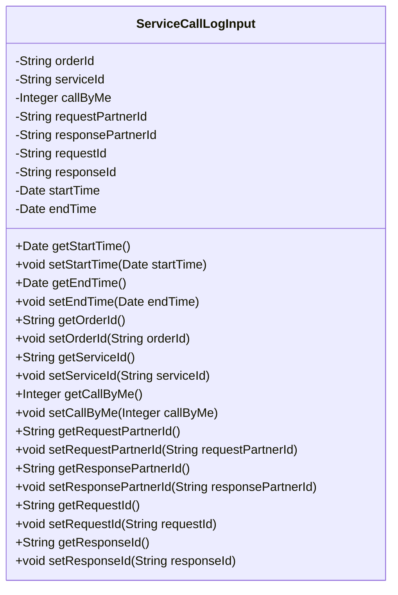

# 基础信息

|      |      |
|------|------|
| 名称 | ServiceCallLogInput |
| 编码语言 | .java |
| 代码路径 | WeFe/serving/serving-service/src/main/java/com/welab/wefe/serving/service/dto/ServiceCallLogInput.java |
| 包名 | com.welab.wefe.serving.service.dto |
| 依赖项 | ['java.util.Date'] |
| 概述说明 | ServiceCallLogInput类包含订单ID、服务ID、调用标识、请求/响应方ID、请求/响应ID及起止时间等字段，用于记录服务调用日志。 |

# 说明

ServiceCallLogInput类是一个用于记录服务调用日志的Java类，包含多个属性：订单ID、服务ID、调用方标识、请求和响应合作方ID、请求和响应ID、开始和结束时间。每个属性都有对应的getter和setter方法，用于获取和设置属性值。该类主要用于存储和管理服务调用的相关信息。

# 类列表 Class Summary

| 名称   | 类型  | 说明 |
|-------|------|-------------|
| ServiceCallLogInput | class | ServiceCallLogInput类包含订单ID、服务ID、调用标识、请求/响应方ID、请求/响应ID及起止时间等字段，用于记录服务调用日志。 |

## 类 ServiceCallLogInput

|      |      |
|------|------|
| 访问范围 | public |
| 类型 | class |
| 名称 | ServiceCallLogInput |
| 说明 | ServiceCallLogInput类包含订单ID、服务ID、调用标识、请求/响应方ID、请求/响应ID及起止时间等字段，用于记录服务调用日志。 |

### UML类图

这段代码定义了一个名为`ServiceCallLogInput`的类，主要用于记录服务调用的日志信息。该类包含多个私有字段，如订单ID、服务ID、调用方标识、请求和响应伙伴ID、请求和响应ID以及开始和结束时间，并提供了相应的getter和setter方法用于访问和修改这些字段的值。这个类可能用于在分布式系统中跟踪服务调用的详细信息，便于后续的日志分析和问题排查。

### 内部方法调用关系图

```mermaid
graph TD
    A["类ServiceCallLogInput"]
    B["属性: String orderId"]
    C["属性: String serviceId"]
    D["属性: Integer callByMe"]
    E["属性: String requestPartnerId"]
    F["属性: String responsePartnerId"]
    G["属性: String requestId"]
    H["属性: String responseId"]
    I["属性: Date startTime"]
    J["属性: Date endTime"]
    K["方法: getStartTime/setStartTime"]
    L["方法: getEndTime/setEndTime"]
    M["方法: getOrderId/setOrderId"]
    N["方法: getServiceId/setServiceId"]
    O["方法: getCallByMe/setCallByMe"]
    P["方法: getRequestPartnerId/setRequestPartnerId"]
    Q["方法: getResponsePartnerId/setResponsePartnerId"]
    R["方法: getRequestId/setRequestId"]
    S["方法: getResponseId/setResponseId"]

    A --> B
    A --> C
    A --> D
    A --> E
    A --> F
    A --> G
    A --> H
    A --> I
    A --> J
    A --> K
    A --> L
    A --> M
    A --> N
    A --> O
    A --> P
    A --> Q
    A --> R
    A --> S
```

该流程图展示了ServiceCallLogInput类的完整结构，包含9个私有属性和16个公共方法（8对getter/setter）。所有属性均为服务调用日志的关键字段，如订单ID、服务ID、调用方标识、合作伙伴ID等，方法则用于对这些属性进行读写操作。类设计符合JavaBean规范，通过封装保证数据安全性，适用于服务调用日志的记录和传输场景。

### 字段列表 Field List

| 名称  | 类型  | 说明 |
|-------|-------|------|
| responsePartnerId | String | 私有字符串类型变量，存储响应合作方ID。 |
| serviceId | String | 私有字符串变量serviceId，用于存储服务标识。 |
| callByMe | Integer | 私有整型变量callByMe |
| orderId | String | 私有字符串类型变量orderId，用于存储订单ID。 |
| requestPartnerId | String | 私有字符串变量，存储请求合作方ID。 |
| startTime | Date | 私有日期类型变量startTime |
| requestId | String | 私有字符串变量requestId，用于标识请求。 |
| endTime | Date | 私有日期类型变量endTime |
| responseId | String | 声明一个私有字符串变量responseId。 |

### 方法列表

| 名称  | 类型  | 说明 |
|-------|-------|------|
| getRequestId | String | 获取请求ID的方法，返回字符串类型的requestId。 |
| getServiceId | String | 获取serviceId的公共方法，返回字符串类型serviceId。 |
| getEndTime | Date | 这是一个Java方法，返回名为endTime的Date类型对象。 |
| setStartTime | void | Java方法：设置startTime属性，参数为Date类型。 |
| setOrderId | void | 设置订单ID的方法，将传入的字符串参数赋值给类的orderId成员变量。 |
| setResponsePartnerId | void | 设置响应合作方ID的方法，将输入参数赋值给类的成员变量responsePartnerId。 |
| getResponseId | String | 方法返回responseId字符串。 |
| getResponsePartnerId | String | 获取响应合作方ID的方法，返回字符串类型的responsePartnerId。 |
| setRequestPartnerId | void | 设置请求合作方ID的方法，将传入的字符串赋值给类的成员变量requestPartnerId。 |
| getOrderId | String | 获取订单ID的方法，返回字符串类型的orderId。 |
| getStartTime | Date | 获取开始时间的方法，返回Date类型变量startTime。 |
| getRequestPartnerId | String | 获取请求合作方ID的方法，返回requestPartnerId字符串。 |
| getCallByMe | Integer | 获取callByMe的整数值。 |
| setRequestId | void | 设置请求ID的方法，将传入的requestId赋值给当前对象的requestId属性。 |
| setServiceId | void | 设置服务ID的方法，将输入参数赋值给类的serviceId成员变量。 |
| setResponseId | void | 设置响应ID的方法，将传入的responseId赋值给当前对象的responseId属性。 |
| setEndTime | void | 设置结束时间的方法，将传入的日期参数赋值给对象的endTime属性。 |
| setCallByMe | void | Java方法：设置callByMe属性值，参数为Integer类型。 |

