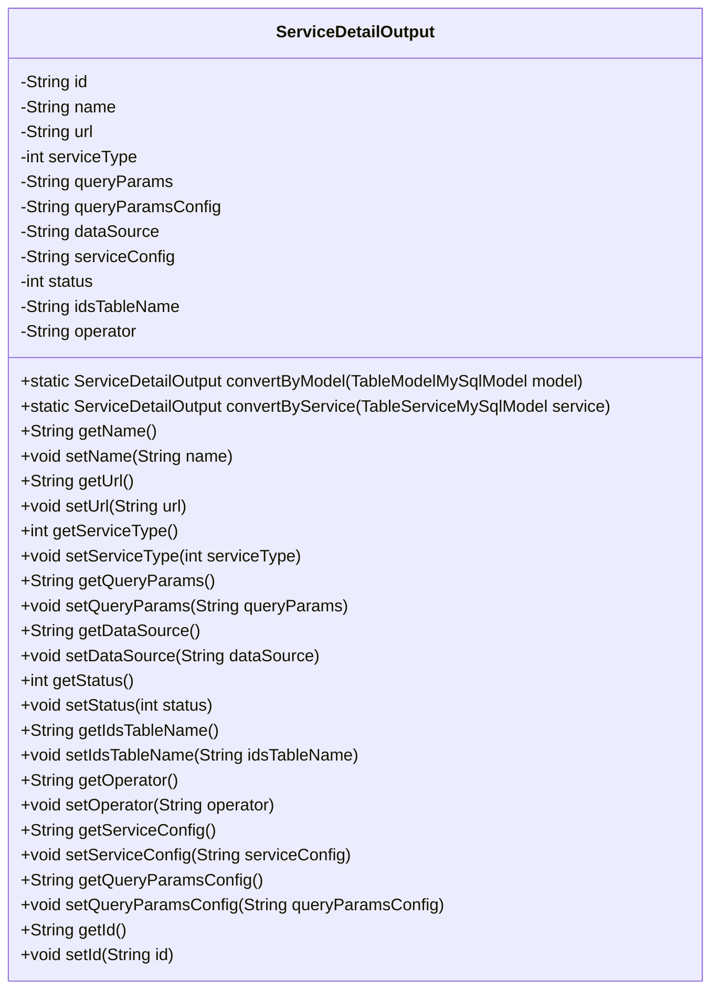

# 基础信息

|      |      |
|------|------|
| 名称 | ServiceDetailOutput |
| 编码语言 | .java |
| 代码路径 | WeFe/serving/serving-service/src/main/java/com/welab/wefe/serving/service/dto/ServiceDetailOutput.java |
| 包名 | com.welab.wefe.serving.service.dto |
| 依赖项 | ['javax.persistence.Column', 'com.welab.wefe.common.web.util.ModelMapper', 'com.welab.wefe.serving.service.database.entity.TableModelMySqlModel', 'com.welab.wefe.serving.service.database.entity.TableServiceMySqlModel'] |
| 概述说明 | ServiceDetailOutput类包含服务ID、名称、地址、类型、查询参数、数据源、状态等字段，提供模型转换和字段访问方法。 |

# 说明

ServiceDetailOutput类是一个Java实体类，用于封装服务详情信息。包含以下字段：唯一标识id、服务名称name、服务地址url、服务类型serviceType（1匿踪查询，2交集查询，3安全聚合被查询方，4安全聚合查询方）、查询参数配置queryParams、查询参数描述queryParamsConfig、数据源配置dataSource（JSON格式）、服务配置serviceConfig（JSON格式）、状态status（1在线0离线）、关联表名idsTableName和操作者operator。提供字段的getter和setter方法，以及两个静态方法convertByModel和convertByService用于模型转换。

# 类列表 Class Summary

| 名称   | 类型  | 说明 |
|-------|------|-------------|
| ServiceDetailOutput | class | ServiceDetailOutput类包含服务ID、名称、地址、类型、查询参数、数据源、状态等字段，提供模型转换和字段访问方法。 |

## 类 ServiceDetailOutput

|      |      |
|------|------|
| 访问范围 | public |
| 类型 | class |
| 名称 | ServiceDetailOutput |
| 说明 | ServiceDetailOutput类包含服务ID、名称、地址、类型、查询参数、数据源、状态等字段，提供模型转换和字段访问方法。 |

### UML类图

这段代码定义了一个名为`ServiceDetailOutput`的类，主要用于存储和转换服务详情信息。该类包含多个私有字段，如服务ID、名称、URL、类型、查询参数配置、数据源等，并通过公有getter和setter方法提供对这些字段的访问和修改。此外，还提供了两个静态方法`convertByModel`和`convertByService`，用于将`TableModelMySqlModel`和`TableServiceMySqlModel`对象转换为`ServiceDetailOutput`对象。该类主要用于服务详情的输出和转换，适用于需要处理服务信息的场景。

### 内部方法调用关系图

```mermaid
graph TD
    A["类ServiceDetailOutput"]
    B["属性: String id"]
    C["属性: String name"]
    D["属性: String url"]
    E["属性: int serviceType"]
    F["属性: String queryParams"]
    G["属性: String queryParamsConfig"]
    H["属性: String dataSource"]
    I["属性: String serviceConfig"]
    J["属性: int status"]
    K["属性: String idsTableName"]
    L["属性: String operator"]
    M["静态方法: convertByModel(TableModelMySqlModel)"]
    N["静态方法: convertByService(TableServiceMySqlModel)"]
    O["Getter/Setter方法组: 16个属性操作方法"]

    A --> B
    A --> C
    A --> D
    A --> E
    A --> F
    A --> G
    A --> H
    A --> I
    A --> J
    A --> K
    A --> L
    A --> M
    A --> N
    A -.-> O
```

该流程图展示了ServiceDetailOutput类的完整结构，包含12个私有属性（含JPA注解）、2个静态转换方法和16个标准Getter/Setter方法。该类主要功能是封装服务详情数据，支持通过ModelMapper实现两种模型转换（TableModelMySqlModel和TableServiceMySqlModel），所有属性均通过注解与数据库表字段映射，体现了典型的数据传输对象(DTO)设计模式。

### 字段列表 Field List

| 名称  | 类型  | 说明 |
|-------|-------|------|
| idsTableName | String | 数据库字段映射：私有字符串变量idsTableName对应表列名ids_table_name。 |
| name | String | 声明一个私有字符串变量name。 |
| queryParamsConfig | String | 数据库字段映射：queryParamsConfig对应表列query_params_config，类型为String。 |
| status = 0 | int | Java实体类字段，数据库列名"status"，默认值0，整型存储状态信息。 |
| operator | String | 数据库字段映射：operator对应私有字符串operator。 |
| serviceConfig | String | 数据库字段映射：serviceConfig对应表列service_config，类型为字符串。 |
| queryParams | String | 数据库字段映射：queryParams对应表列query_params，类型为String。 |
| url | String | 声明一个私有字符串变量url。 |
| dataSource | String | 数据库字段映射：私有字符串类型变量dataSource对应表列data_source。 |
| id | String | 私有字符串类型变量id。 |
| serviceType | int | 数据库字段映射：service_type对应整型变量serviceType。 |

### 方法列表

| 名称  | 类型  | 说明 |
|-------|-------|------|
| getOperator | String | 获取operator属性的字符串值。 |
| getName | String | 方法getName返回字符串name的值。 |
| setServiceType | void | 这是一个Java方法，用于设置类的serviceType属性值。方法接受一个整型参数serviceType，并将其赋值给类的同名成员变量。 |
| getStatus | int | 方法返回状态值status。 |
| setOperator | void | 设置操作符的方法，将输入参数赋值给类的operator成员变量。 |
| setUrl | void | 设置URL地址的方法，将参数url赋值给当前对象的url属性。 |
| setStatus | void | 方法setStatus用于设置状态值，参数为整型status，将其赋值给当前对象的status属性。 |
| setServiceConfig | void | Java方法：设置服务配置参数，将输入字符串赋值给类变量serviceConfig。 |
| getUrl | String | 这是一个Java方法，返回字符串类型的url变量值。 |
| setId | void | 设置对象ID的方法，将参数id赋值给当前对象的id属性。 |
| getQueryParams | String | 获取查询参数字符串的方法。 |
| getServiceConfig | String | 获取serviceConfig的字符串值。 |
| getDataSource | String | 获取数据源方法，返回字符串类型的数据源值。 |
| convertByService | ServiceDetailOutput | 该方法将TableServiceMySqlModel对象转换为ServiceDetailOutput对象，使用ModelMapper进行映射。 |
| getServiceType | int | 获取服务类型的方法，返回整型变量serviceType的值。 |
| getId | String | 获取ID的公共方法，返回字符串类型id。 |
| setQueryParams | void | 这是一个Java方法，用于设置类的queryParams属性值。方法接受一个字符串参数，并将其赋值给类的成员变量queryParams。 |
| convertByModel | ServiceDetailOutput | 该方法将TableModelMySqlModel对象转换为ServiceDetailOutput对象，使用ModelMapper进行映射并返回结果。 |
| setIdsTableName | void | 设置ID表名称的方法，将参数值赋给类的成员变量idsTableName。 |
| setQueryParamsConfig | void | 设置查询参数配置的方法，将输入参数赋值给类成员变量queryParamsConfig。 |
| getQueryParamsConfig | String | 获取查询参数配置的方法，返回字符串类型的queryParamsConfig。 |
| setName | void | 设置对象名称的方法，将参数name赋值给对象的name属性。 |
| getIdsTableName | String | 获取idsTableName的方法，返回字符串类型的表名。 |
| setDataSource | void | 定义了一个公共方法setDataSource，用于设置类的dataSource属性值。 |

