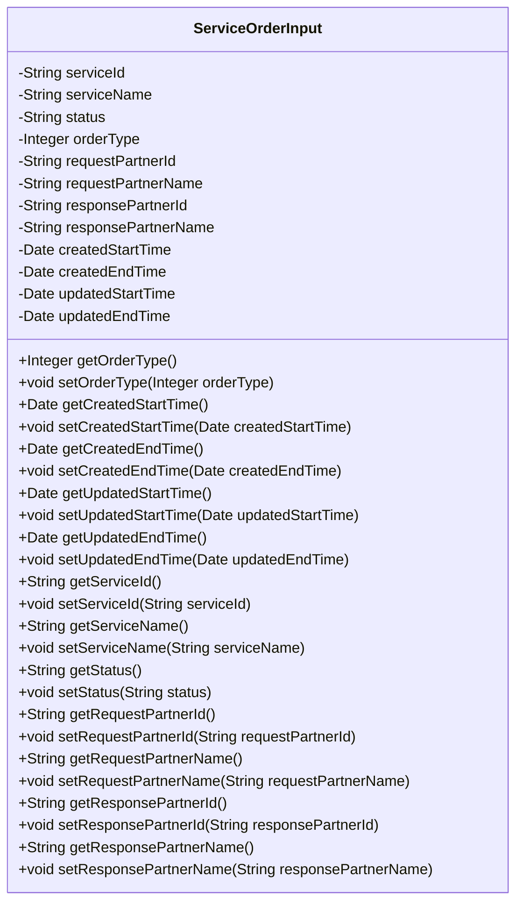

# 基础信息

|      |      |
|------|------|
| 名称 | ServiceOrderInput |
| 编码语言 | .java |
| 代码路径 | WeFe/serving/serving-service/src/main/java/com/welab/wefe/serving/service/dto/ServiceOrderInput.java |
| 包名 | com.welab.wefe.serving.service.dto |
| 依赖项 | ['java.util.Date'] |
| 概述说明 | 服务订单输入类，包含服务ID、名称、状态、类型、请求方和响应方信息及时间范围字段。 |

# 说明

ServiceOrderInput类定义了服务订单查询的输入参数，包含服务ID、名称、状态、订单类型。涉及请求方和响应方的合作伙伴ID与名称。提供创建时间和更新时间范围字段用于筛选。所有字段均通过getter和setter方法进行访问和修改。

# 类列表 Class Summary

| 名称   | 类型  | 说明 |
|-------|------|-------------|
| ServiceOrderInput | class | ServiceOrderInput类包含服务ID、名称、状态、订单类型、请求和响应伙伴信息及创建更新时间范围字段。 |

## 类 ServiceOrderInput

|      |      |
|------|------|
| 访问范围 | public |
| 类型 | class |
| 名称 | ServiceOrderInput |
| 说明 | ServiceOrderInput类包含服务ID、名称、状态、订单类型、请求和响应伙伴信息及创建更新时间范围字段。 |

### UML类图

这段代码定义了一个名为ServiceOrderInput的类，主要用于封装服务订单查询的输入参数。该类包含多个私有字段，如服务ID、服务名称、状态、订单类型、请求方和响应方的ID与名称，以及创建和更新的时间范围。每个字段都有对应的getter和setter方法，用于获取和设置字段的值。这个类通常用于在服务订单查询时传递查询条件，便于对服务订单进行筛选和检索。

### 内部方法调用关系图

该流程图展示了ServiceOrderInput类的完整结构，包含12个私有属性和对应的22个getter/setter方法。类主要用于封装服务订单查询参数，包含服务ID/名称、状态、订单类型、合作方信息以及时间范围等字段。每个属性都配有标准访问方法，形成典型的Java Bean模式，适用于数据传递和条件筛选场景。

### 字段列表 Field List

| 名称  | 类型  | 说明 |
|-------|-------|------|
| serviceName | String | 私有字符串变量，用于存储服务名称。 |
| status | String | 私有字符串变量status，用于存储状态信息。 |
| responsePartnerId | String | 私有字符串变量，存储响应合作方ID。 |
| createdEndTime | Date | 私有日期类型变量，记录创建结束时间。 |
| orderType | Integer | 私有整型变量，表示订单类型。 |
| updatedStartTime | Date | 私有日期类型变量，记录更新的开始时间。 |
| requestPartnerId | String | 定义私有字符串变量requestPartnerId。 |
| requestPartnerName | String | 私有字符串变量，存储请求合作方名称。 |
| updatedEndTime | Date | 私有日期类型变量updatedEndTime |
| serviceId | String | 声明一个私有字符串变量serviceId。 |
| createdStartTime | Date | 私有日期类型变量，记录创建起始时间。 |
| responsePartnerName | String | 私有字符串变量，存储响应伙伴名称。 |

### 方法列表

| 名称  | 类型  | 说明 |
|-------|-------|------|
| setStatus | void | 这是一个Java方法，用于设置对象的status属性值。方法接收一个字符串参数status，并将其赋值给当前对象的同名属性。 |
| setUpdatedEndTime | void | 设置更新后的结束时间。 |
| getResponsePartnerId | String | 获取响应合作方ID的方法，返回字符串类型的responsePartnerId。 |
| getServiceName | String | 这是一个Java方法，返回成员变量serviceName的值。 |
| getRequestPartnerName | String | 获取请求合作方名称的方法，返回字符串类型的requestPartnerName。 |
| getRequestPartnerId | String | 方法返回请求合作方ID。 |
| setCreatedStartTime | void | 设置创建起始时间的方法，将参数值赋给类的成员变量createdStartTime。 |
| getCreatedStartTime | Date | 获取创建起始时间的方法，返回Date类型值createdStartTime。 |
| setServiceId | void | 这是一个Java方法，用于设置类的serviceId属性值。方法接收一个字符串参数serviceId，并将其赋值给类的同名成员变量。 |
| getServiceId | String | 获取serviceId的方法，直接返回serviceId的值。 |
| getUpdatedEndTime | Date | 方法返回updatedEndTime日期对象。 |
| setUpdatedStartTime | void | 设置更新后的开始时间方法，将参数赋值给类的成员变量updatedStartTime。 |
| setServiceName | void | 这是一个Java方法，用于设置类的serviceName属性值。方法接收一个字符串参数serviceName，并将其赋值给类的同名成员变量。 |
| setOrderType | void | 这是一个Java方法，用于设置订单类型，接收一个Integer参数orderType并将其赋值给类的成员变量orderType。 |
| getResponsePartnerName | String | 该方法返回响应伙伴名称的字符串值。 |
| setRequestPartnerName | void | 设置请求合作方名称的方法，将参数值赋给类成员变量requestPartnerName。 |
| getOrderType | Integer | 获取订单类型的方法，返回整型数值orderType。 |
| getUpdatedStartTime | Date | 获取更新后的开始时间。 |
| setRequestPartnerId | void | 设置请求合作方ID的方法，将输入参数赋值给类的成员变量requestPartnerId。 |
| setResponsePartnerId | void | 设置响应合作方ID的方法，将输入参数赋值给类的成员变量responsePartnerId。 |
| setCreatedEndTime | void | 设置创建结束时间的方法，将参数赋值给类的成员变量createdEndTime。 |
| getCreatedEndTime | Date | 获取创建结束时间的方法，返回Date类型值createdEndTime。 |
| setResponsePartnerName | void | 设置响应合作方名称的方法，将输入参数赋值给类的成员变量。 |
| getStatus | String | 获取当前状态的字符串值。 |

