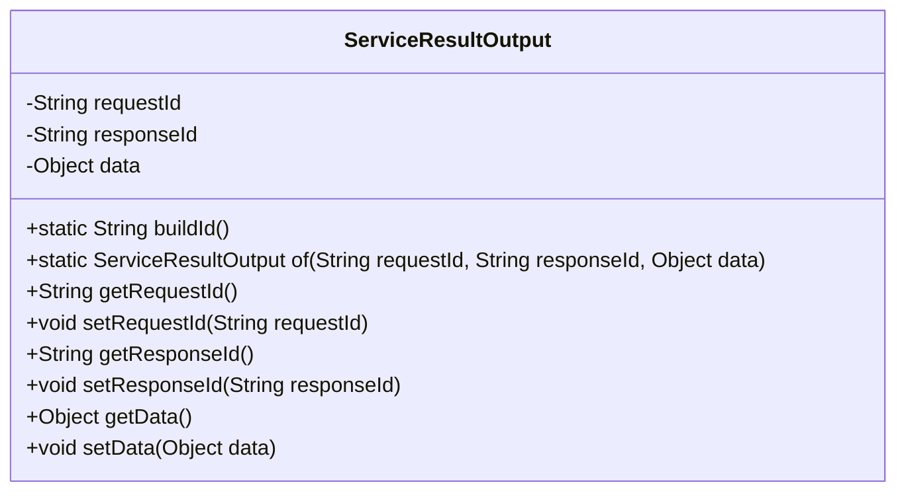
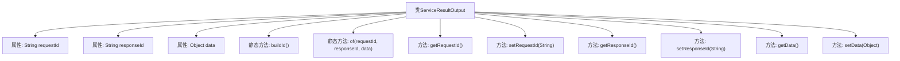

# 基础信息

|      |      |
|------|------|
| 名称 | ServiceResultOutput |
| 编码语言 | .java |
| 代码路径 | WeFe/serving/serving-service/src/main/java/com/welab/wefe/serving/service/dto/ServiceResultOutput.java |
| 包名 | com.welab.wefe.serving.service.dto |
| 依赖项 | ['java.util.UUID'] |
| 概述说明 | ServiceResultOutput类封装请求ID、响应ID和数据，提供构建ID的静态方法和创建实例的工厂方法。 |

# 说明

ServiceResultOutput类是一个用于封装服务调用结果的Java类，包含三个主要属性：requestId表示请求标识，responseId表示响应标识，data存储任意类型的数据对象。该类提供了静态方法buildId用于生成无连字符的UUID字符串，以及静态工厂方法of用于快速创建实例。同时提供了各属性的标准getter和setter方法，支持对请求ID、响应ID和数据对象的读写操作。

# 类列表 Class Summary

| 名称   | 类型  | 说明 |
|-------|------|-------------|
| ServiceResultOutput | class | ServiceResultOutput类封装请求ID、响应ID和数据对象，提供构建ID的静态方法和创建实例的工厂方法。 |

## 类 ServiceResultOutput

|      |      |
|------|------|
| 访问范围 | public |
| 类型 | class |
| 名称 | ServiceResultOutput |
| 说明 | ServiceResultOutput类封装请求ID、响应ID和数据对象，提供构建ID的静态方法和创建实例的工厂方法。 |

### UML类图

这段代码定义了一个名为`ServiceResultOutput`的类，用于封装服务调用的结果数据。该类包含三个私有字段：`requestId`、`responseId`和`data`，分别表示请求ID、响应ID和返回的数据对象。提供了静态方法`buildId()`用于生成UUID格式的ID，以及静态工厂方法`of()`用于创建实例。同时为每个字段提供了getter和setter方法，允许外部访问和修改这些字段的值。这个类主要用于标准化服务调用的输出格式。

### 内部方法调用关系图

该流程图展示了ServiceResultOutput类的完整结构，包含3个私有属性、2个静态方法和6个实例方法。核心静态方法buildId()用于生成格式化UUID，of()方法提供对象创建入口。所有属性均配有getter/setter方法，支持链式操作。类设计遵循POJO规范，具有数据封装和静态构造能力，适用于服务间标准化结果传输场景。

### 字段列表 Field List

| 名称  | 类型  | 说明 |
|-------|-------|------|
| data | Object | 私有数据对象。 |
| requestId | String | 私有字符串变量requestId，用于唯一标识请求。 |
| responseId | String | 私有字符串变量responseId，用于存储响应标识。 |

### 方法列表

| 名称  | 类型  | 说明 |
|-------|-------|------|
| getResponseId | String | 获取响应ID的方法，返回字符串类型的responseId。 |
| setResponseId | void | 这是一个Java方法，用于设置类的responseId属性值。方法接受一个字符串参数responseId，并将其赋值给类的同名成员变量。 |
| getRequestId | String | 方法返回请求ID字符串。 |
| buildId | String | 生成无连字符的随机UUID字符串。 |
| of | ServiceResultOutput | 创建ServiceResultOutput实例，设置requestId、responseId和data属性并返回。 |
| setRequestId | void | 设置请求ID的方法，将输入参数requestId赋值给当前对象的requestId属性。 |
| setData | void | 设置对象数据的方法，将参数data赋值给当前对象的data属性。 |
| getData | Object | 方法getData返回data对象。 |

