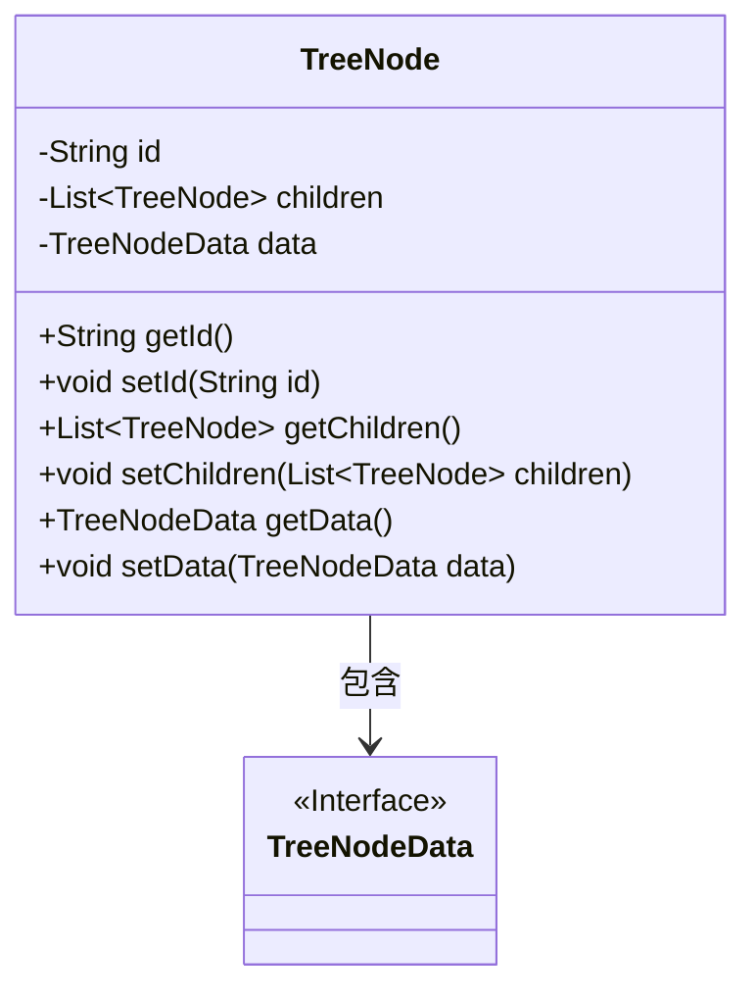
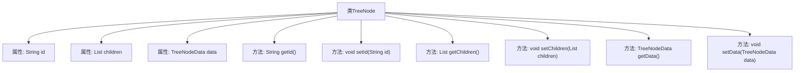

# 基础信息

|      |      |
|------|------|
| 名称 | TreeNode |
| 编码语言 | .java |
| 代码路径 | WeFe/serving/serving-service/src/main/java/com/welab/wefe/serving/service/dto/TreeNode.java |
| 包名 | com.welab.wefe.serving.service.dto |
| 依赖项 | ['java.util.List'] |
| 概述说明 | TreeNode类包含id、children列表和data属性，提供getter和setter方法。 |

# 说明

该代码定义了一个名为TreeNode的类，表示树形结构的节点。该类包含三个主要属性：id用于存储节点的唯一标识符，children是一个TreeNode类型的列表，用于存储子节点，data是TreeNodeData类型的对象，用于存储节点相关数据。类中提供了这三个属性的getter和setter方法，用于获取和设置属性值。TreeNode类通过children属性实现了树形结构的递归嵌套，适合表示层次化数据。

# 类列表 Class Summary

| 名称   | 类型  | 说明 |
|-------|------|-------------|
| TreeNode | class | TreeNode类包含id、子节点列表children和数据对象data，提供各属性的getter和setter方法。 |

## 类 TreeNode

|      |      |
|------|------|
| 访问范围 | public |
| 类型 | class |
| 名称 | TreeNode |
| 说明 | TreeNode类包含id、子节点列表children和数据对象data，提供各属性的getter和setter方法。 |

### UML类图

这段类图展示了一个树形结构节点(TreeNode)的设计，包含节点ID、子节点列表和节点数据三个核心属性。TreeNode类通过泛型List~TreeNode~管理子节点，体现了组合设计模式。节点数据(TreeNodeData)被定义为接口，为不同数据类型提供扩展性。类图中清晰地表现了TreeNode与TreeNodeData之间的包含关系，整体结构简洁但具备良好的扩展性，适合构建各种树形数据结构。

### 内部方法调用关系图

这段代码定义了一个名为TreeNode的类，用于表示树形结构中的节点。该类包含三个私有属性：id（节点标识）、children（子节点列表）和data（节点数据），并提供了对应的getter和setter方法。流程图清晰地展示了类与属性、方法之间的从属关系，所有方法均直接关联到TreeNode类，用于管理节点的基本信息和结构关系。

### 字段列表 Field List

| 名称  | 类型  | 说明 |
|-------|-------|------|
| children | List<TreeNode> | 私有成员变量，存储树节点的子节点列表。 |
| data | TreeNodeData | 私有树节点数据对象。 |
| id | String | 声明一个私有字符串变量id。 |

### 方法列表

| 名称  | 类型  | 说明 |
|-------|-------|------|
| setChildren | void | 设置子节点列表。将输入的子节点列表赋值给当前对象的children属性。 |
| setId | void | 设置对象ID的方法，将参数id赋值给当前对象的id属性。 |
| setData | void | 设置TreeNodeData类型数据到当前对象。 |
| getId | String | 这是一个Java方法，返回字符串类型的id字段值。 |
| getData | TreeNodeData | 方法getData返回TreeNodeData类型的数据对象。 |
| getChildren | List<TreeNode> | 获取子节点列表的方法。 |

