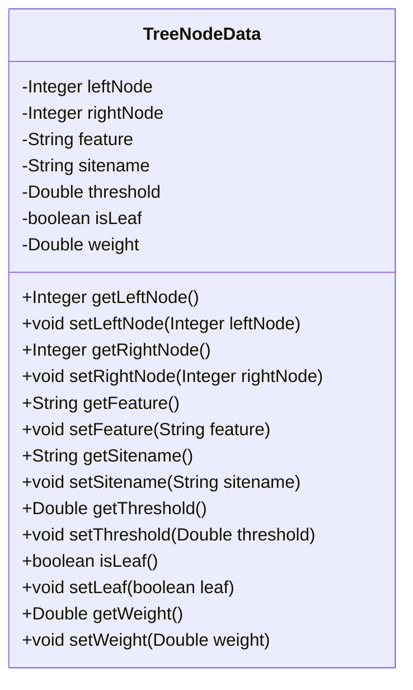

# 基础信息

|      |      |
|------|------|
| 名称 | TreeNodeData |
| 编码语言 | .java |
| 代码路径 | WeFe/serving/serving-service/src/main/java/com/welab/wefe/serving/service/dto/TreeNodeData.java |
| 包名 | com.welab.wefe.serving.service.dto |
| 依赖项 | [] |
| 概述说明 | 树节点数据结构，包含左右子节点、特征、站点名、分割阈值、是否叶节点和权重等属性及其访问方法。 |

# 说明

TreeNodeData类是一个表示树节点的数据结构，包含左右子节点索引、特征名称、站点名称、分割阈值、是否为叶节点标志和节点权重等属性。该类提供了所有属性的getter和setter方法，用于获取和设置各字段的值。

# 类列表 Class Summary

| 名称   | 类型  | 说明 |
|-------|------|-------------|
| TreeNodeData | class | TreeNodeData类定义了树节点数据结构，包含左右子节点、特征、站点名、分割阈值、是否叶节点和权重等属性及其访问方法。 |

## 类 TreeNodeData

|      |      |
|------|------|
| 访问范围 | public |
| 类型 | class |
| 名称 | TreeNodeData |
| 说明 | TreeNodeData类定义了树节点数据结构，包含左右子节点、特征、站点名、分割阈值、是否叶节点和权重等属性及其访问方法。 |

### UML类图

这段代码定义了一个名为TreeNodeData的类，用于表示树形结构中的节点数据。该类包含多个私有属性，如左右子节点标识(leftNode/rightNode)、特征名称(feature)、站点名称(sitename)、分割阈值(threshold)、是否为叶节点(isLeaf)和节点权重(weight)，并为每个属性提供了对应的getter和setter方法。这个类主要用于存储和操作决策树或类似树形结构中节点的各种属性和状态，通过封装这些数据提供了对树节点信息的完整管理能力。

### 内部方法调用关系图

```mermaid
graph TD
    A["类TreeNodeData"]
    B["属性: Integer leftNode"]
    C["属性: Integer rightNode"]
    D["属性: String feature"]
    E["属性: String sitename"]
    F["属性: Double threshold"]
    G["属性: boolean isLeaf"]
    H["属性: Double weight"]
    I["方法: getLeftNode()"]
    J["方法: setLeftNode(Integer)"]
    K["方法: getRightNode()"]
    L["方法: setRightNode(Integer)"]
    M["方法: getFeature()"]
    N["方法: setFeature(String)"]
    O["方法: getSitename()"]
    P["方法: setSitename(String)"]
    Q["方法: getThreshold()"]
    R["方法: setThreshold(Double)"]
    S["方法: isLeaf()"]
    T["方法: setLeaf(boolean)"]
    U["方法: getWeight()"]
    V["方法: setWeight(Double)"]

    A --> B
    A --> C
    A --> D
    A --> E
    A --> F
    A --> G
    A --> H
    A --> I
    A --> J
    A --> K
    A --> L
    A --> M
    A --> N
    A --> O
    A --> P
    A --> Q
    A --> R
    A --> S
    A --> T
    A --> U
    A --> V
```

这段代码定义了一个名为TreeNodeData的类，用于表示树节点的数据结构。该类包含7个私有属性：leftNode和rightNode表示左右子节点，feature和sitename是字符串类型的特征和站点名称，threshold是分割阈值，isLeaf标识是否为叶节点，weight表示节点权重。每个属性都有对应的getter和setter方法，用于封装属性的访问和修改。这个类主要用于构建树形结构的数据模型，适用于决策树等机器学习算法的实现。

### 字段列表 Field List

| 名称  | 类型  | 说明 |
|-------|-------|------|
| isLeaf | boolean | 布尔变量isLeaf表示是否为叶子节点。 |
| rightNode | Integer | 私有整型变量rightNode，用于存储右节点信息。 |
| threshold | Double | 声明一个私有的Double类型变量threshold。 |
| leftNode | Integer | 私有整型变量leftNode，用于存储左节点信息。 |
| sitename | String | 定义了一个私有字符串变量sitename。 |
| feature | String | 私有字符串类型变量feature。 |
| weight | Double | 声明一个私有的Double类型变量weight。 |

### 方法列表

| 名称  | 类型  | 说明 |
|-------|-------|------|
| isLeaf | boolean | 该方法返回一个布尔值，表示当前节点是否为叶子节点。 |
| getLeftNode | Integer | 获取左节点值的方法，返回整数类型。 |
| setWeight | void | 设置对象重量属性的方法，参数为Double类型。 |
| setFeature | void | 这是一个Java方法，用于设置对象的feature属性值。方法接收一个字符串参数feature，并将其赋值给当前对象的同名属性。 |
| getThreshold | Double | 获取阈值的方法，返回Double类型数值。 |
| getSitename | String | 获取站点名称的方法，返回字符串sitename。 |
| getFeature | String | 这是一个Java方法，返回字符串类型的成员变量feature的值。 |
| setThreshold | void | 设置阈值方法，接收Double类型参数threshold并赋值给类成员变量。 |
| getRightNode | Integer | 获取右节点值的方法，返回Integer类型。 |
| setLeftNode | void | 设置左节点值为输入参数。 |
| setSitename | void | 设置站点名称的方法，将参数sitename赋值给当前对象的sitename属性。 |
| setRightNode | void | 设置右节点值为输入参数。 |
| setLeaf | void | 设置节点是否为叶子状态的方法，将传入的leaf布尔值赋给isLeaf变量。 |
| getWeight | Double | 这是一个Java方法，返回Double类型的weight值。 |

