# 基础信息

|      |      |
|------|------|
| 名称 | dto |
| 编码语言 | .java |
| 代码路径 | WeFe/serving/serving-service/src/main/java/com/welab/wefe/serving/service/dto |
| 包名 | docs.serving.serving-service.src.main.java.com.welab.wefe.serving.service.dto |
| 概述说明 | 注解驱动全局配置管理模块，自动收集分类配置模型，支持分组检索。包含多个DTO类如ServiceOrderInput、TreeNode等，用于处理服务订单、树形结构、模型状态等数据。提供分页、日志、成员参数管理功能。 |

# 说明

## 概述  
该模块实现多场景DTO管理，核心职责是统一封装业务数据交互模型，支持配置管理、服务调用和分页查询等场景。接口规范涵盖静态工厂方法（如of/buildId）和标准getter/setter，关键数据结构包括分页泛型类PagingOutput、树形节点TreeNode及各类输入输出DTO。外部依赖仅需ModelMapper和CacheObjects工具类。例如，ServiceDetailOutput封装服务类型与配置，TreeNodeData实现决策树特征存储。

## 主要业务场景  
模块采用类似数据总线模式，业务流程包括服务订单查询（ServiceOrderInput）、批量预测（BatchPredictInput）和操作日志记录（OperationLogOutputModel）。典型交互通过分页参数（PagingInput）和泛型响应（PagingOutput）实现标准化数据交换。功能覆盖成员管理（MemberParams）、费用统计（FeeDetailInput）和模型状态跟踪（ModelStatusOutput），例如AccountListAllOutputModel实现权限分级控制，ServiceCallLogInput记录调用链路。API类型聚焦CRUD操作，集成案例表现为ModelSqlConfigOutput与SQL执行的协同。

### 包内部结构视图

```mermaid
graph TD
    dto --> globalconfig
    dto --> ServiceOrderInput.java
    dto --> ModelSqlConfigOutput.java
    dto --> TreeNode.java
    dto --> ModelStatusOutput.java
    dto --> ServiceDetailOutput.java
    dto --> TreeNodeData.java
    dto --> OperationLogOutputModel.java
    dto --> OrderStatisticsInput.java
    dto --> FeeDetailInput.java
    dto --> BatchPredictInput.java
    dto --> AccountListAllOutputModel.java
    dto --> PagingOutput.java
    dto --> ServiceCallLogInput.java
    dto --> ServiceResultOutput.java
    dto --> MemberParams.java
    dto --> PagingInput.java
    globalconfig --> base
    globalconfig --> CaptchaSendChannelConfigModel.java
    globalconfig --> MailServerModel.java
    globalconfig --> UnionInfoModel.java
    globalconfig --> ServiceCacheConfigModel.java
    globalconfig --> GlobalConfigFlag.java
    globalconfig --> AliyunSmsConfigModel.java
    globalconfig --> GlobalConfigModel.java
    globalconfig --> IdentityInfoModel.java
    base --> AbstractConfigModel.java
    base --> GlobalConfigInput.java
    base --> ConfigModel.java
    base --> ConfigGroupConstant.java
```

该流程图展示了WeFe服务模块中DTO层的完整结构，包含globalconfig配置子目录和多个数据传输对象文件。globalconfig下又分为base基础配置类和多个具体配置模型，形成清晰的层级关系。同时主目录下包含各种服务相关的输入输出DTO，如ServiceOrderInput、ModelStatusOutput等，共同构成服务间数据传输的完整体系。

# 文件列表

| 名称   | 类型  | 说明 |
|-------|------|-------------|
| [ServiceOrderInput.java](ServiceOrderInput.md) | file | 服务订单输入类，包含服务ID、名称、状态、类型、请求方和响应方信息及时间范围字段。 |
| [ModelSqlConfigOutput.java](ModelSqlConfigOutput.md) | file | ModelSqlConfigOutput类包含sqlScript、sqlConditionField和dataSourceId字段，提供getter/setter方法和静态工厂方法of。 |
| [TreeNode.java](TreeNode.md) | file | TreeNode类包含id、children列表和data属性，提供getter和setter方法。 |
| [ModelStatusOutput.java](ModelStatusOutput.md) | file | ModelStatusOutput类包含成员ID、名称、URL和状态字段，提供两种静态构建方法和对应的getter/setter方法。 |
| [ServiceDetailOutput.java](ServiceDetailOutput.md) | file | ServiceDetailOutput类包含服务ID、名称、地址、类型、查询参数、数据源、状态等字段，提供模型转换和字段访问方法。 |
| [TreeNodeData.java](TreeNodeData.md) | file | 树节点数据结构，包含左右子节点、特征、站点名、分割阈值、是否叶节点和权重等属性及其访问方法。 |
| [OperationLogOutputModel.java](OperationLogOutputModel.md) | file | 操作日志输出模型类，包含接口、IP、操作人、行为、结果等字段及getter/setter方法。 |
| [OrderStatisticsInput.java](OrderStatisticsInput.md) | file | OrderStatisticsInput类包含服务ID、请求方ID、响应方ID、分钟、开始时间和结束时间字段，提供各字段的getter和setter方法。 |
| [FeeDetailInput.java](FeeDetailInput.md) | file | FeeDetailInput类包含ID、服务ID、客户ID、总请求次数和总费用字段，提供getter和setter方法。 |
| [BatchPredictInput.java](BatchPredictInput.md) | file | BatchPredictInput类包含userId、featureData和params字段，提供getter和setter方法。 |
| [AccountListAllOutputModel.java](AccountListAllOutputModel.md) | file | AccountListAllOutputModel类包含昵称、超级管理员、管理员、审核状态、可用性和注销状态等属性及其getter/setter方法。 |
| [PagingOutput.java](PagingOutput.md) | file | 分页输出类，包含总数和列表数据，提供两种创建方法：直接赋值和自动映射数据库实体到DTO。支持总数和列表的获取与设置。 |
| [ServiceCallLogInput.java](ServiceCallLogInput.md) | file | ServiceCallLogInput类包含订单ID、服务ID、调用标识、请求/响应方ID、请求/响应ID及起止时间等字段，用于记录服务调用日志。 |
| [ServiceResultOutput.java](ServiceResultOutput.md) | file | ServiceResultOutput类封装请求ID、响应ID和数据，提供构建ID的静态方法和创建实例的工厂方法。 |
| [MemberParams.java](MemberParams.md) | file | MemberParams类包含成员ID、名称、角色、公钥、URL和密钥类型属性，提供各属性的getter和setter方法。 |
| [PagingInput.java](PagingInput.md) | file | 分页输入类，包含页码和每页数量，页码默认为0，最小为0，每页数量默认为100。 |
| [globalconfig](globalconfig/_module.md) | package | 该模块实现注解驱动的全局配置管理，通过静态Map存储配置类，支持分组检索。包含短信、邮件、缓存等配置模型类，各模型继承AbstractConfigModel并标注分组。核心功能为配置注册与查询，依赖反射工具实现自动加载。 |

