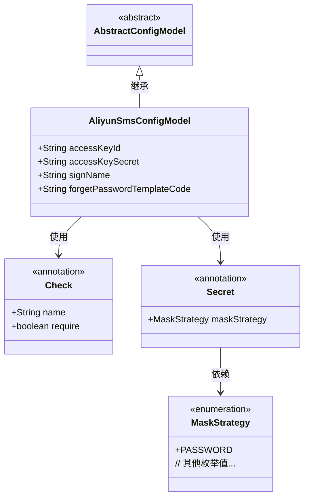
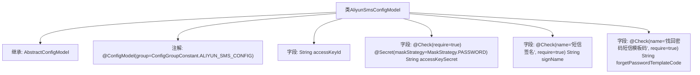

# 基础信息

|      |      |
|------|------|
| 名称 | AliyunSmsConfigModel |
| 编码语言 | .java |
| 代码路径 | WeFe/serving/serving-service/src/main/java/com/welab/wefe/serving/service/dto/globalconfig/AliyunSmsConfigModel.java |
| 包名 | com.welab.wefe.serving.service.dto.globalconfig |
| 依赖项 | ['com.welab.wefe.common.fieldvalidate.annotation.Check', 'com.welab.wefe.common.fieldvalidate.secret.MaskStrategy', 'com.welab.wefe.common.fieldvalidate.secret.Secret', 'com.welab.wefe.serving.service.dto.globalconfig.base.AbstractConfigModel', 'com.welab.wefe.serving.service.dto.globalconfig.base.ConfigGroupConstant', 'com.welab.wefe.serving.service.dto.globalconfig.base.ConfigModel'] |
| 概述说明 | 阿里云短信配置类，包含必填的密钥ID、加密密钥、短信签名及找回密码模板码。 |

# 说明

该内容描述了一个名为AliyunSmsConfigModel的配置模型类，用于阿里云短信服务配置。该类继承自AbstractConfigModel，并标注了ConfigModel注解，指定配置组为ALIYUN_SMS_CONFIG。类中包含四个字段：accessKeyId（访问密钥ID）、accessKeySecret（访问密钥，要求必填且使用密码掩码策略）、signName（短信签名，要求必填）、forgetPasswordTemplateCode（找回密码短信模板码，要求必填）。这些字段通过Check注解进行校验，确保配置的完整性和正确性。

# 类列表 Class Summary

| 名称   | 类型  | 说明 |
|-------|------|-------------|
| AliyunSmsConfigModel | class | 阿里云短信配置类，包含必填的accessKeyId、加密的accessKeySecret、短信签名和找回密码模板码。 |

## 类 AliyunSmsConfigModel

|      |      |
|------|------|
| 访问范围 | @ConfigModel(group = ConfigGroupConstant.ALIYUN_SMS_CONFIG);public |
| 类型 | class |
| 名称 | AliyunSmsConfigModel |
| 说明 | 阿里云短信配置类，包含必填的accessKeyId、加密的accessKeySecret、短信签名和找回密码模板码。 |

### UML类图

这段类图展示了阿里云短信配置模型的结构。AliyunSmsConfigModel继承自抽象基类AbstractConfigModel，包含四个公有字段：accessKeyId、accessKeySecret（带敏感信息掩码注解）、signName和forgetPasswordTemplateCode。通过Check和Secret注解实现字段校验和脱敏处理，其中Secret注解依赖MaskStrategy枚举定义掩码策略。该设计实现了可扩展的配置模型，支持字段级校验规则和敏感信息保护机制。

### 内部方法调用关系图

该流程图展示了AliyunSmsConfigModel类的结构，它是一个继承自AbstractConfigModel的配置模型类，带有@ConfigModel注解。类中包含四个字段：accessKeyId、accessKeySecret（带有安全检查注解和脱敏策略）、signName（必填的短信签名）和forgetPasswordTemplateCode（必填的找回密码模板码）。所有字段都通过注解实现了配置验证和业务语义标记。

### 字段列表 Field List

| 名称  | 类型  | 说明 |
|-------|-------|------|
| accessKeySecret | String | 代码定义了一个必须校验的字符串字段accessKeySecret，采用密码掩码策略进行敏感信息保护。 |
| accessKeyId | String | 声明一个公共字符串变量accessKeyId。 |
| signName | String | 短信签名字段，必填项。 |
| forgetPasswordTemplateCode | String | 检查项为找回密码短信模板码，必填字段，变量名为forgetPasswordTemplateCode。 |

### 方法列表

| 名称  | 类型  | 说明 |
|-------|-------|------|

