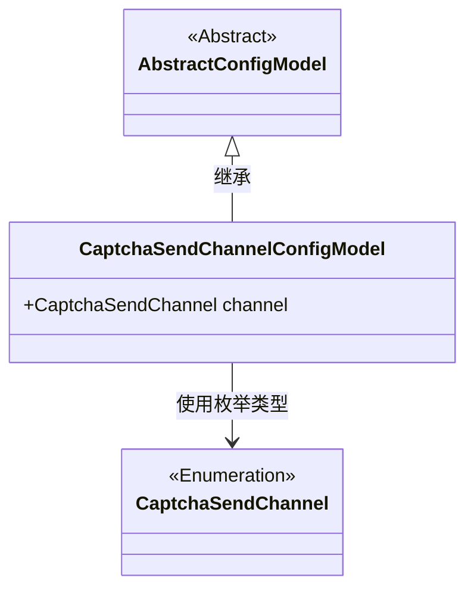
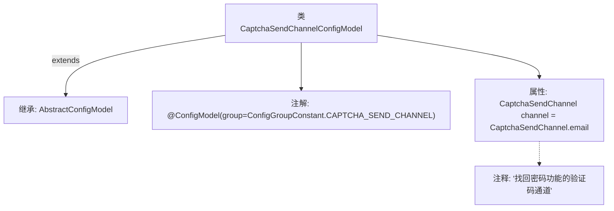

# 基础信息

|      |      |
|------|------|
| 名称 | CaptchaSendChannelConfigModel |
| 编码语言 | .java |
| 代码路径 | WeFe/serving/serving-service/src/main/java/com/welab/wefe/serving/service/dto/globalconfig/CaptchaSendChannelConfigModel.java |
| 包名 | com.welab.wefe.serving.service.dto.globalconfig |
| 依赖项 | ['com.welab.wefe.common.verification.code.common.CaptchaSendChannel', 'com.welab.wefe.serving.service.dto.globalconfig.base.AbstractConfigModel', 'com.welab.wefe.serving.service.dto.globalconfig.base.ConfigGroupConstant', 'com.welab.wefe.serving.service.dto.globalconfig.base.ConfigModel'] |
| 概述说明 | 配置类CaptchaSendChannelConfigModel定义了找回密码验证码发送通道，默认使用email渠道。 |

# 说明

该内容定义了一个名为CaptchaSendChannelConfigModel的配置模型类，属于验证码发送通道配置组。类中包含一个channel字段，默认值为email，用于指定找回密码功能的验证码发送通道。该类继承自AbstractConfigModel基类，并通过注解标记其配置组归属。

# 类列表 Class Summary

| 名称   | 类型  | 说明 |
|-------|------|-------------|
| CaptchaSendChannelConfigModel | class | 配置类CaptchaSendChannelConfigModel，定义找回密码验证码发送通道，默认使用email。 |

## 类 CaptchaSendChannelConfigModel

|      |      |
|------|------|
| 访问范围 | @ConfigModel(group = ConfigGroupConstant.CAPTCHA_SEND_CHANNEL);public |
| 类型 | class |
| 名称 | CaptchaSendChannelConfigModel |
| 说明 | 配置类CaptchaSendChannelConfigModel，定义找回密码验证码发送通道，默认使用email。 |

### UML类图

这段类图展示了CaptchaSendChannelConfigModel继承自AbstractConfigModel，并包含一个CaptchaSendChannel枚举类型的channel字段。CaptchaSendChannel作为枚举类型被单独表示，ConfigModel注解表明这是一个配置模型类，专门用于管理验证码发送渠道的配置。类图清晰地呈现了继承关系和类型依赖，其中抽象基类与具体实现类通过泛化关系连接，而枚举类型作为独立组件被引用。

### 内部方法调用关系图

该流程图展示了CaptchaSendChannelConfigModel类的结构，它是一个继承自AbstractConfigModel的配置模型类，带有@ConfigModel注解并指定了配置组。类中包含一个默认值为email的CaptchaSendChannel类型属性channel，用于配置找回密码功能的验证码发送通道，属性附有清晰的注释说明其用途。整个类结构简洁明了，符合配置模型的设计规范。

### 字段列表 Field List

| 名称  | 类型  | 说明 |
|-------|-------|------|
| channel = CaptchaSendChannel.email | CaptchaSendChannel | 验证码发送渠道设置为邮箱。 |

### 方法列表

| 名称  | 类型  | 说明 |
|-------|-------|------|

