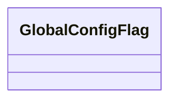

# 基础信息

|      |      |
|------|------|
| 名称 | GlobalConfigFlag |
| 编码语言 | .java |
| 代码路径 | WeFe/serving/serving-service/src/main/java/com/welab/wefe/serving/service/dto/globalconfig/GlobalConfigFlag.java |
| 包名 | com.welab.wefe.serving.service.dto.globalconfig |
| 依赖项 | [] |
| 概述说明 | GlobalConfigFlag是一个空的公共类，可能用于全局配置标记。 |

# 说明

GlobalConfigFlag是一个公共类，用于表示全局配置标志。该类目前为空，未定义任何成员变量或方法，可能作为基础结构预留后续扩展。其设计意图可能是为系统提供统一的全局配置管理入口点。

# 类列表 Class Summary

| 名称   | 类型  | 说明 |
|-------|------|-------------|
| GlobalConfigFlag | class | 类GlobalConfigFlag用于全局配置标记。 |

## 类 GlobalConfigFlag

|      |      |
|------|------|
| 访问范围 | public |
| 类型 | class |
| 名称 | GlobalConfigFlag |
| 说明 | 类GlobalConfigFlag用于全局配置标记。 |

### UML类图

这段类图展示了一个名为GlobalConfigFlag的空类，目前没有任何属性和方法。根据类名推断，这个类可能用于管理全局配置标志，但当前实现为空，需要后续扩展功能。空类结构表明这是一个基础框架类，为未来可能的配置管理功能预留了扩展点，后续可以添加静态配置参数或相关操作方法。

### 内部方法调用关系图

这段流程图描述了一个名为GlobalConfigFlag的空类结构。该图仅包含一个节点表示类声明，没有任何属性或方法定义。这是一个最简单的类结构示意图，通常作为配置标志的基类或占位符使用，后续可通过添加静态字段或方法来实现具体功能。当前版本仅展示类的基本框架，没有实现任何具体业务逻辑。

### 字段列表 Field List

| 名称  | 类型  | 说明 |
|-------|-------|------|

### 方法列表

| 名称  | 类型  | 说明 |
|-------|-------|------|

