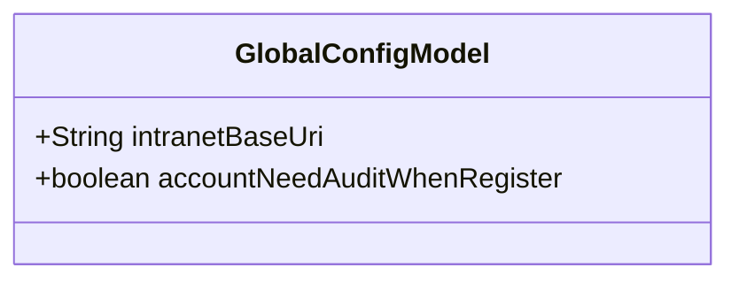
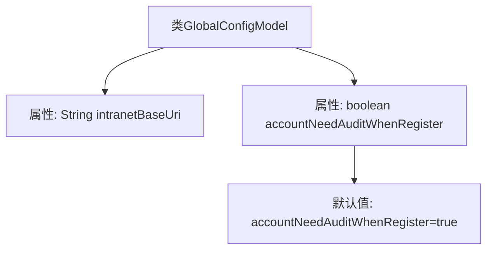

# 基础信息

|      |      |
|------|------|
| 名称 | GlobalConfigModel |
| 编码语言 | .java |
| 代码路径 | WeFe/serving/serving-service/src/main/java/com/welab/wefe/serving/service/dto/globalconfig/GlobalConfigModel.java |
| 包名 | com.welab.wefe.serving.service.dto.globalconfig |
| 依赖项 | [] |
| 概述说明 | GlobalConfigModel类包含内网服务地址和注册账号需审核的布尔配置项。 |

# 说明

GlobalConfigModel类包含两个配置项：intranetBaseUri表示fusion服务的内部网络基础URL；accountNeedAuditWhenRegister是一个布尔值，默认为true，用于控制新注册账号是否需要管理员审核。

# 类列表 Class Summary

| 名称   | 类型  | 说明 |
|-------|------|-------------|
| GlobalConfigModel | class | GlobalConfigModel类包含两个配置项：intranetBaseUri（内网服务地址）和accountNeedAuditWhenRegister（新账号注册需审核，默认true）。 |

## 类 GlobalConfigModel

|      |      |
|------|------|
| 访问范围 | public |
| 类型 | class |
| 名称 | GlobalConfigModel |
| 说明 | GlobalConfigModel类包含两个配置项：intranetBaseUri（内网服务地址）和accountNeedAuditWhenRegister（新账号注册需审核，默认true）。 |

### UML类图

这段代码定义了一个名为GlobalConfigModel的配置类，包含两个公有字段：intranetBaseUri用于存储内网基础URL地址（字符串类型），accountNeedAuditWhenRegister是布尔类型配置项，默认值为true，表示新注册账号是否需要管理员审核。该类作为全局配置的数据载体，没有定义方法，采用直接字段暴露的设计模式，适用于需要快速读取配置参数的场景。

### 内部方法调用关系图

该流程图展示了GlobalConfigModel类的结构，包含两个主要属性：intranetBaseUri字符串类型用于存储内网基础URL，accountNeedAuditWhenRegister布尔类型默认值为true表示新注册账号需要管理员审核。图形清晰地呈现了类与属性的包含关系，以及默认值的特殊标注，便于理解配置模型的初始状态和关键参数定义。

### 字段列表 Field List

| 名称  | 类型  | 说明 |
|-------|-------|------|
| intranetBaseUri | String | 类成员变量，字符串类型，表示内网基础URI。 |
| accountNeedAuditWhenRegister = true | boolean | 注册时账户需审核 |

### 方法列表

| 名称  | 类型  | 说明 |
|-------|-------|------|

