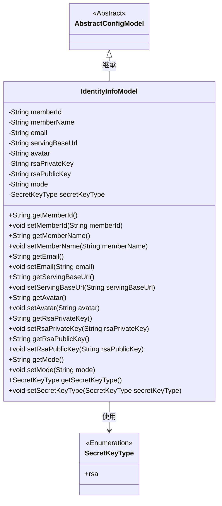

# 基础信息

|      |      |
|------|------|
| 名称 | IdentityInfoModel |
| 编码语言 | .java |
| 代码路径 | WeFe/serving/serving-service/src/main/java/com/welab/wefe/serving/service/dto/globalconfig/IdentityInfoModel.java |
| 包名 | com.welab.wefe.serving.service.dto.globalconfig |
| 依赖项 | ['com.welab.wefe.common.constant.SecretKeyType', 'com.welab.wefe.common.fieldvalidate.annotation.Check', 'com.welab.wefe.common.fieldvalidate.secret.MaskStrategy', 'com.welab.wefe.common.fieldvalidate.secret.Secret', 'com.welab.wefe.serving.service.dto.globalconfig.base.AbstractConfigModel', 'com.welab.wefe.serving.service.dto.globalconfig.base.ConfigGroupConstant', 'com.welab.wefe.serving.service.dto.globalconfig.base.ConfigModel'] |
| 概述说明 | IdentityInfoModel类存储身份信息，包含成员ID、名称、邮箱、URL、头像、RSA密钥、系统模式和密钥类型等字段。 |

# 说明

IdentityInfoModel类是一个配置模型，属于身份信息配置组。它包含成员ID、名称、邮箱、系统域路径、头像等基本信息。成员ID在独立模式下默认为uuid，联邦模式下为memberId。该类还包含RSA公私钥，私钥使用BLOCK策略进行脱敏处理。系统模式分为独立模式和联邦模式，密钥类型默认为rsa。所有字段均有对应的getter和setter方法。

# 类列表 Class Summary

| 名称   | 类型  | 说明 |
|-------|------|-------------|
| IdentityInfoModel | class | IdentityInfoModel类包含成员ID、名称、邮箱、系统路径、头像、RSA密钥、运行模式和密钥类型等配置信息。 |

## 类 IdentityInfoModel

|      |      |
|------|------|
| 访问范围 | @ConfigModel(group = ConfigGroupConstant.IDENTITY_INFO);public |
| 类型 | class |
| 名称 | IdentityInfoModel |
| 说明 | IdentityInfoModel类包含成员ID、名称、邮箱、系统路径、头像、RSA密钥、运行模式和密钥类型等配置信息。 |

### UML类图

这段类图展示了IdentityInfoModel继承自AbstractConfigModel，并包含多个私有字段及其对应的getter/setter方法。该类用于存储身份信息配置，包括成员ID、名称、邮箱等基础信息，以及RSA密钥对和系统模式等安全相关配置。SecretKeyType作为枚举类型，定义了密钥类型选项。注解@ConfigModel和@Check表明这是一个配置模型类，带有字段校验功能。

### 内部方法调用关系图

```mermaid
graph TD
    A["类IdentityInfoModel"]
    B["继承: AbstractConfigModel"]
    C["注解: @ConfigModel(group=ConfigGroupConstant.IDENTITY_INFO)"]
    D["属性: String memberId"]
    E["属性: String memberName"]
    F["属性: String email"]
    G["属性: String servingBaseUrl"]
    H["属性: String avatar"]
    I["属性: String rsaPrivateKey"]
    J["属性: String rsaPublicKey"]
    K["属性: String mode"]
    L["属性: SecretKeyType secretKeyType"]
    M["方法: getMemberId/setMemberId"]
    N["方法: getMemberName/setMemberName"]
    O["方法: getEmail/setEmail"]
    P["方法: getServingBaseUrl/setServingBaseUrl"]
    Q["方法: getAvatar/setAvatar"]
    R["方法: getRsaPrivateKey/setRsaPrivateKey"]
    S["方法: getRsaPublicKey/setRsaPublicKey"]
    T["方法: getMode/setMode"]
    U["方法: getSecretKeyType/setSecretKeyType"]

    A --> B
    A --> C
    A --> D
    A --> E
    A --> F
    A --> G
    A --> H
    A --> I
    A --> J
    A --> K
    A --> L
    A --> M
    A --> N
    A --> O
    A --> P
    A --> Q
    A --> R
    A --> S
    A --> T
    A --> U
```

这段代码定义了一个名为IdentityInfoModel的配置模型类，继承自AbstractConfigModel，用于存储身份验证相关的信息。类中包含多个带有@Check注解的属性，如memberId、memberName、email等，以及对应的getter和setter方法。特别注意的是rsaPrivateKey属性使用了@Secret注解进行敏感信息保护。该类通过@ConfigModel注解指定了配置分组，适用于独立模式或联邦模式下的身份信息管理场景。

### 字段列表 Field List

| 名称  | 类型  | 说明 |
|-------|-------|------|
| memberId | String | 系统ID，全局唯一，独立模式默认uuid，联邦模式为memberId。 |
| servingBaseUrl | String | 系统域路径检查，私有字符串变量servingBaseUrl。 |
| secretKeyType = SecretKeyType.rsa | SecretKeyType | 代码定义了一个私有字段secretKeyType，默认值为rsa，并使用@Check注解标记字段名称为"密钥类型"。 |
| rsaPublicKey | String | 代码定义了一个私有字符串变量rsaPublicKey，并用@Check注解标记其名称为"公钥"。 |
| email | String | 代码定义私有字符串变量email，使用@Check注解校验邮箱格式。 |
| memberName | String | 代码定义了一个私有字符串变量memberName，并用@Check注解标记其名称为"名称"。 |
| avatar | String | 字段avatar使用@Check注解校验，参数name为"头像"。 |
| mode | String | 代码定义私有字符串变量mode，通过注解说明其取值：standalone（独立模式）或union（联邦模式）。 |
| rsaPrivateKey | String | Java字段注解：私钥字段使用BLOCK策略进行脱敏处理。 |

### 方法列表

| 名称  | 类型  | 说明 |
|-------|-------|------|
| setSecretKeyType | void | 设置密钥类型的方法，将参数secretKeyType赋值给类的同名属性。 |
| setMode | void | 方法setMode接收字符串参数mode，并将其赋值给当前对象的mode属性。 |
| getAvatar | String | 获取头像URL的公共方法，返回字符串类型变量avatar的值。 |
| getServingBaseUrl | String | 获取服务基础URL的方法，返回servingBaseUrl变量值。 |
| getMemberName | String | 获取成员名称的方法，返回成员变量memberName的值。 |
| setRsaPublicKey | void | 设置RSA公钥的字符串值。 |
| setAvatar | void | 设置用户头像的方法，将参数avatar赋值给当前对象的avatar属性。 |
| setRsaPrivateKey | void | 设置RSA私钥的方法，将输入字符串赋值给类变量rsaPrivateKey。 |
| setMemberName | void | 设置成员变量memberName的值。 |
| getSecretKeyType | SecretKeyType | 方法返回secretKeyType的值。 |
| getRsaPublicKey | String | 获取RSA公钥的方法。 |
| getEmail | String | 获取email值的公共方法。 |
| getMode | String | 方法返回字符串变量mode的值。 |
| getRsaPrivateKey | String | 获取RSA私钥的方法，返回字符串类型的私钥值。 |
| setMemberId | void | 设置成员ID的方法，将输入参数赋给类的成员变量memberId。 |
| setServingBaseUrl | void | 设置服务基础URL的方法，将输入参数赋给类变量servingBaseUrl。 |
| getMemberId | String | 这是一个Java方法，返回成员ID字符串。方法名为getMemberId，无参数，直接返回成员变量memberId的值。 |
| setEmail | void | 这是一个Java方法，用于设置对象的email属性，将传入的字符串参数赋值给成员变量email。 |

