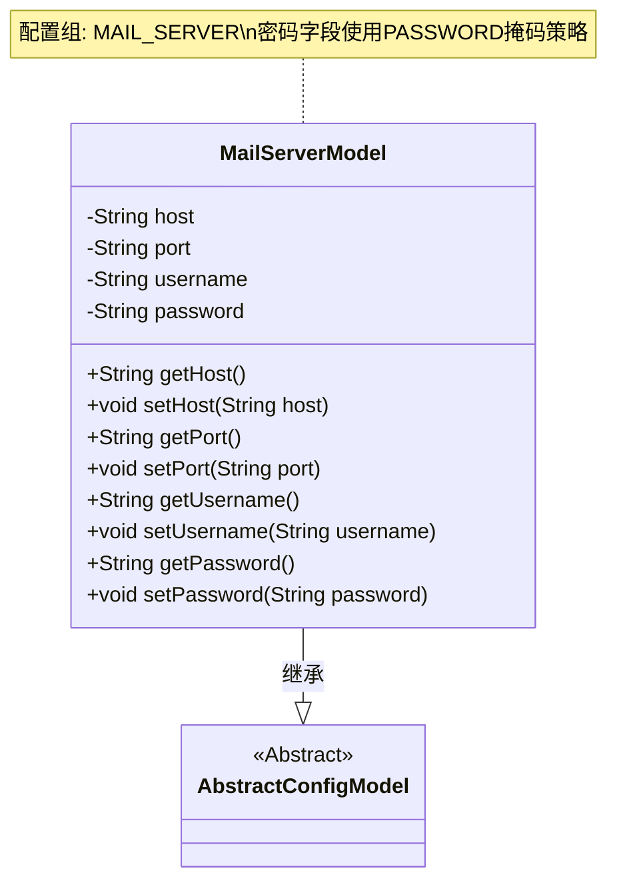
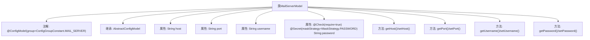

# 基础信息

|      |      |
|------|------|
| 名称 | MailServerModel |
| 编码语言 | .java |
| 代码路径 | WeFe/serving/serving-service/src/main/java/com/welab/wefe/serving/service/dto/globalconfig/MailServerModel.java |
| 包名 | com.welab.wefe.serving.service.dto.globalconfig |
| 依赖项 | ['com.welab.wefe.common.fieldvalidate.annotation.Check', 'com.welab.wefe.common.fieldvalidate.secret.MaskStrategy', 'com.welab.wefe.common.fieldvalidate.secret.Secret', 'com.welab.wefe.serving.service.dto.globalconfig.base.AbstractConfigModel', 'com.welab.wefe.serving.service.dto.globalconfig.base.ConfigGroupConstant', 'com.welab.wefe.serving.service.dto.globalconfig.base.ConfigModel'] |
| 概述说明 | 邮件服务器配置类，包含主机、端口、用户名和密码字段，密码需加密且必填。 |

# 说明

这是一个名为MailServerModel的配置模型类，属于邮件服务器配置组。类中包含四个关键属性：host表示服务器地址，port表示端口号，username表示用户名，password表示密码。其中password字段被标记为必填项，并采用密码掩码策略进行敏感信息保护。类提供了标准的getter和setter方法用于属性访问和修改。该类继承自AbstractConfigModel基类，表明它是一个配置模型。

# 类列表 Class Summary

| 名称   | 类型  | 说明 |
|-------|------|-------------|
| MailServerModel | class | 邮件服务器配置类，包含主机、端口、用户名和密码字段，密码需校验且加密存储。 |

## 类 MailServerModel

|      |      |
|------|------|
| 访问范围 | @ConfigModel(group = ConfigGroupConstant.MAIL_SERVER);public |
| 类型 | class |
| 名称 | MailServerModel |
| 说明 | 邮件服务器配置类，包含主机、端口、用户名和密码字段，密码需校验且加密存储。 |

### UML类图

这段代码展示了一个邮件服务器配置模型类MailServerModel，继承自抽象配置基类AbstractConfigModel。该类包含host、port、username和password四个私有字段，其中password字段通过@Secret注解标记为敏感数据（采用密码掩码策略），并通过@Check注解标记为必填项。所有字段都提供了标准的getter/setter方法，符合JavaBean规范。类级别的@ConfigModel注解指定了该配置属于MAIL_SERVER组。

### 内部方法调用关系图

这段代码定义了一个邮件服务器配置模型类MailServerModel，继承自AbstractConfigModel。类中包含host、port、username和password四个属性，其中password属性带有@Check和@Secret注解用于验证和脱敏处理。每个属性都有对应的getter和setter方法。该模型通过@ConfigModel注解标记为邮件服务器配置组，用于集中管理邮件服务相关的配置参数。

### 字段列表 Field List

| 名称  | 类型  | 说明 |
|-------|-------|------|
| host | String | 声明一个私有字符串变量host。 |
| port | String | 声明一个私有字符串变量port。 |
| username | String | 声明一个私有字符串变量username。 |
| password | String | 字段password必须校验，需掩码处理策略为密码类型。 |

### 方法列表

| 名称  | 类型  | 说明 |
|-------|-------|------|
| getPort | String | 获取端口号的方法，直接返回port变量值。 |
| setHost | void | 设置主机地址的方法，将输入参数赋值给类的host变量。 |
| getHost | String | 获取主机地址的方法，返回字符串类型的host变量。 |
| setPort | void | 设置端口值的方法，将输入字符串赋值给类变量port。 |
| getUsername | String | 获取用户名字符串的方法。 |
| setUsername | void | 这是一个Java方法，用于设置类的username属性，接收一个字符串参数并赋值给成员变量。 |
| getPassword | String | 这是一个Java方法，返回字符串类型的password变量值。 |
| setPassword | void | 设置密码方法，将输入字符串赋值给类成员变量password。 |

