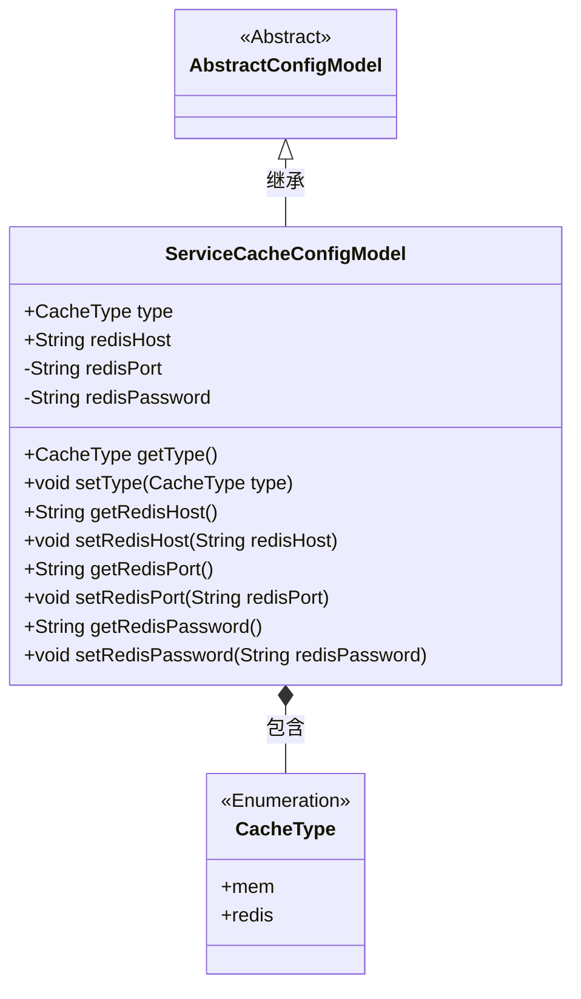
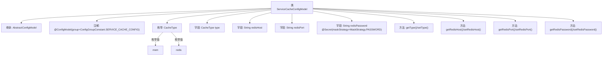

# 基础信息

|      |      |
|------|------|
| 名称 | ServiceCacheConfigModel |
| 编码语言 | .java |
| 代码路径 | WeFe/serving/serving-service/src/main/java/com/welab/wefe/serving/service/dto/globalconfig/ServiceCacheConfigModel.java |
| 包名 | com.welab.wefe.serving.service.dto.globalconfig |
| 依赖项 | ['com.welab.wefe.common.fieldvalidate.secret.MaskStrategy', 'com.welab.wefe.common.fieldvalidate.secret.Secret', 'com.welab.wefe.serving.service.dto.globalconfig.base.AbstractConfigModel', 'com.welab.wefe.serving.service.dto.globalconfig.base.ConfigGroupConstant', 'com.welab.wefe.serving.service.dto.globalconfig.base.ConfigModel'] |
| 概述说明 | 服务缓存配置类，包含缓存类型（内存或Redis）、Redis主机、端口及密码（加密）。提供各字段的getter和setter方法。 |

# 说明

该内容描述了一个名为ServiceCacheConfigModel的Java配置类，继承自AbstractConfigModel，用于定义服务缓存配置。类中包含缓存类型枚举CacheType（mem和redis），以及redis相关配置项：主机地址redisHost、端口redisPort和密码redisPassword。密码字段使用@Secret注解标记为敏感信息，采用密码掩码策略。类提供了各字段的getter和setter方法，并通过@ConfigModel注解指定了配置分组为SERVICE_CACHE_CONFIG。

# 类列表 Class Summary

| 名称   | 类型  | 说明 |
|-------|------|-------------|
| ServiceCacheConfigModel | class | 服务缓存配置类，支持内存和Redis两种类型，包含Redis主机、端口和密码字段，密码字段加密处理。 |

## 类 ServiceCacheConfigModel

|      |      |
|------|------|
| 访问范围 | @ConfigModel(group = ConfigGroupConstant.SERVICE_CACHE_CONFIG);public |
| 类型 | class |
| 名称 | ServiceCacheConfigModel |
| 说明 | 服务缓存配置类，支持内存和Redis两种类型，包含Redis主机、端口和密码字段，密码字段加密处理。 |

### UML类图

这段代码定义了一个服务缓存配置模型ServiceCacheConfigModel，继承自抽象配置类AbstractConfigModel。该类包含缓存类型枚举CacheType（支持mem和redis两种类型）以及Redis连接相关的配置项（主机、端口、密码）。其中redisPassword字段使用了@Secret注解进行敏感信息脱敏处理。类图清晰地展示了继承关系和组合关系，体现了配置模型的核心数据结构。

### 内部方法调用关系图

该流程图展示了ServiceCacheConfigModel类的完整结构，包括继承关系、配置注解、枚举定义、字段声明和方法组成。核心是描述缓存服务的配置模型，包含Redis连接参数（主机、端口、加密密码）和缓存类型枚举（内存/Redis），所有字段都配有getter/setter方法。特别注意redisPassword字段使用了安全掩码注解，体现了敏感信息处理的设计考量。

### 字段列表 Field List

| 名称  | 类型  | 说明 |
|-------|-------|------|
| type | CacheType | 缓存类型字段。 |
| redisPassword | String | 私有字符串redisPassword，使用密码掩码策略进行保密。 |
| redisHost | String | 声明一个公共字符串变量redisHost，用于存储Redis主机地址。 |
| redisPort | String | 声明私有字符串变量redisPort |

### 方法列表

| 名称  | 类型  | 说明 |
|-------|-------|------|
| setType | void | 设置缓存类型的方法，将参数type赋值给当前对象的type属性。 |
| getRedisPort | String | 获取Redis端口的方法，返回redisPort字符串。 |
| getType | CacheType | 方法返回CacheType类型的对象type。 |
| setRedisHost | void | 设置Redis主机地址的方法，参数为redisHost。 |
| getRedisHost | String | 获取Redis主机地址的方法。 |
| setRedisPort | void | 设置Redis端口的方法，将输入参数赋值给类的redisPort成员变量。 |
| getRedisPassword | String | 获取Redis密码的方法，返回字符串类型的密码值。 |
| setRedisPassword | void | 设置Redis密码的方法，将输入参数赋值给类成员变量redisPassword。 |

