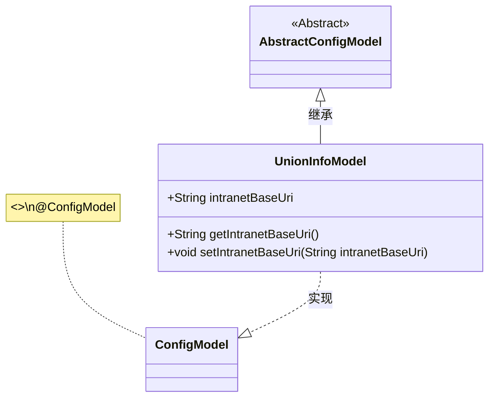
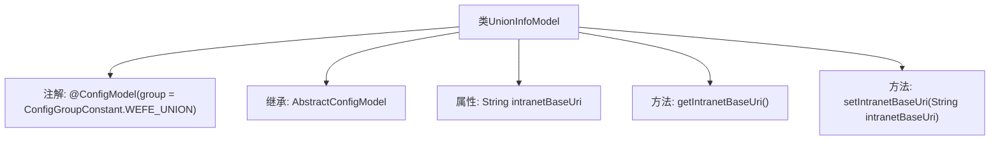

# 基础信息

|      |      |
|------|------|
| 名称 | UnionInfoModel |
| 编码语言 | .java |
| 代码路径 | WeFe/serving/serving-service/src/main/java/com/welab/wefe/serving/service/dto/globalconfig/UnionInfoModel.java |
| 包名 | com.welab.wefe.serving.service.dto.globalconfig |
| 依赖项 | ['com.welab.wefe.serving.service.dto.globalconfig.base.AbstractConfigModel', 'com.welab.wefe.serving.service.dto.globalconfig.base.ConfigGroupConstant', 'com.welab.wefe.serving.service.dto.globalconfig.base.ConfigModel'] |
| 概述说明 | UnionInfoModel类，配置组为WEFE_UNION，包含内网基础URL属性intranetBaseUri及其getter/setter方法。 |

# 说明

该代码定义了一个名为UnionInfoModel的配置模型类，继承自AbstractConfigModel。类上标注了@ConfigModel注解，指定配置组为WEFE_UNION。类中包含一个字符串类型字段intranetBaseUri，用于存储联盟服务内网基础URL，并提供了对应的getter和setter方法。该模型用于管理联盟服务的配置信息。

# 类列表 Class Summary

| 名称   | 类型  | 说明 |
|-------|------|-------------|
| UnionInfoModel | class | UnionInfoModel配置类，包含内网基础URI的getter/setter方法，属于WEFE_UNION组。 |

## 类 UnionInfoModel

|      |      |
|------|------|
| 访问范围 | @ConfigModel(group = ConfigGroupConstant.WEFE_UNION);public |
| 类型 | class |
| 名称 | UnionInfoModel |
| 说明 | UnionInfoModel配置类，包含内网基础URI的getter/setter方法，属于WEFE_UNION组。 |

### UML类图

这段类图展示了UnionInfoModel继承自AbstractConfigModel抽象类，并实现了ConfigModel接口（通过@ConfigModel注解标记）。UnionInfoModel包含一个公有字符串字段intranetBaseUri及其getter/setter方法，用于管理内网基础URI的配置信息。该模型属于WEFE_UNION配置组，体现了Java配置模型的典型实现方式。

### 内部方法调用关系图

这段代码定义了一个名为UnionInfoModel的配置模型类，继承自AbstractConfigModel，并标注了@ConfigModel注解指定配置组。类中包含一个字符串属性intranetBaseUri用于存储内网基础URL，以及对应的getter和setter方法。该设计用于集中管理联盟服务的网络配置，通过标准访问方法确保数据封装性。

### 字段列表 Field List

| 名称  | 类型  | 说明 |
|-------|-------|------|
| intranetBaseUri | String | 声明一个公共字符串变量intranetBaseUri，用于存储内网基础URI。 |

### 方法列表

| 名称  | 类型  | 说明 |
|-------|-------|------|
| getIntranetBaseUri | String | 该方法返回私有成员变量intranetBaseUri的字符串值。 |
| setIntranetBaseUri | void | 设置内网基础URI的方法，参数为字符串intranetBaseUri。 |

