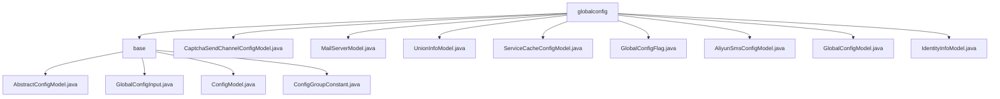

# 基础信息

|      |      |
|------|------|
| 名称 | globalconfig |
| 编码语言 | .java |
| 代码路径 | WeFe/serving/serving-service/src/main/java/com/welab/wefe/serving/service/dto/globalconfig |
| 包名 | docs.serving.serving-service.src.main.java.com.welab.wefe.serving.service.dto.globalconfig |
| 概述说明 | 该模块实现注解驱动的全局配置管理，通过静态Map存储配置类，支持分组检索。包含短信、邮件、缓存等配置模型类，各模型继承AbstractConfigModel并标注分组。核心功能为配置注册与查询，依赖反射工具实现自动加载。 |

# 说明

## 概述  
该模块实现注解驱动的全局配置管理，核心职责是自动收集并分类管理各类配置模型，提供分组检索能力。接口规范包括getModelClass(group)和getModelClasses()方法，关键数据结构涵盖MODEL_CLASSES映射表、GlobalConfigInput DTO及ConfigGroupConstant分组常量。外部依赖仅需ReflectionsUtil反射工具。例如，@ConfigModel标记的MailServerModel会自动注册到邮件服务器组。

## 主要业务场景  
模块采用类似服务注册中心模式，业务流程包括配置注册、分组查询和值传递。典型交互通过注解绑定配置组（如ALIYUN_SMS_CONFIG），配合常量类实现类型安全访问。功能覆盖短信、邮件、缓存等场景，例如通过IdentityInfoModel管理身份信息，或ServiceCacheConfigModel配置Redis参数。API类型聚焦配置检索，集成案例表现为AliyunSmsConfigModel与验证码发送服务的协同。

### 包内部结构视图

该流程图展示了globalconfig目录下的层级结构，包含一个base子目录和多个配置文件。base目录下又包含4个抽象配置类文件，globalconfig根目录下则包含8个具体配置模型文件，整体呈现清晰的树状结构，反映了配置管理模块的文件组织方式。

# 文件列表

| 名称   | 类型  | 说明 |
|-------|------|-------------|
| [CaptchaSendChannelConfigModel.java](CaptchaSendChannelConfigModel.md) | file | 配置类CaptchaSendChannelConfigModel定义了找回密码验证码发送通道，默认使用email渠道。 |
| [MailServerModel.java](MailServerModel.md) | file | 邮件服务器配置类，包含主机、端口、用户名和密码字段，密码需加密且必填。 |
| [UnionInfoModel.java](UnionInfoModel.md) | file | UnionInfoModel类，配置组为WEFE_UNION，包含内网基础URL属性intranetBaseUri及其getter/setter方法。 |
| [ServiceCacheConfigModel.java](ServiceCacheConfigModel.md) | file | 服务缓存配置类，包含缓存类型（内存或Redis）、Redis主机、端口及密码（加密）。提供各字段的getter和setter方法。 |
| [GlobalConfigFlag.java](GlobalConfigFlag.md) | file | GlobalConfigFlag是一个空的公共类，可能用于全局配置标记。 |
| [AliyunSmsConfigModel.java](AliyunSmsConfigModel.md) | file | 阿里云短信配置类，包含必填的密钥ID、加密密钥、短信签名及找回密码模板码。 |
| [GlobalConfigModel.java](GlobalConfigModel.md) | file | GlobalConfigModel类包含内网服务地址和注册账号需审核的布尔配置项。 |
| [IdentityInfoModel.java](IdentityInfoModel.md) | file | IdentityInfoModel类存储身份信息，包含成员ID、名称、邮箱、URL、头像、RSA密钥、系统模式和密钥类型等字段。 |
| [base](base/_module.md) | package | AbstractConfigModel是继承AbstractCheckModel的抽象类，通过反射获取带ConfigModel注解的类并按group存储。GlobalConfigInput封装全局配置输入信息。ConfigModel是运行时注解，用于标记配置类。ConfigGroupConstant定义配置组常量。 |

