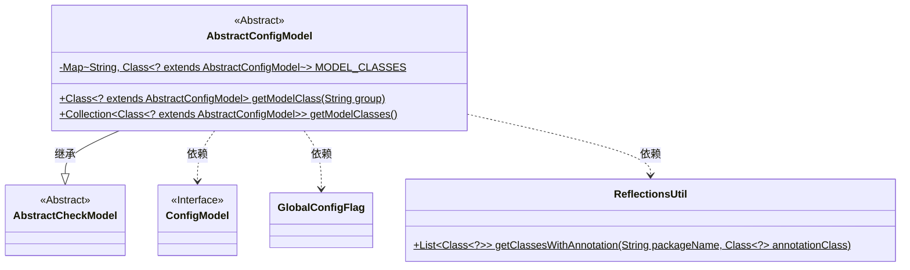
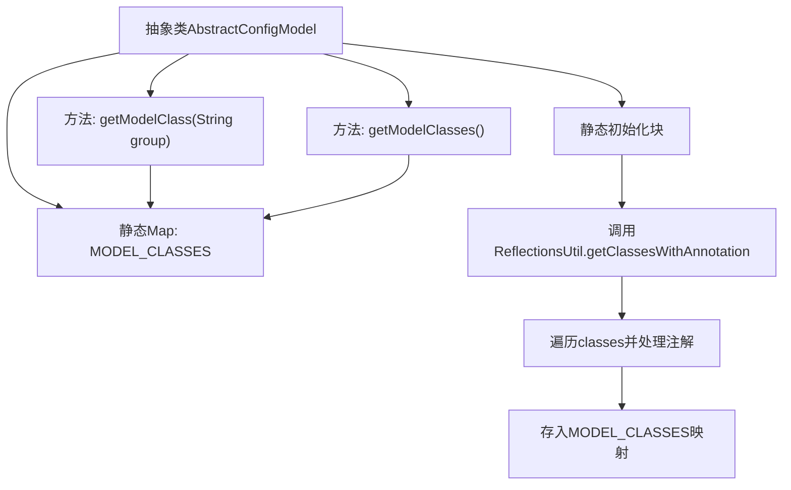

# 基础信息

|      |      |
|------|------|
| 名称 | AbstractConfigModel |
| 编码语言 | .java |
| 代码路径 | WeFe/serving/serving-service/src/main/java/com/welab/wefe/serving/service/dto/globalconfig/base/AbstractConfigModel.java |
| 包名 | com.welab.wefe.serving.service.dto.globalconfig.base |
| 依赖项 | ['com.welab.wefe.common.fieldvalidate.AbstractCheckModel', 'com.welab.wefe.common.util.ReflectionsUtil', 'com.welab.wefe.serving.service.dto.globalconfig.GlobalConfigFlag', 'java.util.Collection', 'java.util.HashMap', 'java.util.List', 'java.util.Map'] |
| 概述说明 | 抽象类AbstractConfigModel继承AbstractCheckModel，通过反射收集带ConfigModel注解的类并存入静态Map，提供按组名或全部获取模型类的方法。 |

# 说明

AbstractConfigModel是一个抽象类，继承自AbstractCheckModel。它使用静态代码块通过反射获取带有ConfigModel注解的类，并将这些类按注解中的group值存储在静态Map MODEL_CLASSES中。提供了两个静态方法：getModelClass根据group获取对应的类，getModelClasses返回所有配置模型类。整个过程利用了反射工具类ReflectionsUtil和自定义注解ConfigModel、GlobalConfigFlag。

# 类列表 Class Summary

| 名称   | 类型  | 说明 |
|-------|------|-------------|
| AbstractConfigModel | class | 抽象类AbstractConfigModel继承AbstractCheckModel，通过反射获取带ConfigModel注解的类并缓存到静态Map，提供按组名或全部获取模型类的方法。 |

## 类 AbstractConfigModel

|      |      |
|------|------|
| 访问范围 | public abstract |
| 类型 | class |
| 名称 | AbstractConfigModel |
| 说明 | 抽象类AbstractConfigModel继承AbstractCheckModel，通过反射获取带ConfigModel注解的类并缓存到静态Map，提供按组名或全部获取模型类的方法。 |

### UML类图

类图描述：
AbstractConfigModel是一个抽象类，继承自AbstractCheckModel，用于管理配置模型类。它通过静态初始化块使用ReflectionsUtil工具扫描带有ConfigModel注解的类，并按组别存储在MODEL_CLASSES静态Map中。提供两个静态方法分别用于按组获取模型类和获取所有模型类。该类依赖ConfigModel接口、GlobalConfigFlag类和ReflectionsUtil工具类。

### 内部方法调用关系图

这段代码流程图展示了AbstractConfigModel类的核心结构和工作流程。静态初始化块通过反射获取带有ConfigModel注解的类，并按照注解分组存储到MODEL_CLASSES映射中。类提供两个静态方法：getModelClass通过组名获取对应模型类，getModelClasses返回所有配置模型类集合。整个流程体现了配置模型的自动发现和分类管理机制，静态初始化确保在类加载时就完成注解类的扫描和注册。

### 字段列表 Field List

| 名称  | 类型  | 说明 |
|-------|-------|------|
| MODEL_CLASSES | Map<String, Class<? extends AbstractConfigModel>> | 私有静态映射，键为字符串，值为AbstractConfigModel的子类类型。 |

### 方法列表

| 名称  | 类型  | 说明 |
|-------|-------|------|
| getModelClass | Class<? extends AbstractConfigModel> | 该方法根据传入的组名返回对应的配置模型类，从预定义的映射表中查找。 |
| getModelClasses | Collection<Class<? extends AbstractConfigModel>> | 获取配置模型类的集合，返回存储的所有AbstractConfigModel子类。 |

