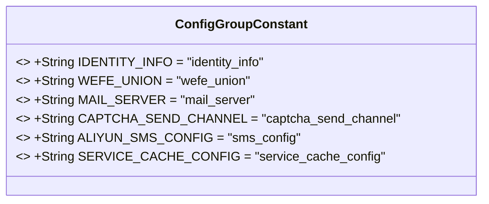
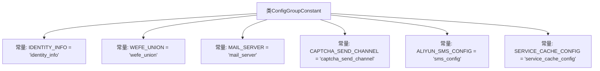

# 基础信息

|      |      |
|------|------|
| 名称 | ConfigGroupConstant |
| 编码语言 | .java |
| 代码路径 | WeFe/serving/serving-service/src/main/java/com/welab/wefe/serving/service/dto/globalconfig/base/ConfigGroupConstant.java |
| 包名 | com.welab.wefe.serving.service.dto.globalconfig.base |
| 依赖项 | [] |
| 概述说明 | ConfigGroupConstant类定义了系统设置的常量，包括身份信息、联盟配置、邮件服务器、验证码通道、短信配置和服务缓存配置。 |

# 说明

该代码定义了一个名为ConfigGroupConstant的公共类，包含多个静态常量字符串字段，用于表示系统配置组标识。主要字段包括身份信息、联盟设置、邮件服务器、验证码发送渠道、阿里云短信配置和服务缓存配置。这些常量用于统一管理系统配置的键名，便于代码维护和引用。

# 类列表 Class Summary

| 名称   | 类型  | 说明 |
|-------|------|-------------|
| ConfigGroupConstant | class | ConfigGroupConstant类定义了系统配置常量，包括身份信息、联盟、邮件服务器、验证码通道、短信配置和服务缓存配置。 |

## 类 ConfigGroupConstant

|      |      |
|------|------|
| 访问范围 | public |
| 类型 | class |
| 名称 | ConfigGroupConstant |
| 说明 | ConfigGroupConstant类定义了系统配置常量，包括身份信息、联盟、邮件服务器、验证码通道、短信配置和服务缓存配置。 |

### UML类图

该类图展示了一个常量配置类`ConfigGroupConstant`，包含6个公开静态不可修改的字符串常量，用于集中管理系统配置的分组标识。每个常量均以全大写命名并通过`final`修饰确保不可变性，常量值对应不同配置模块（如身份信息、邮件服务、短信验证等）。此类设计模式常用于统一维护系统配置键名，避免硬编码分散在代码各处。

### 内部方法调用关系图

该流程图展示了ConfigGroupConstant类中定义的6个公共静态常量字符串，这些常量用于集中管理系统配置的分组标识。每个常量通过箭头与类主体关联，表示它们属于类的成员变量。常量命名采用大写蛇形命名法，值均为小写字符串，用于标识不同系统模块（如身份信息、邮件服务、验证码通道等）的配置组键名。这种设计模式常用于配置中心的键值管理，提高代码可读性和维护性。

### 字段列表 Field List

| 名称  | 类型  | 说明 |
|-------|-------|------|
| WEFE_UNION = "wefe_union" | String | 定义了一个公共静态常量字符串WEFE_UNION，值为"wefe_union"。 |
| CAPTCHA_SEND_CHANNEL = "captcha_send_channel" | String | 定义静态常量CAPTCHA_SEND_CHANNEL，值为"captcha_send_channel"，用于标识验证码发送通道。 |
| MAIL_SERVER = "mail_server" | String | 定义常量字符串MAIL_SERVER，值为"mail_server"。 |
| IDENTITY_INFO = "identity_info" | String | 定义静态常量IDENTITY_INFO，值为"identity_info"。 |
| ALIYUN_SMS_CONFIG = "sms_config" | String | 定义了一个公共静态常量字符串ALIYUN_SMS_CONFIG，值为"sms_config"。 |
| SERVICE_CACHE_CONFIG = "service_cache_config" | String | 定义静态常量字符串SERVICE_CACHE_CONFIG，值为"service_cache_config"。 |

### 方法列表

| 名称  | 类型  | 说明 |
|-------|-------|------|

