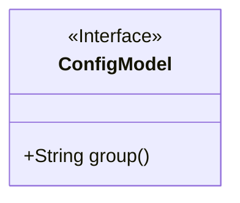
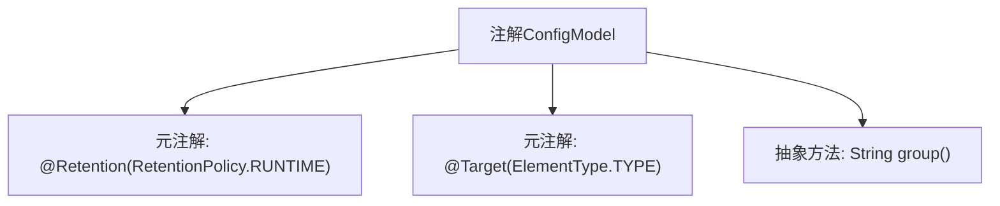

# 基础信息

|      |      |
|------|------|
| 名称 | ConfigModel |
| 编码语言 | .java |
| 代码路径 | WeFe/serving/serving-service/src/main/java/com/welab/wefe/serving/service/dto/globalconfig/base/ConfigModel.java |
| 包名 | com.welab.wefe.serving.service.dto.globalconfig.base |
| 依赖项 | ['java.lang.annotation.ElementType', 'java.lang.annotation.Retention', 'java.lang.annotation.RetentionPolicy', 'java.lang.annotation.Target'] |
| 概述说明 | Java注解ConfigModel，用于类级别，保留至运行时，需指定group参数。 |

# 说明

这是一个Java注解定义，名为ConfigModel。它使用元注解@Retention指定注解在运行时保留，通过@Target限定该注解只能用于类或接口上。注解包含一个名为group的字符串类型必填属性。该设计通常用于标记配置类，通过group属性实现配置分组管理。

# 类列表 Class Summary

| 名称   | 类型  | 说明 |
|-------|------|-------------|
| ConfigModel | annotation | Java注解ConfigModel，运行时保留，作用于类，需指定group属性。 |

## 类 ConfigModel

|      |      |
|------|------|
| 访问范围 | @Retention(RetentionPolicy.RUNTIME);@Target(ElementType.TYPE);public |
| 类型 | annotation |
| 名称 | ConfigModel |
| 说明 | Java注解ConfigModel，运行时保留，作用于类，需指定group属性。 |

### UML类图

这段代码定义了一个名为`ConfigModel`的运行时注解接口，该注解用于类级别（`ElementType.TYPE`），包含一个必须指定的`group`字符串属性。类图中将其表示为带有`<<Interface>>`标记的接口，其中公开方法`group()`对应注解的属性声明。这种设计通常用于标记配置类，通过反射机制在运行时获取分组信息。

### 内部方法调用关系图

该流程图展示了Java注解`ConfigModel`的结构定义。首先通过`@Retention`指定注解在运行时保留，`@Target`限定注解仅用于类/接口类型。核心是声明了一个名为`group`的抽象方法，作为该注解的唯一可配置属性。整个设计符合Java注解的基本语法规范，用于为类添加可运行时读取的配置分组标记。

### 字段列表 Field List

| 名称  | 类型  | 说明 |
|-------|-------|------|
| group | String | 获取当前字符串的分组名称。 |

### 方法列表

| 名称  | 类型  | 说明 |
|-------|-------|------|

