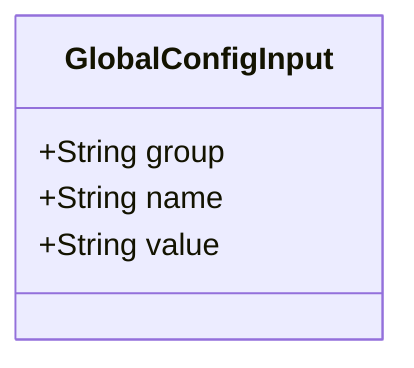
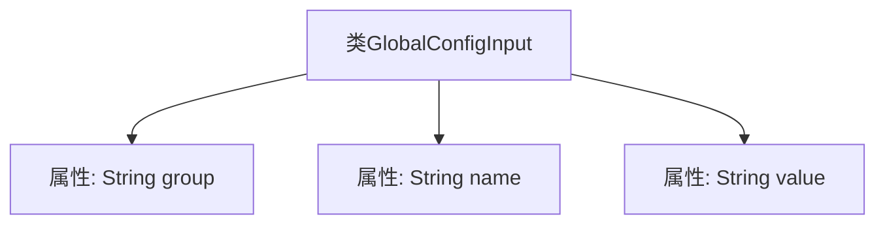

# 基础信息

|      |      |
|------|------|
| 名称 | GlobalConfigInput |
| 编码语言 | .java |
| 代码路径 | WeFe/serving/serving-service/src/main/java/com/welab/wefe/serving/service/dto/globalconfig/base/GlobalConfigInput.java |
| 包名 | com.welab.wefe.serving.service.dto.globalconfig.base |
| 依赖项 | [] |
| 概述说明 | GlobalConfigInput类包含三个字符串属性：group、name和value，用于配置项分组、名称和值。 |

# 说明

GlobalConfigInput是一个公共类，包含三个字符串类型的成员变量：group表示配置所属的组别，name表示配置项的名称，value存储配置的具体值。该类用于封装全局配置的输入信息。

# 类列表 Class Summary

| 名称   | 类型  | 说明 |
|-------|------|-------------|
| GlobalConfigInput | class | GlobalConfigInput类包含三个字符串属性：group、name和value，用于配置项分组、名称和值。 |

## 类 GlobalConfigInput

|      |      |
|------|------|
| 访问范围 | public |
| 类型 | class |
| 名称 | GlobalConfigInput |
| 说明 | GlobalConfigInput类包含三个字符串属性：group、name和value，用于配置项分组、名称和值。 |

### UML类图

这段类图描述了一个简单的配置输入类GlobalConfigInput，包含三个公有字符串类型字段：group表示配置分组，name表示配置项名称，value存储配置值。该类没有定义任何方法，仅作为数据载体使用，适用于存储全局配置信息的基本结构。由于所有字段均为公有且无封装逻辑，使用时需注意直接字段访问可能导致的数据一致性问题。

### 内部方法调用关系图

这段流程图描述了GlobalConfigInput类的结构，该类包含三个公共字符串属性：group、name和value。图中清晰地展示了类与属性之间的从属关系，每个属性都直接隶属于GlobalConfigInput类。由于该类仅包含属性定义而没有方法，因此流程图仅展示了属性层级的简单结构，没有涉及方法调用或逻辑流程。

### 字段列表 Field List

| 名称  | 类型  | 说明 |
|-------|-------|------|
| group | String | 定义了一个公共字符串变量group。 |
| name | String | 声明一个公共字符串变量name。 |
| value | String | 类中公开的字符串变量value。 |

### 方法列表

| 名称  | 类型  | 说明 |
|-------|-------|------|

