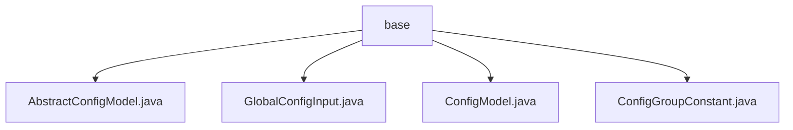

# 基础信息

|      |      |
|------|------|
| 名称 | base |
| 编码语言 | .java |
| 代码路径 | WeFe/serving/serving-service/src/main/java/com/welab/wefe/serving/service/dto/globalconfig/base |
| 包名 | docs.serving.serving-service.src.main.java.com.welab.wefe.serving.service.dto.globalconfig.base |
| 概述说明 | AbstractConfigModel是继承AbstractCheckModel的抽象类，通过反射获取带ConfigModel注解的类并按group存储。GlobalConfigInput封装全局配置输入信息。ConfigModel是运行时注解，用于标记配置类。ConfigGroupConstant定义配置组常量。 |

# 说明

## 概述  
该模块实现全局配置管理功能，核心职责是通过注解驱动机制自动收集配置模型类，并提供分组检索能力。接口规范包含静态方法getModelClass(group)和getModelClasses()，支持按组别获取配置类或全部配置类。关键数据结构包括存储配置类的静态Map MODEL_CLASSES、封装配置输入的GlobalConfigInput DTO以及分组常量类ConfigGroupConstant。外部依赖仅涉及反射工具类ReflectionsUtil。例如，ConfigModel注解标记的类会被自动加载到内存映射表中。

## 主要业务场景  
模块采用类似注册中心的模式管理分布式配置，业务流程涵盖配置类注册、分组查询和值传递。交互模式通过注解绑定配置组（如身份信息、邮件服务器等），配合常量类实现类型安全访问。典型应用包括动态加载不同业务域的配置模型，例如通过ConfigGroupConstant.ALIYUN_SMS获取短信配置组。API类型聚焦于配置检索，集成案例表现为GlobalConfigInput与注解驱动的配置模型协同工作。

### 包内部结构视图

该流程图展示了WeFe项目中globalconfig/base目录下的文件结构。base作为父节点，包含4个Java类文件：AbstractConfigModel.java、GlobalConfigInput.java、ConfigModel.java和ConfigGroupConstant.java。这些文件都属于全局配置模块的基础DTO类，层级关系清晰，没有子目录嵌套。

# 文件列表

| 名称   | 类型  | 说明 |
|-------|------|-------------|
| [AbstractConfigModel.java](AbstractConfigModel.md) | file | 抽象类AbstractConfigModel继承AbstractCheckModel，通过反射收集带ConfigModel注解的类并存入静态Map，提供按组名或全部获取模型类的方法。 |
| [GlobalConfigInput.java](GlobalConfigInput.md) | file | GlobalConfigInput类包含三个字符串属性：group、name和value，用于配置项分组、名称和值。 |
| [ConfigModel.java](ConfigModel.md) | file | Java注解ConfigModel，用于类级别，保留至运行时，需指定group参数。 |
| [ConfigGroupConstant.java](ConfigGroupConstant.md) | file | ConfigGroupConstant类定义了系统设置的常量，包括身份信息、联盟配置、邮件服务器、验证码通道、短信配置和服务缓存配置。 |

