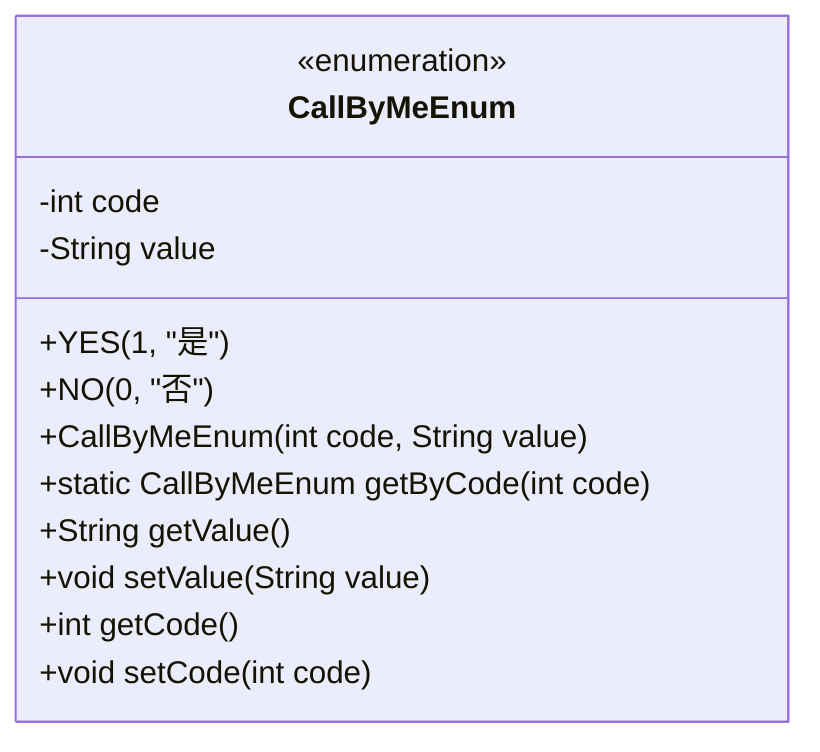
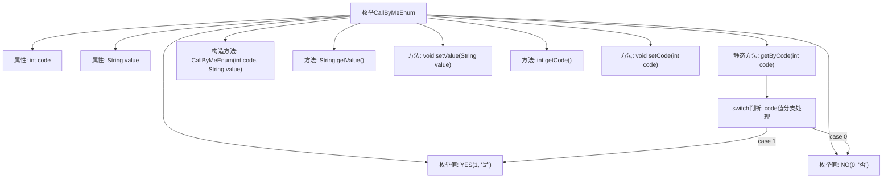

# 基础信息

|      |      |
|------|------|
| 名称 | CallByMeEnum |
| 编码语言 | .java |
| 代码路径 | WeFe/serving/serving-service/src/main/java/com/welab/wefe/serving/service/enums/CallByMeEnum.java |
| 包名 | com.welab.wefe.serving.service.enums |
| 依赖项 | [] |
| 概述说明 | 枚举类CallByMeEnum定义YES和NO两个枚举值，分别对应代码1和0，提供根据代码获取枚举值的方法，包含获取和设置代码及描述的功能。 |

# 说明

这是一个名为CallByMeEnum的枚举类，包含两个枚举值YES和NO，分别对应代码1和0，以及中文描述"是"和"否"。枚举类提供了通过代码获取对应枚举值的方法getByCode，以及获取和设置代码和描述值的getter和setter方法。构造函数用于初始化枚举值的代码和描述。

# 类列表 Class Summary

| 名称   | 类型  | 说明 |
|-------|------|-------------|
| CallByMeEnum | enum | 枚举类CallByMeEnum定义YES和NO两个枚举值，分别对应code1和0，提供根据code获取枚举值的方法，包含code和value的getter/setter。 |

## 类 CallByMeEnum

|      |      |
|------|------|
| 访问范围 | public |
| 类型 | enum |
| 名称 | CallByMeEnum |
| 说明 | 枚举类CallByMeEnum定义YES和NO两个枚举值，分别对应code1和0，提供根据code获取枚举值的方法，包含code和value的getter/setter。 |

### UML类图

该代码定义了一个枚举类型`CallByMeEnum`，包含两个枚举值`YES`和`NO`，分别对应代码1和0。枚举类提供了通过代码获取枚举值的方法`getByCode`，以及获取和设置代码和值的相关方法。枚举类常用于表示固定的常量集合，如状态、类型等。

### 内部方法调用关系图

该流程图展示了CallByMeEnum枚举的结构和逻辑流程。枚举包含YES/NO两个值，具有code/value属性和对应的getter/setter方法。核心是getByCode静态方法，通过switch语句根据输入code返回对应枚举实例。构造方法初始化枚举值，其他方法提供属性访问和修改能力。整体结构清晰，实现了枚举值与数字编码的双向映射功能。

### 字段列表 Field List

| 名称  | 类型  | 说明 |
|-------|-------|------|

### 方法列表

| 名称  | 类型  | 说明 |
|-------|-------|------|

