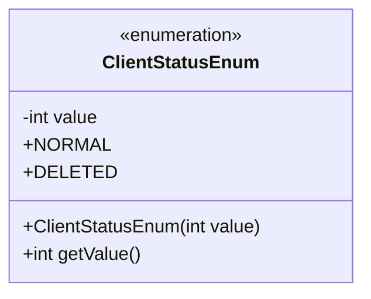
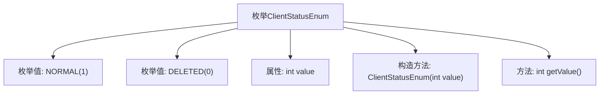

# 基础信息

|      |      |
|------|------|
| 名称 | ClientStatusEnum |
| 编码语言 | .java |
| 代码路径 | WeFe/serving/serving-service/src/main/java/com/welab/wefe/serving/service/enums/ClientStatusEnum.java |
| 包名 | com.welab.wefe.serving.service.enums |
| 依赖项 | [] |
| 概述说明 | 枚举ClientStatusEnum定义两种状态：NORMAL(1)和DELETED(0)，包含构造方法和获取值的getValue()方法。 |

# 说明

该代码定义了一个名为ClientStatusEnum的枚举类型，包含两个枚举常量：NORMAL和DELETED，分别对应整数值1和0。枚举类中定义了一个私有整型字段value，通过构造函数初始化该值，并提供了getValue方法用于获取枚举常量的数值。该枚举用于表示客户端状态，正常状态为1，删除状态为0。

# 类列表 Class Summary

| 名称   | 类型  | 说明 |
|-------|------|-------------|
| ClientStatusEnum | enum | 枚举类ClientStatusEnum定义两种状态：NORMAL(1)和DELETED(0)，包含私有字段value和获取方法getValue()。 |

## 类 ClientStatusEnum

|      |      |
|------|------|
| 访问范围 | public |
| 类型 | enum |
| 名称 | ClientStatusEnum |
| 说明 | 枚举类ClientStatusEnum定义两种状态：NORMAL(1)和DELETED(0)，包含私有字段value和获取方法getValue()。 |

### UML类图

这段代码定义了一个枚举类型`ClientStatusEnum`，包含两个枚举常量`NORMAL(1)`和`DELETED(0)`，每个枚举常量都有一个整型的`value`属性。枚举类提供了构造函数来初始化`value`，并包含一个公有方法`getValue()`用于获取枚举值。该枚举用于表示客户端状态，其中`NORMAL`对应值1表示正常状态，`DELETED`对应值0表示已删除状态。枚举类型通过私有字段和公有方法的封装实现了状态值的类型安全访问。

### 内部方法调用关系图

该流程图展示了ClientStatusEnum枚举的结构，包含两个枚举值NORMAL和DELETED，一个私有整型属性value，一个带参数的构造方法用于初始化枚举值，以及一个getValue()方法用于获取枚举值对应的数值。枚举通过构造方法将传入的数值绑定到每个枚举常量上，并通过getValue()方法提供外部访问。这种设计常用于需要将枚举与数据库存储值或业务逻辑代码映射的场景。

### 字段列表 Field List

| 名称  | 类型  | 说明 |
|-------|-------|------|

### 方法列表

| 名称  | 类型  | 说明 |
|-------|-------|------|

