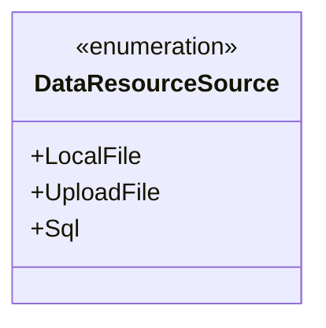
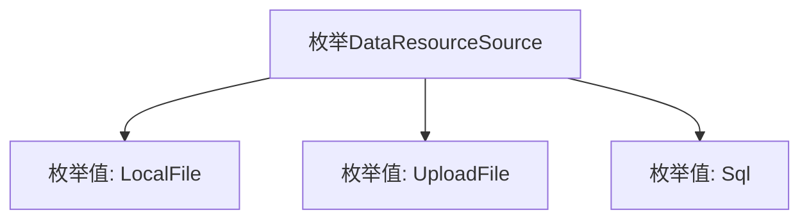

# 基础信息

|      |      |
|------|------|
| 名称 | DataResourceSource |
| 编码语言 | .java |
| 代码路径 | WeFe/serving/serving-service/src/main/java/com/welab/wefe/serving/service/enums/DataResourceSource.java |
| 包名 | com.welab.wefe.serving.service.enums |
| 依赖项 | [] |
| 概述说明 | 数据资源来源枚举：本地文件、上传文件、SQL。 |

# 说明

该内容定义了一个名为DataResourceSource的枚举类型，包含三个枚举值：LocalFile表示本地文件来源，UploadFile表示上传文件来源，Sql表示数据库来源。枚举类型用于限定数据资源的来源类型。

# 类列表 Class Summary

| 名称   | 类型  | 说明 |
|-------|------|-------------|
| DataResourceSource | enum | 枚举DataResourceSource定义三种数据源类型：本地文件、上传文件和SQL数据库。 |

## 类 DataResourceSource

|      |      |
|------|------|
| 访问范围 | public |
| 类型 | enum |
| 名称 | DataResourceSource |
| 说明 | 枚举DataResourceSource定义三种数据源类型：本地文件、上传文件和SQL数据库。 |

### UML类图

这段代码定义了一个名为DataResourceSource的枚举类型，包含三个枚举常量：LocalFile、UploadFile和Sql。枚举类型用于表示一组固定的常量值，这里可能用于标识数据来源的不同类型（本地文件、上传文件或SQL数据库）。该枚举结构简单明确，适合在需要区分不同数据源场景下使用，通过枚举值可以清晰地表达数据来源的类别。

### 内部方法调用关系图

该流程图展示了DataResourceSource枚举的结构，包含三个枚举值：LocalFile表示本地文件资源，UploadFile表示上传文件资源，Sql表示数据库资源。枚举类型通过固定常量值确保类型安全，常用于定义程序中有限的、预定义的选项集合，适用于资源来源的类型标识场景。

### 字段列表 Field List

| 名称  | 类型  | 说明 |
|-------|-------|------|

### 方法列表

| 名称  | 类型  | 说明 |
|-------|-------|------|

