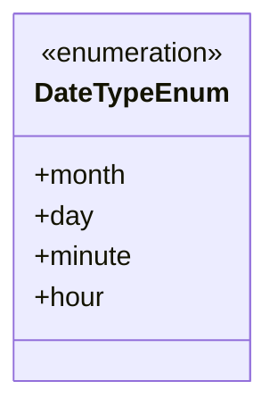
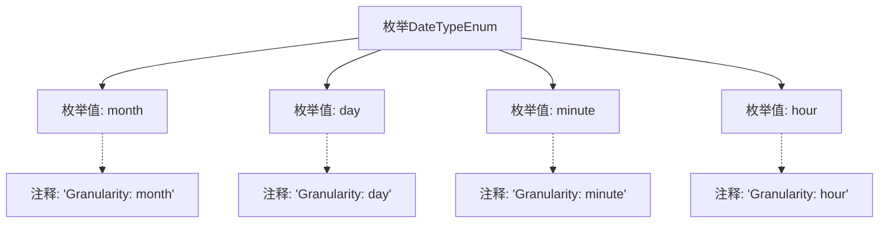

# 基础信息

|      |      |
|------|------|
| 名称 | DateTypeEnum |
| 编码语言 | .java |
| 代码路径 | WeFe/serving/serving-service/src/main/java/com/welab/wefe/serving/service/enums/DateTypeEnum.java |
| 包名 | com.welab.wefe.serving.service.enums |
| 依赖项 | [] |
| 概述说明 | 枚举DateTypeEnum定义日期粒度类型，包含month、day、hour、minute四种精度。 |

# 说明

该枚举定义了四种日期粒度类型，分别为月、日、小时和分钟。每种类型通过注释说明其时间精度，月对应月份粒度，日对应天粒度，小时对应小时粒度，分钟对应分钟粒度。该枚举用于表示不同精度的时间单位。

# 类列表 Class Summary

| 名称   | 类型  | 说明 |
|-------|------|-------------|
| DateTypeEnum | enum | 枚举DateTypeEnum定义了四种日期粒度类型：月、日、小时和分钟。 |

## 类 DateTypeEnum

|      |      |
|------|------|
| 访问范围 | public |
| 类型 | enum |
| 名称 | DateTypeEnum |
| 说明 | 枚举DateTypeEnum定义了四种日期粒度类型：月、日、小时和分钟。 |

### UML类图

这段代码定义了一个名为DateTypeEnum的枚举类型，包含四种时间粒度：month(月)、day(日)、minute(分钟)和hour(小时)。枚举类型在类图中用<<enumeration>>标记，每个枚举值都是该枚举类的公有静态实例。该枚举主要用于表示和区分不同的时间精度级别，适用于需要按不同时间粒度处理数据的场景，如日志记录、统计分析和时间序列数据处理等。

### 内部方法调用关系图

该流程图展示了DateTypeEnum枚举的结构，包含四个枚举值（month/day/minute/hour）及其对应的注释说明。每个枚举值通过虚线箭头关联到其粒度描述的注释，整体呈现了枚举定义与文档的对应关系。这种设计常用于表示时间粒度的分类场景。

### 字段列表 Field List

| 名称  | 类型  | 说明 |
|-------|-------|------|

### 方法列表

| 名称  | 类型  | 说明 |
|-------|-------|------|

