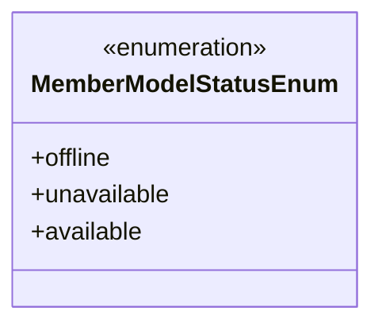
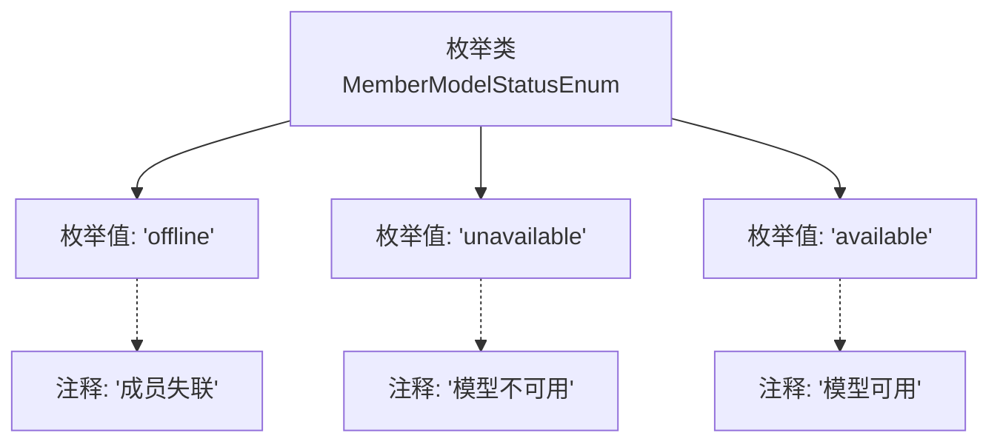

# 基础信息

|      |      |
|------|------|
| 名称 | MemberModelStatusEnum |
| 编码语言 | .java |
| 代码路径 | WeFe/serving/serving-service/src/main/java/com/welab/wefe/serving/service/enums/MemberModelStatusEnum.java |
| 包名 | com.welab.wefe.serving.service.enums |
| 依赖项 | [] |
| 概述说明 | 枚举定义成员模型状态：失联(offline)、不可用(unavailable)、可用(available)。 |

# 说明

这是一个枚举类型MemberModelStatusEnum，定义了三种成员模型状态。offline表示成员失联状态，unavailable表示模型不可用状态，available表示模型可用状态。每种状态都有对应的注释说明其含义。

# 类列表 Class Summary

| 名称   | 类型  | 说明 |
|-------|------|-------------|
| MemberModelStatusEnum | enum | 成员模型状态枚举：失联(offline)、不可用(unavailable)、可用(available)。 |

## 类 MemberModelStatusEnum

|      |      |
|------|------|
| 访问范围 | public |
| 类型 | enum |
| 名称 | MemberModelStatusEnum |
| 说明 | 成员模型状态枚举：失联(offline)、不可用(unavailable)、可用(available)。 |

### UML类图

该枚举类定义了成员模型状态的三种可能值：offline（成员失联）、unavailable（模型不可用）和available（模型可用）。通过枚举类型确保了状态值的类型安全，避免了魔法字符串的使用，同时通过注释清晰地描述了每个枚举值的业务含义。这种设计常用于状态机、选项配置等需要固定值集合的场景，提高了代码的可读性和可维护性。

### 内部方法调用关系图

该流程图展示了MemberModelStatusEnum枚举类的结构，包含三个枚举值：offline（成员失联状态）、unavailable（模型不可用状态）和available（模型可用状态）。每个枚举值都通过虚线连接其对应的注释说明，清晰地呈现了状态枚举的定义和语义。这种设计常用于表示系统成员的模型状态机，适用于需要明确区分不同可用状态的业务场景。

### 字段列表 Field List

| 名称  | 类型  | 说明 |
|-------|-------|------|

### 方法列表

| 名称  | 类型  | 说明 |
|-------|-------|------|

