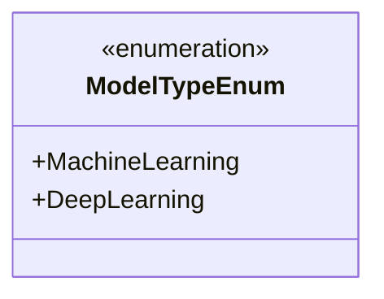
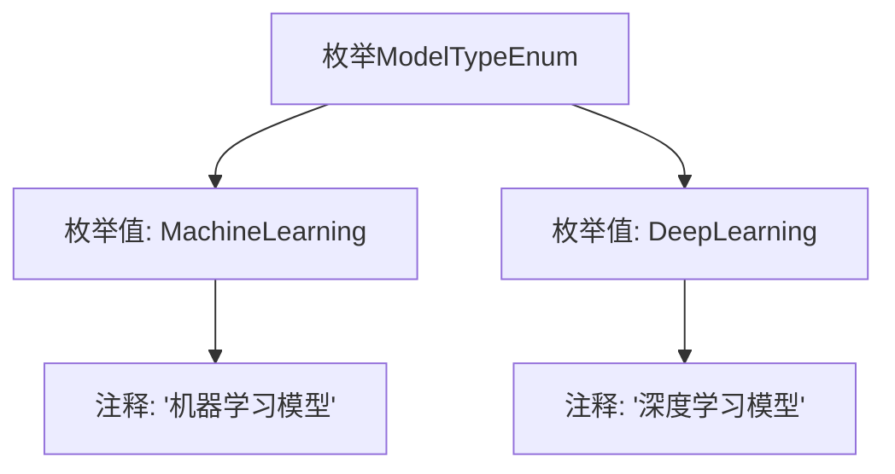

# 基础信息

|      |      |
|------|------|
| 名称 | ModelTypeEnum |
| 编码语言 | .java |
| 代码路径 | WeFe/serving/serving-service/src/main/java/com/welab/wefe/serving/service/enums/ModelTypeEnum.java |
| 包名 | com.welab.wefe.serving.service.enums |
| 依赖项 | [] |
| 概述说明 | 枚举定义两种模型类型：机器学习和深度学习。 |

# 说明

该内容定义了一个名为ModelTypeEnum的枚举类型，包含两个枚举值：MachineLearning表示机器学习模型，DeepLearning表示深度学习模型。枚举通过注释说明了每个值的具体含义。

# 类列表 Class Summary

| 名称   | 类型  | 说明 |
|-------|------|-------------|
| ModelTypeEnum | enum | 枚举定义两种模型类型：机器学习和深度学习。 |

## 类 ModelTypeEnum

|      |      |
|------|------|
| 访问范围 | public |
| 类型 | enum |
| 名称 | ModelTypeEnum |
| 说明 | 枚举定义两种模型类型：机器学习和深度学习。 |

### UML类图

这段代码定义了一个枚举类`ModelTypeEnum`，包含两个枚举常量：`MachineLearning`（机器学习模型）和`DeepLearning`（深度学习模型）。枚举类用于表示一组固定的常量值，这里区分了两种不同类型的模型。通过`<<enumeration>>`标记明确其枚举类型特性，公有枚举常量直接作为类成员列出，符合枚举类型的标准表示方式。

### 内部方法调用关系图

该流程图展示了ModelTypeEnum枚举的结构，包含两个枚举值MachineLearning和DeepLearning，每个枚举值都有对应的中文注释说明其类型。MachineLearning表示机器学习模型，DeepLearning表示深度学习模型。这种枚举设计常用于区分不同类型的模型，便于在代码中明确使用场景和类型检查。

### 字段列表 Field List

| 名称  | 类型  | 说明 |
|-------|-------|------|

### 方法列表

| 名称  | 类型  | 说明 |
|-------|-------|------|

