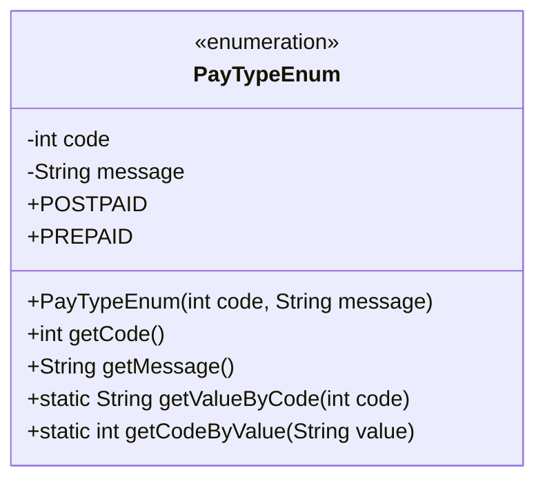
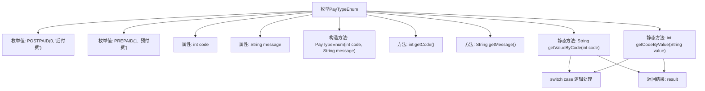

# 基础信息

|      |      |
|------|------|
| 名称 | PayTypeEnum |
| 编码语言 | .java |
| 代码路径 | WeFe/serving/serving-service/src/main/java/com/welab/wefe/serving/service/enums/PayTypeEnum.java |
| 包名 | com.welab.wefe.serving.service.enums |
| 依赖项 | [] |
| 概述说明 | 定义支付类型枚举，包含后付费和预付费两种类型，提供代码与描述相互转换的方法。 |

# 说明

该枚举类定义了两种支付类型：后付费和预付费。后付费对应代码0，预付费对应代码1。类中提供了获取代码和描述的方法，以及通过代码或描述查找对应值的方法。所有方法均为静态，可直接调用。

# 类列表 Class Summary

| 名称   | 类型  | 说明 |
|-------|------|-------------|
| PayTypeEnum | enum | 枚举类PayTypeEnum定义后付费和预付费两种支付类型，包含代码和描述，提供根据代码获取描述和根据描述获取代码的方法。 |

## 类 PayTypeEnum

|      |      |
|------|------|
| 访问范围 | public |
| 类型 | enum |
| 名称 | PayTypeEnum |
| 说明 | 枚举类PayTypeEnum定义后付费和预付费两种支付类型，包含代码和描述，提供根据代码获取描述和根据描述获取代码的方法。 |

### UML类图

这段代码定义了一个枚举类`PayTypeEnum`，用于表示支付类型，包含后付费(POSTPAID)和预付费(PREPAID)两种类型。枚举类中维护了code和message两个私有属性，分别表示支付类型的编码和描述信息。提供了获取code和message的方法，以及通过code获取message和通过message获取code的静态方法。枚举类通过构造函数初始化了两个枚举常量，每个常量都有对应的code和message值。

### 内部方法调用关系图

该流程图展示了PayTypeEnum枚举的结构和功能。枚举包含POSTPAID和PREPAID两个枚举值，每个枚举值有code和message属性。通过构造方法初始化这些属性，并提供getCode()和getMessage()方法获取属性值。静态方法getValueByCode()和getCodeByValue()分别通过switch-case逻辑实现code与message的相互转换，最终返回处理结果。整个设计实现了支付类型代码和描述的双向查询功能。

### 字段列表 Field List

| 名称  | 类型  | 说明 |
|-------|-------|------|

### 方法列表

| 名称  | 类型  | 说明 |
|-------|-------|------|

