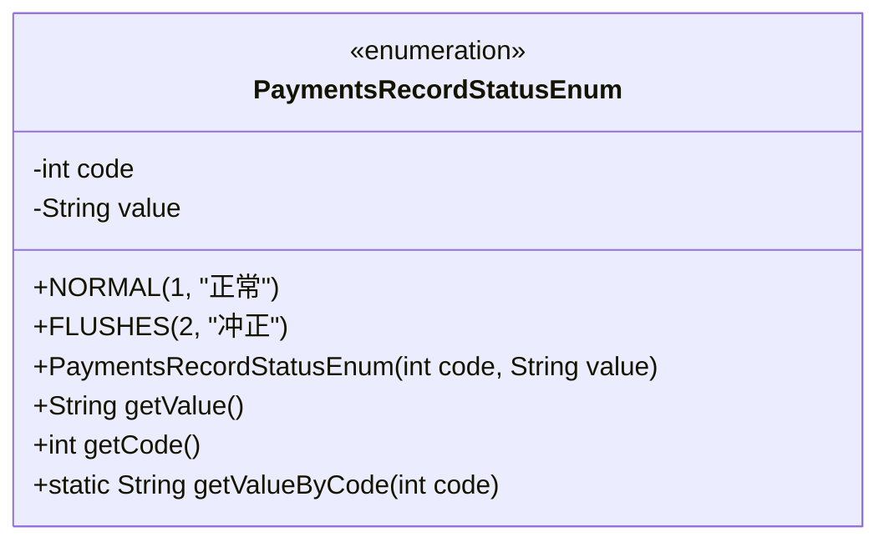
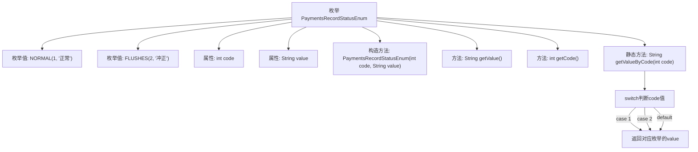

# 基础信息

|      |      |
|------|------|
| 名称 | PaymentsRecordStatusEnum |
| 编码语言 | .java |
| 代码路径 | WeFe/serving/serving-service/src/main/java/com/welab/wefe/serving/service/enums/PaymentsRecordStatusEnum.java |
| 包名 | com.welab.wefe.serving.service.enums |
| 依赖项 | [] |
| 概述说明 | 支付记录状态枚举类，包含正常和冲正两种状态，分别对应代码1和2，提供根据代码获取状态描述的方法。 |

# 说明

这是一个名为PaymentsRecordStatusEnum的枚举类，用于定义支付记录状态。它包含两个枚举值：NORMAL（正常）和FLUSHES（冲正），分别对应代码1和2。每个枚举值有code和value两个属性，通过构造函数初始化。类提供了getValue和getCode方法获取属性值，以及一个静态方法getValueByCode根据代码获取对应的value值。

# 类列表 Class Summary

| 名称   | 类型  | 说明 |
|-------|------|-------------|
| PaymentsRecordStatusEnum | enum | 支付记录状态枚举类，包含正常和冲正两种状态，分别对应代码1和2，提供根据代码获取状态值的方法。 |

## 类 PaymentsRecordStatusEnum

|      |      |
|------|------|
| 访问范围 | public |
| 类型 | enum |
| 名称 | PaymentsRecordStatusEnum |
| 说明 | 支付记录状态枚举类，包含正常和冲正两种状态，分别对应代码1和2，提供根据代码获取状态值的方法。 |

### UML类图

这段代码定义了一个枚举类`PaymentsRecordStatusEnum`，用于表示支付记录状态。枚举包含两个实例：`NORMAL`(正常)和`FLUSHES`(冲正)，每个实例都有对应的状态码(code)和描述值(value)。类提供了获取value和code的方法，以及一个静态方法`getValueByCode`用于根据状态码获取对应的描述值。枚举类通过私有构造函数初始化内部状态，封装了状态码和描述信息的映射关系。

### 内部方法调用关系图

该流程图展示了PaymentsRecordStatusEnum枚举的结构和功能。枚举包含两个实例NORMAL和FLUSHES，每个实例都有code和value属性。构造方法初始化这两个属性，getValue()和getCode()方法分别返回value和code。静态方法getValueByCode()通过switch语句根据输入的code返回对应的value值，流程图清晰地展示了从方法调用到结果返回的完整逻辑路径。

### 字段列表 Field List

| 名称  | 类型  | 说明 |
|-------|-------|------|

### 方法列表

| 名称  | 类型  | 说明 |
|-------|-------|------|

