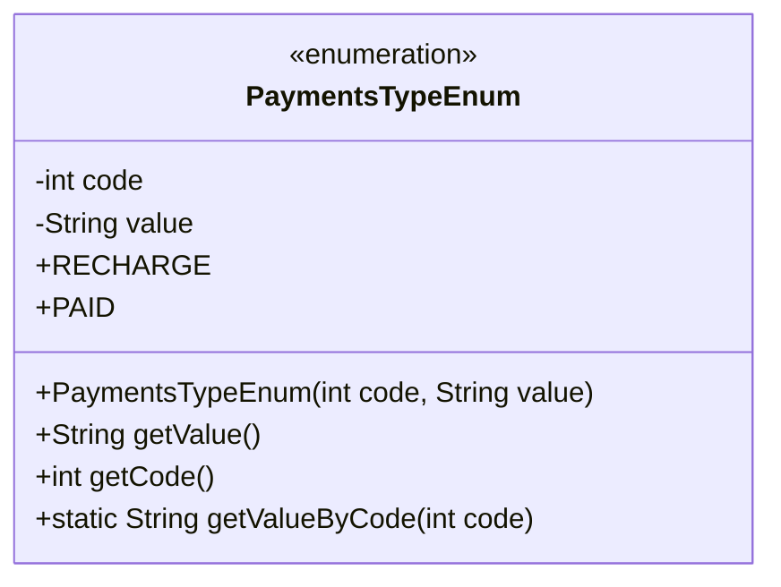
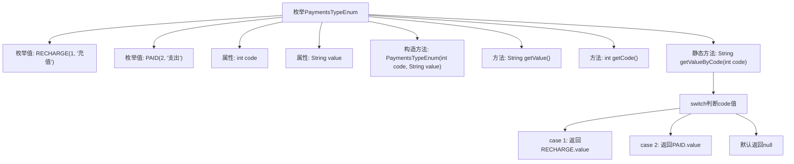

# 基础信息

|      |      |
|------|------|
| 名称 | PaymentsTypeEnum |
| 编码语言 | .java |
| 代码路径 | WeFe/serving/serving-service/src/main/java/com/welab/wefe/serving/service/enums/PaymentsTypeEnum.java |
| 包名 | com.welab.wefe.serving.service.enums |
| 依赖项 | [] |
| 概述说明 | 枚举类PaymentsTypeEnum定义支付类型，包含充值(RECHARGE)和支出(PAID)，提供代码和值映射及查询方法。 |

# 说明

这是一个名为PaymentsTypeEnum的枚举类，用于定义支付类型。它包含两个枚举常量：RECHARGE（充值）和PAID（支出），每个常量都有一个整型code和字符串value。类中提供了构造函数、获取value和code的方法，以及一个静态方法getValueByCode，该方法根据传入的code返回对应的value。当code为1时返回"充值"，code为2时返回"支出"，其他情况返回null。

# 类列表 Class Summary

| 名称   | 类型  | 说明 |
|-------|------|-------------|
| PaymentsTypeEnum | enum | 枚举类PaymentsTypeEnum定义支付类型，包含充值(RECHARGE)和支出(PAID)，提供code和value的获取方法及通过code获取value的功能。 |

## 类 PaymentsTypeEnum

|      |      |
|------|------|
| 访问范围 | public |
| 类型 | enum |
| 名称 | PaymentsTypeEnum |
| 说明 | 枚举类PaymentsTypeEnum定义支付类型，包含充值(RECHARGE)和支出(PAID)，提供code和value的获取方法及通过code获取value的功能。 |

### UML类图

该代码定义了一个枚举类`PaymentsTypeEnum`，包含两个枚举常量`RECHARGE`和`PAID`，分别表示充值和支出类型。每个枚举常量都有对应的`code`和`value`属性，通过构造函数初始化。类提供了获取`value`和`code`的方法，以及一个静态方法`getValueByCode`根据传入的`code`返回对应的`value`。枚举类适合表示固定的一组常量，代码简洁且类型安全。

### 内部方法调用关系图

该流程图展示了PaymentsTypeEnum枚举的结构和逻辑流程。枚举包含两个实例RECHARGE和PAID，每个实例有code和value属性，通过构造函数初始化。提供getValue()和getCode()方法获取属性值，静态方法getValueByCode()通过switch-case根据code返回对应的value值。流程图清晰呈现了枚举定义、属性访问和静态方法的分支逻辑，完整覆盖了代码的所有关键路径。

### 字段列表 Field List

| 名称  | 类型  | 说明 |
|-------|-------|------|

### 方法列表

| 名称  | 类型  | 说明 |
|-------|-------|------|

