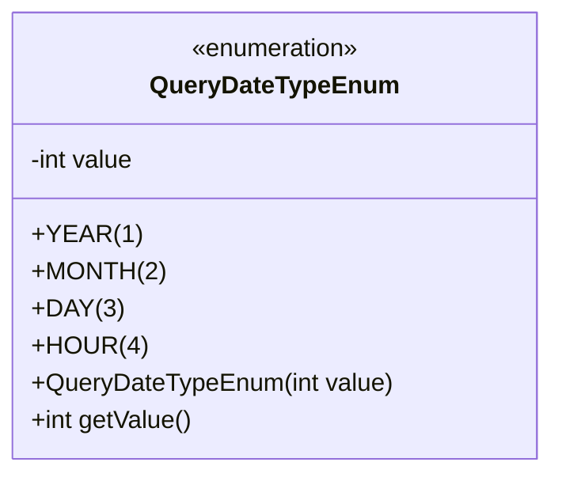
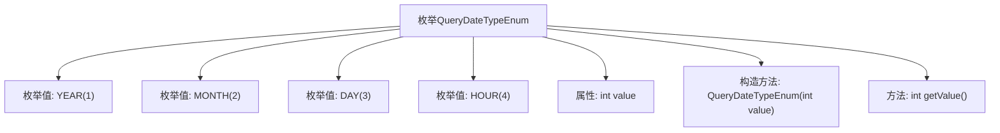

# 基础信息

|      |      |
|------|------|
| 名称 | QueryDateTypeEnum |
| 编码语言 | .java |
| 代码路径 | WeFe/serving/serving-service/src/main/java/com/welab/wefe/serving/service/enums/QueryDateTypeEnum.java |
| 包名 | com.welab.wefe.serving.service.enums |
| 依赖项 | [] |
| 概述说明 | 枚举类QueryDateTypeEnum定义了四种日期查询类型：YEAR(1)、MONTH(2)、DAY(3)、HOUR(4)，每个类型对应一个整数值，可通过getValue()方法获取。 |

# 说明

这是一个名为QueryDateTypeEnum的枚举类，定义了四种日期查询类型：YEAR（值为1）、MONTH（值为2）、DAY（值为3）和HOUR（值为4）。每个枚举常量都有一个对应的整数值，通过构造函数初始化，并提供了getValue方法来获取该值。这个枚举用于表示不同的时间粒度，便于在程序中进行日期相关的查询操作。

# 类列表 Class Summary

| 名称   | 类型  | 说明 |
|-------|------|-------------|
| QueryDateTypeEnum | enum | 枚举类QueryDateTypeEnum定义了四种日期查询类型：YEAR(1)、MONTH(2)、DAY(3)、HOUR(4)，每个枚举值对应一个整数值，可通过getValue()方法获取。 |

## 类 QueryDateTypeEnum

|      |      |
|------|------|
| 访问范围 | public |
| 类型 | enum |
| 名称 | QueryDateTypeEnum |
| 说明 | 枚举类QueryDateTypeEnum定义了四种日期查询类型：YEAR(1)、MONTH(2)、DAY(3)、HOUR(4)，每个枚举值对应一个整数值，可通过getValue()方法获取。 |

### UML类图

这段代码定义了一个名为`QueryDateTypeEnum`的枚举类型，包含四个预定义常量（YEAR、MONTH、DAY、HOUR），每个常量关联一个整数值。枚举类通过私有字段`value`存储数值，并通过构造函数初始化，提供公有方法`getValue()`获取数值。枚举类型用于表示固定的时间粒度类型，通过数值映射实现类型标识，适合在需要严格限定取值范围的场景中使用，如时间查询参数校验或数据库字段类型标记。

### 内部方法调用关系图

这段代码定义了一个名为QueryDateTypeEnum的枚举类型，包含YEAR、MONTH、DAY和HOUR四个枚举值，每个枚举值都有一个对应的整数值。枚举类包含一个私有属性value、一个构造方法用于初始化value，以及一个公有方法getValue()用于获取枚举值对应的整数值。该枚举用于表示不同的日期查询类型，每种类型通过整数值进行标识。

### 字段列表 Field List

| 名称  | 类型  | 说明 |
|-------|-------|------|

### 方法列表

| 名称  | 类型  | 说明 |
|-------|-------|------|

