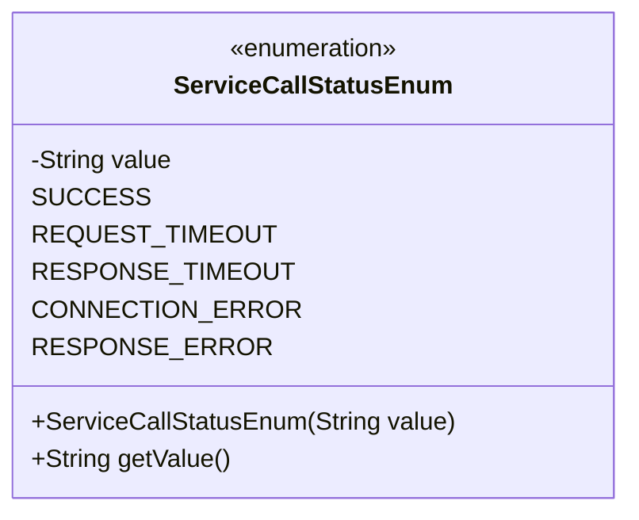
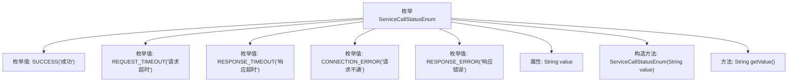

# 基础信息

|      |      |
|------|------|
| 名称 | ServiceCallStatusEnum |
| 编码语言 | .java |
| 代码路径 | WeFe/serving/serving-service/src/main/java/com/welab/wefe/serving/service/enums/ServiceCallStatusEnum.java |
| 包名 | com.welab.wefe.serving.service.enums |
| 依赖项 | [] |
| 概述说明 | 枚举类定义服务调用状态，包含成功、请求超时、响应超时、请求不通和响应错误五种状态，每种状态对应中文描述。 |

# 说明

这是一个名为ServiceCallStatusEnum的枚举类，定义了五种服务调用状态：成功、请求超时、响应超时、请求不通和响应错误。每个枚举值都关联了一个中文描述字符串，并通过构造函数初始化。类提供了getValue方法用于获取状态描述。该枚举用于表示服务调用的不同结果状态。

# 类列表 Class Summary

| 名称   | 类型  | 说明 |
|-------|------|-------------|
| ServiceCallStatusEnum | enum | 枚举类ServiceCallStatusEnum定义了服务调用的状态：成功、请求超时、响应超时、请求不通和响应错误，每个状态有对应的描述值。 |

## 类 ServiceCallStatusEnum

|      |      |
|------|------|
| 访问范围 | public |
| 类型 | enum |
| 名称 | ServiceCallStatusEnum |
| 说明 | 枚举类ServiceCallStatusEnum定义了服务调用的状态：成功、请求超时、响应超时、请求不通和响应错误，每个状态有对应的描述值。 |

### UML类图

这段类图描述了一个名为ServiceCallStatusEnum的枚举类，该类定义了五种服务调用状态（成功、请求超时、响应超时、请求不通和响应错误），每个枚举实例都关联了一个描述性字符串值。该类包含一个私有字段value用于存储状态描述，一个构造方法用于初始化该字段，以及一个公有方法getValue()用于获取状态描述。枚举类通过<<enumeration>>标记明确标识其类型。

### 内部方法调用关系图

该流程图展示了ServiceCallStatusEnum枚举的结构，包含5个预定义的枚举实例（SUCCESS、REQUEST_TIMEOUT等），每个实例通过构造方法初始化对应的中文描述。枚举类包含私有value属性和公开的getValue()方法，用于获取枚举值的描述文本。这种设计常用于标准化服务调用状态，通过枚举保证类型安全并提供可读的状态描述。

### 字段列表 Field List

| 名称  | 类型  | 说明 |
|-------|-------|------|

### 方法列表

| 名称  | 类型  | 说明 |
|-------|-------|------|

