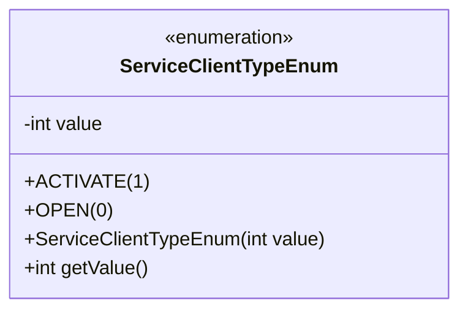
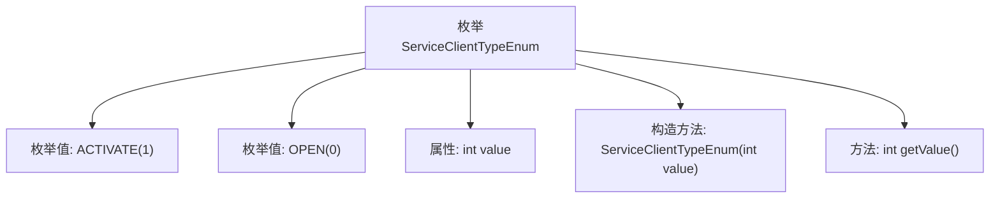

# 基础信息

|      |      |
|------|------|
| 名称 | ServiceClientTypeEnum |
| 编码语言 | .java |
| 代码路径 | WeFe/serving/serving-service/src/main/java/com/welab/wefe/serving/service/enums/ServiceClientTypeEnum.java |
| 包名 | com.welab.wefe.serving.service.enums |
| 依赖项 | [] |
| 概述说明 | 枚举ServiceClientTypeEnum定义两种服务客户端类型：ACTIVATE(1)和OPEN(0)，包含构造函数和获取值的方法。 |

# 说明

这是一个名为ServiceClientTypeEnum的Java枚举类，定义了两个枚举常量：ACTIVATE和OPEN。ACTIVATE对应的整数值为1，表示激活；OPEN对应的整数值为0，表示开通。枚举类包含一个私有整型字段value，通过构造函数初始化，并提供了getValue方法获取该值。这个枚举用于表示服务客户端的类型状态。

# 类列表 Class Summary

| 名称   | 类型  | 说明 |
|-------|------|-------------|
| ServiceClientTypeEnum | enum | 枚举ServiceClientTypeEnum定义两种服务类型：ACTIVATE(1)表示激活，OPEN(0)表示开通。包含构造函数和获取值的方法。 |

## 类 ServiceClientTypeEnum

|      |      |
|------|------|
| 访问范围 | public |
| 类型 | enum |
| 名称 | ServiceClientTypeEnum |
| 说明 | 枚举ServiceClientTypeEnum定义两种服务类型：ACTIVATE(1)表示激活，OPEN(0)表示开通。包含构造函数和获取值的方法。 |

### UML类图

这段代码定义了一个名为ServiceClientTypeEnum的枚举类型，包含ACTIVATE和OPEN两个枚举常量，分别对应整数值1和0。枚举类具有私有字段value存储数值，通过构造函数初始化，并提供getValue()方法获取数值。该设计常用于表示有限且固定的服务客户端类型，通过枚举值确保类型安全性和代码可读性。

### 内部方法调用关系图

这段代码定义了一个名为ServiceClientTypeEnum的枚举类型，包含ACTIVATE和OPEN两个枚举值，分别对应整数值1和0。枚举类具有私有属性value存储数值，通过构造方法初始化，并提供getValue()方法获取数值。流程图展示了枚举结构、属性、构造方法及成员方法的层级关系，体现了枚举值定义与内部实现的关联性。

### 字段列表 Field List

| 名称  | 类型  | 说明 |
|-------|-------|------|

### 方法列表

| 名称  | 类型  | 说明 |
|-------|-------|------|

