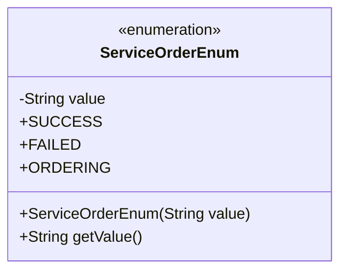
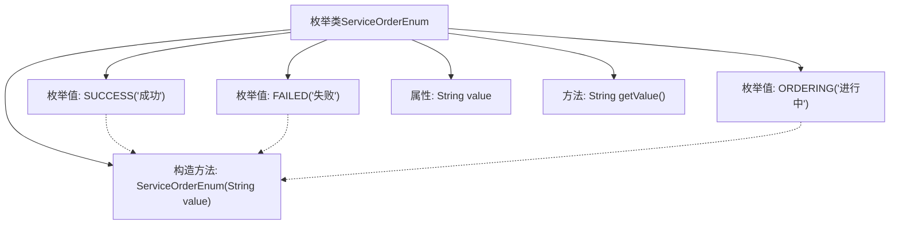

# 基础信息

|      |      |
|------|------|
| 名称 | ServiceOrderEnum |
| 编码语言 | .java |
| 代码路径 | WeFe/serving/serving-service/src/main/java/com/welab/wefe/serving/service/enums/ServiceOrderEnum.java |
| 包名 | com.welab.wefe.serving.service.enums |
| 依赖项 | [] |
| 概述说明 | 定义枚举类ServiceOrderEnum，包含三个状态：成功、失败、进行中，每个状态对应一个字符串值，可通过getValue方法获取。 |

# 说明

这是一个名为ServiceOrderEnum的枚举类，定义了三种服务订单状态：SUCCESS（成功）、FAILED（失败）和ORDERING（进行中）。每个枚举值都有一个对应的中文描述字符串，通过构造函数初始化，并提供了getValue方法获取描述值。该枚举用于表示服务订单的不同状态。

# 类列表 Class Summary

| 名称   | 类型  | 说明 |
|-------|------|-------------|
| ServiceOrderEnum | enum | ServiceOrderEnum枚举定义了三种订单状态：成功、失败、进行中，每种状态对应一个描述值。 |

## 类 ServiceOrderEnum

|      |      |
|------|------|
| 访问范围 | public |
| 类型 | enum |
| 名称 | ServiceOrderEnum |
| 说明 | ServiceOrderEnum枚举定义了三种订单状态：成功、失败、进行中，每种状态对应一个描述值。 |

### UML类图

这段类图描述了一个名为ServiceOrderEnum的枚举类型，其中包含三个枚举常量：SUCCESS（成功）、FAILED（失败）和ORDERING（进行中）。每个枚举常量都关联一个字符串值，通过私有字段value存储，并通过公有方法getValue()提供访问。枚举的构造函数为私有，用于初始化这些字符串值。该设计简洁地封装了服务订单状态及其描述信息，适用于需要明确限定状态值的场景。

### 内部方法调用关系图

该流程图展示了ServiceOrderEnum枚举类的结构，包含三个枚举值(SUCCESS/FAILED/ORDERING)、一个私有属性value、一个构造方法和一个getValue()方法。枚举值通过构造方法初始化，箭头表示类与成员之间的从属关系，虚线箭头表示枚举值对构造方法的隐式调用。

### 字段列表 Field List

| 名称  | 类型  | 说明 |
|-------|-------|------|

### 方法列表

| 名称  | 类型  | 说明 |
|-------|-------|------|

