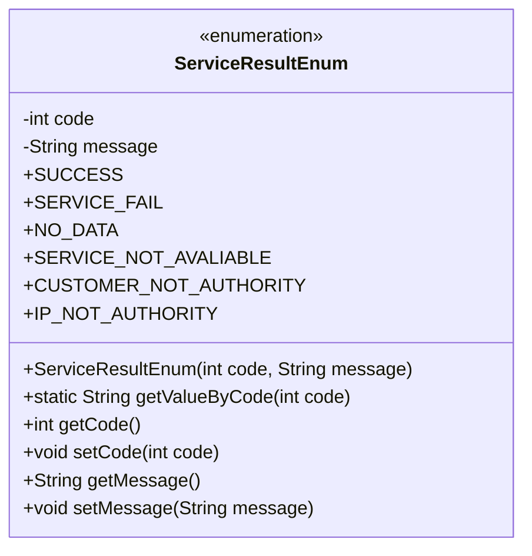
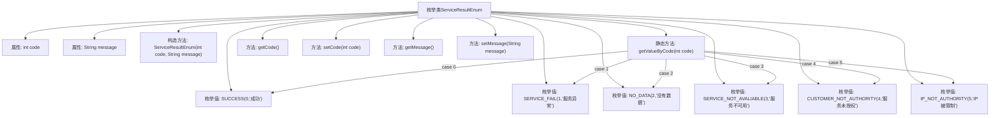

# 基础信息

|      |      |
|------|------|
| 名称 | ServiceResultEnum |
| 编码语言 | .java |
| 代码路径 | WeFe/serving/serving-service/src/main/java/com/welab/wefe/serving/service/enums/ServiceResultEnum.java |
| 包名 | com.welab.wefe.serving.service.enums |
| 依赖项 | [] |
| 概述说明 | ServiceResultEnum定义了6种服务结果状态码和消息，包括成功、服务异常、无数据等，提供根据状态码获取消息的方法。 |

# 说明

这是一个枚举类ServiceResultEnum，定义了6种服务结果状态码及其对应消息。状态码包括0成功、1服务异常、2没有数据、3服务不可用、4服务未授权、5IP被限制。类中包含构造方法初始化状态码和消息，提供getValueByCode方法通过状态码获取消息，以及各属性的getter和setter方法。

# 类列表 Class Summary

| 名称   | 类型  | 说明 |
|-------|------|-------------|
| ServiceResultEnum | enum | 定义服务结果枚举，包含6种状态码及对应消息：成功(0)、服务异常(1)、无数据(2)、服务不可用(3)、未授权(4)、IP限制(5)。提供通过状态码获取消息的方法。 |

## 类 ServiceResultEnum

|      |      |
|------|------|
| 访问范围 | public |
| 类型 | enum |
| 名称 | ServiceResultEnum |
| 说明 | 定义服务结果枚举，包含6种状态码及对应消息：成功(0)、服务异常(1)、无数据(2)、服务不可用(3)、未授权(4)、IP限制(5)。提供通过状态码获取消息的方法。 |

### UML类图

这段代码定义了一个名为`ServiceResultEnum`的枚举类，用于表示服务调用的各种结果状态。枚举包含6个预定义常量（如SUCCESS、SERVICE_FAIL等），每个常量关联一个状态码和描述信息。类提供了通过状态码获取描述信息的方法`getValueByCode()`，以及常规的getter/setter方法。枚举的构造器是私有的，用于初始化每个枚举常量的code和message字段。这个设计模式常用于标准化服务响应状态，便于统一处理不同业务场景下的结果反馈。

### 内部方法调用关系图

该流程图展示了ServiceResultEnum枚举类的完整结构，包含6个预定义枚举值、2个私有属性、1个构造方法和5个成员方法。核心逻辑体现在getValueByCode方法中，通过switch-case结构将数字编码映射到对应的枚举值描述信息。所有方法均围绕code和message两个核心属性展开，提供了标准的getter/setter方法，整体设计用于统一管理服务调用的结果状态码和描述信息。

### 字段列表 Field List

| 名称  | 类型  | 说明 |
|-------|-------|------|

### 方法列表

| 名称  | 类型  | 说明 |
|-------|-------|------|

