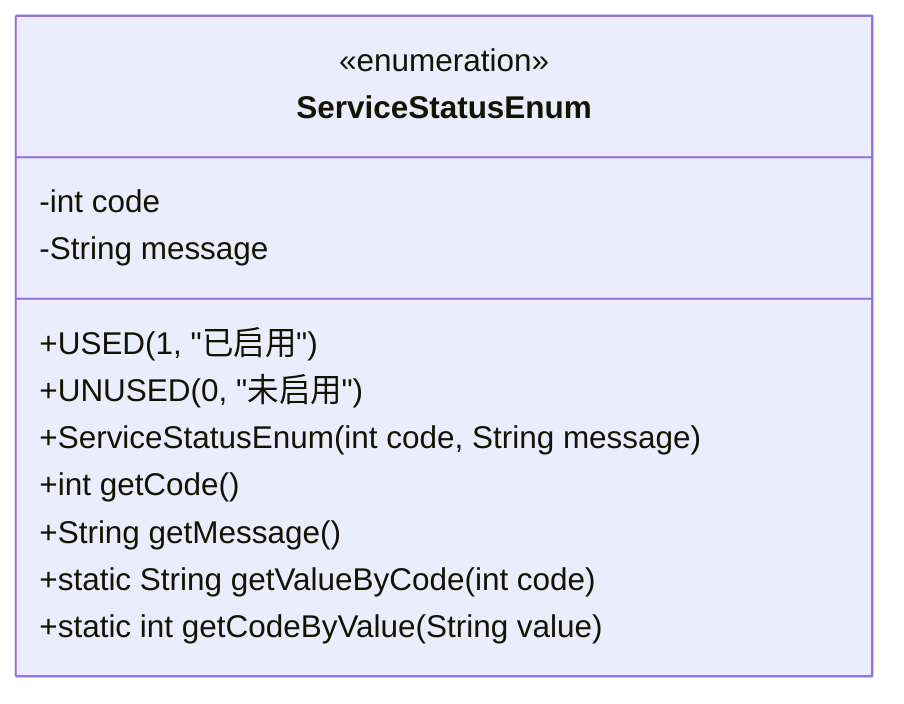
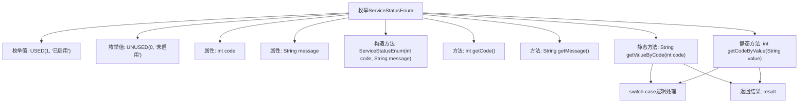

# 基础信息

|      |      |
|------|------|
| 名称 | ServiceStatusEnum |
| 编码语言 | .java |
| 代码路径 | WeFe/serving/serving-service/src/main/java/com/welab/wefe/serving/service/enums/ServiceStatusEnum.java |
| 包名 | com.welab.wefe.serving.service.enums |
| 依赖项 | [] |
| 概述说明 | 定义服务状态枚举，包含已启用和未启用两种状态，提供状态码和描述信息，支持通过码或描述互相查询。 |

# 说明

该枚举类定义了服务状态，包含已启用和未启用两种状态，分别对应代码1和0。提供了通过代码获取状态描述和通过描述获取代码的方法，实现了状态与描述的双向转换。枚举类包含私有构造方法和获取代码及描述的公共方法。

# 类列表 Class Summary

| 名称   | 类型  | 说明 |
|-------|------|-------------|
| ServiceStatusEnum | enum | 枚举类定义服务状态，包含已启用和未启用两种状态，提供状态码和描述信息，支持通过码或描述互相查询。 |

## 类 ServiceStatusEnum

|      |      |
|------|------|
| 访问范围 | public |
| 类型 | enum |
| 名称 | ServiceStatusEnum |
| 说明 | 枚举类定义服务状态，包含已启用和未启用两种状态，提供状态码和描述信息，支持通过码或描述互相查询。 |

### UML类图

这段代码定义了一个枚举类`ServiceStatusEnum`，用于表示服务状态。枚举包含两个实例：`USED`（已启用）和`UNUSED`（未启用），每个实例关联一个状态码和描述信息。类提供了通过状态码获取描述信息的方法`getValueByCode`，以及通过描述信息获取状态码的方法`getCodeByValue`。这种设计常用于系统状态管理和状态码转换场景，提高了代码的可读性和维护性。

### 内部方法调用关系图

该流程图描述了ServiceStatusEnum枚举的结构和功能。枚举包含两个实例USED和UNUSED，分别表示启用和未启用状态。每个实例包含code和message属性，通过构造方法初始化。提供getCode()和getMessage()方法获取属性值，以及两个静态方法getValueByCode()和getCodeByValue()实现code与message的相互转换，内部通过switch-case逻辑处理不同情况并返回结果。

### 字段列表 Field List

| 名称  | 类型  | 说明 |
|-------|-------|------|

### 方法列表

| 名称  | 类型  | 说明 |
|-------|-------|------|

