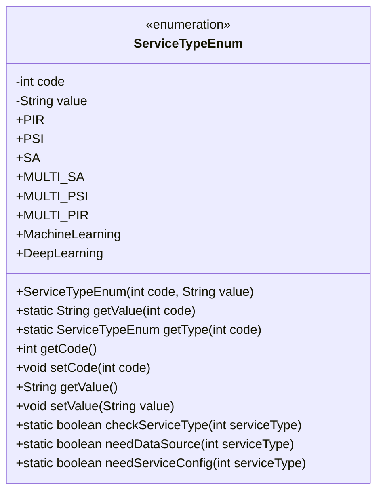

# 基础信息

|      |      |
|------|------|
| 名称 | ServiceTypeEnum |
| 编码语言 | .java |
| 代码路径 | WeFe/serving/serving-service/src/main/java/com/welab/wefe/serving/service/enums/ServiceTypeEnum.java |
| 包名 | com.welab.wefe.serving.service.enums |
| 依赖项 | [] |
| 概述说明 | 枚举类ServiceTypeEnum定义了8种服务类型，包含代码和描述，提供根据代码获取类型、描述及校验服务类型的方法，区分需数据源或服务配置的类型。 |

# 说明

该枚举类定义了八种服务类型，每种类型有唯一编码和描述。包含两方匿踪查询、两方交集查询、多方安全统计（被查询方和查询方）、多方交集查询、多方匿踪查询、机器学习和深度学习模型。提供了根据编码获取类型或描述的方法，以及验证服务类型是否有效的方法。还包含判断特定服务类型是否需要数据源或服务配置的功能方法。

# 类列表 Class Summary

| 名称   | 类型  | 说明 |
|-------|------|-------------|
| ServiceTypeEnum | enum | 枚举类ServiceTypeEnum定义了8种服务类型，包含代码和描述，提供根据代码获取类型、描述及校验服务类型的方法，支持判断是否需要数据源或服务配置。 |

## 类 ServiceTypeEnum

|      |      |
|------|------|
| 访问范围 | public |
| 类型 | enum |
| 名称 | ServiceTypeEnum |
| 说明 | 枚举类ServiceTypeEnum定义了8种服务类型，包含代码和描述，提供根据代码获取类型、描述及校验服务类型的方法，支持判断是否需要数据源或服务配置。 |

### UML类图

这段代码定义了一个枚举类`ServiceTypeEnum`，用于表示不同类型的服务。每个枚举实例包含一个整型`code`和字符串`value`，分别表示服务类型的编码和描述。类提供了静态方法`getValue`和`getType`来根据编码获取对应的描述或枚举实例，以及`checkServiceType`来验证服务类型是否存在。此外，`needDataSource`和`needServiceConfig`方法用于判断特定服务类型是否需要数据源或服务配置。枚举类封装了服务类型的相关操作，便于代码中统一管理和使用。

### 内部方法调用关系图

```mermaid
graph TD
    A["枚举ServiceTypeEnum"]
    B["枚举常量: PIR(1,'两方匿踪查询')"]
    C["枚举常量: PSI(2,'两方交集查询')"]
    D["枚举常量: SA(3,'多方安全统计(被查询方)')"]
    E["枚举常量: MULTI_SA(4,'多方安全统计(查询方)')"]
    F["枚举常量: MULTI_PSI(5,'多方交集查询')"]
    G["枚举常量: MULTI_PIR(6,'多方匿踪查询')"]
    H["枚举常量: MachineLearning(7,'机器学习模型')"]
    I["枚举常量: DeepLearning(8,'深度学习模型')"]
    J["属性: int code"]
    K["属性: String value"]
    L["构造方法: ServiceTypeEnum(int code, String value)"]
    M["静态方法: getValue(int code)"]
    N["静态方法: getType(int code)"]
    O["方法: getCode()/setCode(int)"]
    P["方法: getValue()/setValue(String)"]
    Q["静态方法: checkServiceType(int)"]
    R["静态方法: needDataSource(int)"]
    S["静态方法: needServiceConfig(int)"]

    A --> B
    A --> C
    A --> D
    A --> E
    A --> F
    A --> G
    A --> H
    A --> I
    A --> J
    A --> K
    A --> L
    A --> M
    A --> N
    A --> O
    A --> P
    A --> Q
    A --> R
    A --> S
```

该流程图展示了ServiceTypeEnum枚举类的完整结构，包含8个预定义的服务类型常量、核心属性和方法。枚举通过code-value键值对存储服务类型信息，提供静态方法实现code到value/枚举实例的转换，并包含业务校验方法如checkServiceType()和needDataSource()。所有方法都围绕code-value属性展开操作，形成完整的服务类型管理工具。

### 字段列表 Field List

| 名称  | 类型  | 说明 |
|-------|-------|------|

### 方法列表

| 名称  | 类型  | 说明 |
|-------|-------|------|

