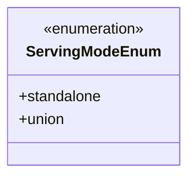
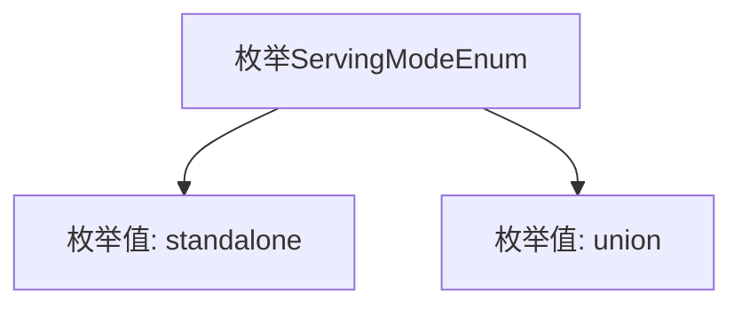

# 基础信息

|      |      |
|------|------|
| 名称 | ServingModeEnum |
| 编码语言 | .java |
| 代码路径 | WeFe/serving/serving-service/src/main/java/com/welab/wefe/serving/service/enums/ServingModeEnum.java |
| 包名 | com.welab.wefe.serving.service.enums |
| 依赖项 | [] |
| 概述说明 | 枚举定义两种服务模式：standalone（独立）和union（联合）。 |

# 说明

该内容定义了一个名为ServingModeEnum的公共枚举类型，包含两个枚举值：standalone表示独立模式，union表示联合模式。枚举用于表示服务运行时的两种不同配置状态。

# 类列表 Class Summary

| 名称   | 类型  | 说明 |
|-------|------|-------------|
| ServingModeEnum | enum | 枚举定义两种服务模式：独立运行(standalone)和联合运行(union)。 |

## 类 ServingModeEnum

|      |      |
|------|------|
| 访问范围 | public |
| 类型 | enum |
| 名称 | ServingModeEnum |
| 说明 | 枚举定义两种服务模式：独立运行(standalone)和联合运行(union)。 |

### UML类图

这段代码定义了一个名为`ServingModeEnum`的枚举类型，包含两个枚举常量：`standalone`和`union`。枚举类型用于表示一组固定的常量值，这里可能用于表示服务的两种不同运行模式。类图中使用`<<enumeration>>`标记明确表示这是一个枚举类型，并列出了其所有公开的枚举值。该枚举结构简单，适合在需要明确区分服务模式的场景中使用。

### 内部方法调用关系图

这段代码定义了一个名为ServingModeEnum的枚举类型，包含两个枚举值：standalone和union。枚举常用于表示一组固定的常量，这里可能用于标识服务的两种运行模式。流程图清晰地展示了枚举类型与其值的从属关系，standalone和union作为ServingModeEnum的直接成员存在，没有其他方法或属性。这种结构适合在需要严格限定取值范围的场景中使用，例如配置服务部署模式。

### 字段列表 Field List

| 名称  | 类型  | 说明 |
|-------|-------|------|

### 方法列表

| 名称  | 类型  | 说明 |
|-------|-------|------|

