# 基础信息

|      |      |
|------|------|
| 名称 | enums |
| 编码语言 | .java |
| 代码路径 | WeFe/serving/serving-service/src/main/java/com/welab/wefe/serving/service/enums |
| 包名 | docs.serving.serving-service.src.main.java.com.welab.wefe.serving.service.enums |
| 概述说明 | DataResourceSource枚举定义数据来源类型：本地文件、上传文件、数据库。ServiceTypeEnum枚举定义八种服务类型，含查询统计和模型服务。MemberModelStatusEnum枚举成员模型状态：离线、不可用、可用。DateTypeEnum枚举四种日期粒度：月、日、小时、分钟。ServiceOrderEnum枚举三种订单状态：成功、失败、进行中。CallByMeEnum枚举是否调用：是、否。ModelTypeEnum枚举模型类型：机器学习、深度学习。ServiceResultEnum枚举六种服务结果状态码。PaymentsRecordStatusEnum枚举支付状态：正常、冲正。PayTypeEnum枚举两种支付类型：后付费、预付费。QueryDateTypeEnum枚举四种日期查询类型。ServingModeEnum枚举服务模式：独立、联合。ServiceClientTypeEnum枚举客户端类型：激活、开通。ServiceStatusEnum枚举服务状态：启用、未启用。ClientStatusEnum枚举客户端状态：正常、删除。ServiceCallStatusEnum枚举五种调用状态。PaymentsTypeEnum枚举支付类型：充值、支出。 |

# 说明

## 概述  
该模块通过枚举类型系统化定义了服务治理领域的核心状态与类型，类似状态机模式统一管理业务实体的生命周期。包含三类关键数据结构：服务类型（如两方匿踪查询）、状态枚举（如订单状态）和配置类型（如支付方式）。外部依赖仅基础Java环境，无第三方库。例如ServiceTypeEnum定义8种服务类型，PayTypeEnum区分预付费/后付费。  

## 主要业务场景  
模块支撑联邦学习服务的全流程管理，包括服务调用（如ServiceCallStatusEnum记录5种调用状态）、支付结算（如PaymentsTypeEnum区分充值/支出）和资源调度（如DataResourceSource限定数据来源）。典型交互模式为枚举值双向查询，例如ServiceStatusEnum实现状态码与描述的转换。整合后形成完整工作流：服务配置→调用执行→状态跟踪→支付结算，例如通过ServiceOrderEnum跟踪订单状态变更。

### 包内部结构视图

```mermaid
graph TD
    enums --> DataResourceSource.java
    enums --> ServiceTypeEnum.java
    enums --> MemberModelStatusEnum.java
    enums --> DateTypeEnum.java
    enums --> ServiceOrderEnum.java
    enums --> CallByMeEnum.java
    enums --> ModelTypeEnum.java
    enums --> ServiceResultEnum.java
    enums --> PaymentsRecordStatusEnum.java
    enums --> PayTypeEnum.java
    enums --> QueryDateTypeEnum.java
    enums --> ServingModeEnum.java
    enums --> ServiceClientTypeEnum.java
    enums --> ServiceStatusEnum.java
    enums --> ClientStatusEnum.java
    enums --> ServiceCallStatusEnum.java
    enums --> PaymentsTypeEnum.java
```

该流程图展示了WeFe服务模块中枚举类的层级结构，根节点为"enums"目录，其下包含18个具体的枚举类文件，涵盖了数据资源来源、服务类型、成员模型状态、日期类型等多种业务枚举类型，完整呈现了该服务模块的枚举类组织结构。

# 文件列表

| 名称   | 类型  | 说明 |
|-------|------|-------------|
| [DataResourceSource.java](DataResourceSource.md) | file | 数据资源来源枚举：本地文件、上传文件、SQL。 |
| [ServiceTypeEnum.java](ServiceTypeEnum.md) | file | 枚举类ServiceTypeEnum定义了8种服务类型，包含代码和描述，提供根据代码获取类型、描述及校验服务类型的方法，区分需数据源或服务配置的类型。 |
| [MemberModelStatusEnum.java](MemberModelStatusEnum.md) | file | 枚举定义成员模型状态：失联(offline)、不可用(unavailable)、可用(available)。 |
| [DateTypeEnum.java](DateTypeEnum.md) | file | 枚举DateTypeEnum定义日期粒度类型，包含month、day、hour、minute四种精度。 |
| [ServiceOrderEnum.java](ServiceOrderEnum.md) | file | 定义枚举类ServiceOrderEnum，包含三个状态：成功、失败、进行中，每个状态对应一个字符串值，可通过getValue方法获取。 |
| [CallByMeEnum.java](CallByMeEnum.md) | file | 枚举类CallByMeEnum定义YES和NO两个枚举值，分别对应代码1和0，提供根据代码获取枚举值的方法，包含获取和设置代码及描述的功能。 |
| [ModelTypeEnum.java](ModelTypeEnum.md) | file | 枚举定义两种模型类型：机器学习和深度学习。 |
| [ServiceResultEnum.java](ServiceResultEnum.md) | file | ServiceResultEnum定义了6种服务结果状态码和消息，包括成功、服务异常、无数据等，提供根据状态码获取消息的方法。 |
| [PaymentsRecordStatusEnum.java](PaymentsRecordStatusEnum.md) | file | 支付记录状态枚举类，包含正常和冲正两种状态，分别对应代码1和2，提供根据代码获取状态描述的方法。 |
| [PayTypeEnum.java](PayTypeEnum.md) | file | 定义支付类型枚举，包含后付费和预付费两种类型，提供代码与描述相互转换的方法。 |
| [QueryDateTypeEnum.java](QueryDateTypeEnum.md) | file | 枚举类QueryDateTypeEnum定义了四种日期查询类型：YEAR(1)、MONTH(2)、DAY(3)、HOUR(4)，每个类型对应一个整数值，可通过getValue()方法获取。 |
| [ServingModeEnum.java](ServingModeEnum.md) | file | 枚举定义两种服务模式：standalone（独立）和union（联合）。 |
| [ServiceClientTypeEnum.java](ServiceClientTypeEnum.md) | file | 枚举ServiceClientTypeEnum定义两种服务客户端类型：ACTIVATE(1)和OPEN(0)，包含构造函数和获取值的方法。 |
| [ServiceStatusEnum.java](ServiceStatusEnum.md) | file | 定义服务状态枚举，包含已启用和未启用两种状态，提供状态码和描述信息，支持通过码或描述互相查询。 |
| [ClientStatusEnum.java](ClientStatusEnum.md) | file | 枚举ClientStatusEnum定义两种状态：NORMAL(1)和DELETED(0)，包含构造方法和获取值的getValue()方法。 |
| [ServiceCallStatusEnum.java](ServiceCallStatusEnum.md) | file | 枚举类定义服务调用状态，包含成功、请求超时、响应超时、请求不通和响应错误五种状态，每种状态对应中文描述。 |
| [PaymentsTypeEnum.java](PaymentsTypeEnum.md) | file | 枚举类PaymentsTypeEnum定义支付类型，包含充值(RECHARGE)和支出(PAID)，提供代码和值映射及查询方法。 |

