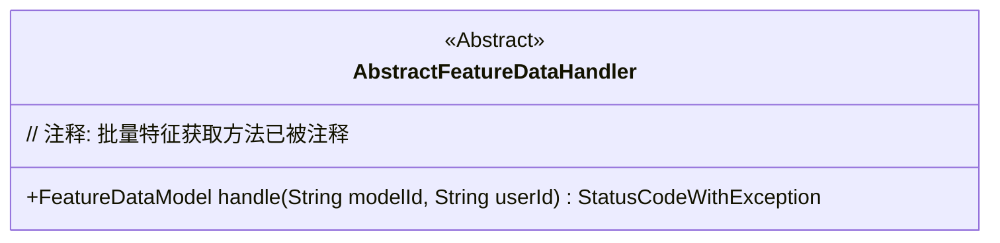
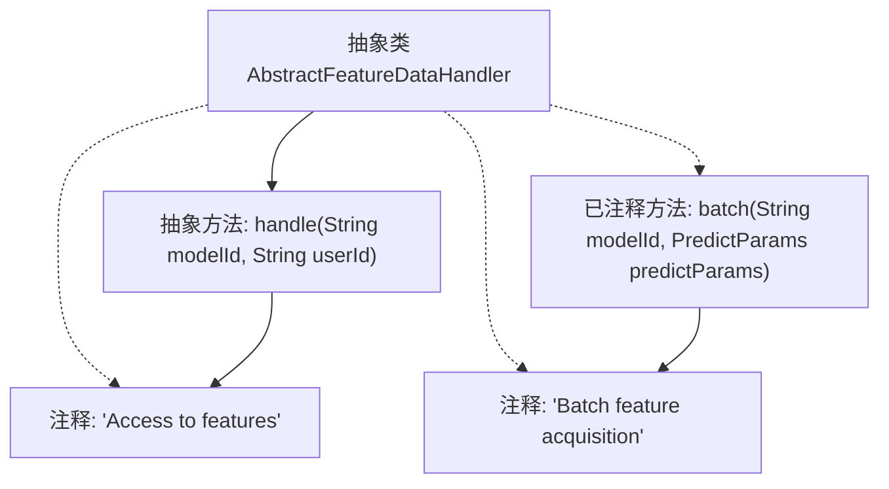

# 基础信息

|      |      |
|------|------|
| 名称 | AbstractFeatureDataHandler |
| 编码语言 | .java |
| 代码路径 | WeFe/serving/serving-service/src/main/java/com/welab/wefe/serving/service/feature/AbstractFeatureDataHandler.java |
| 包名 | com.welab.wefe.serving.service.feature |
| 依赖项 | ['com.welab.wefe.common.exception.StatusCodeWithException', 'com.welab.wefe.serving.sdk.dto.PredictParams', 'com.welab.wefe.serving.sdk.model.FeatureDataModel', 'java.util.Map'] |
| 概述说明 | 抽象类AbstractFeatureDataHandler定义处理特征数据的方法，包括单个特征获取handle和批量获取batch（注释状态），可能抛出StatusCodeWithException异常。 |

# 说明

AbstractFeatureDataHandler是一个抽象类，提供了处理特征数据的抽象方法。它包含一个抽象方法handle，用于根据模型ID和用户ID获取特征数据，可能抛出StatusCodeWithException异常。该类还注释了一个未实现的batch方法，用于批量获取特征数据，但当前已被注释掉。两个方法都涉及模型ID参数，并返回特征数据。

# 类列表 Class Summary

| 名称   | 类型  | 说明 |
|-------|------|-------------|
| AbstractFeatureDataHandler | class | 抽象类AbstractFeatureDataHandler定义了两个方法：handle用于获取单个特征数据，batch用于批量获取特征数据（注释状态）。两者均需提供modelId，可能抛出StatusCodeWithException异常。 |

## 类 AbstractFeatureDataHandler

|      |      |
|------|------|
| 访问范围 | public abstract |
| 类型 | class |
| 名称 | AbstractFeatureDataHandler |
| 说明 | 抽象类AbstractFeatureDataHandler定义了两个方法：handle用于获取单个特征数据，batch用于批量获取特征数据（注释状态）。两者均需提供modelId，可能抛出StatusCodeWithException异常。 |

### UML类图

这段类图描述了一个抽象类AbstractFeatureDataHandler，它定义了一个处理特征数据的抽象方法handle，该方法接收模型ID和用户ID作为参数，返回FeatureDataModel对象并可能抛出StatusCodeWithException异常。类图中明确标注了这是一个抽象类（<<Abstract>>），并保留了被注释掉的批量处理方法batch作为设计痕迹，体现了该类的核心职责是处理特征数据获取逻辑。

### 内部方法调用关系图

该流程图展示了抽象类AbstractFeatureDataHandler的结构，包含一个已实现的抽象方法handle()和两个注释说明。其中handle()方法带有详细注释说明其功能是"特征访问"，而另一个被注释掉的batch()方法则标注了"批量特征获取"功能。类与方法之间通过实线连接，注释说明通过虚线关联，清晰地呈现了类的抽象特性和方法间的逻辑关系。

### 字段列表 Field List

| 名称  | 类型  | 说明 |
|-------|-------|------|

### 方法列表

| 名称  | 类型  | 说明 |
|-------|-------|------|
| handle | FeatureDataModel | 抽象方法handle，接收modelId和userId，返回FeatureDataModel，可能抛出StatusCodeWithException异常。 |

