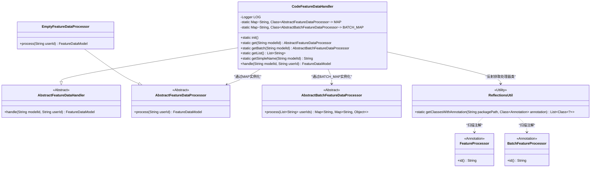
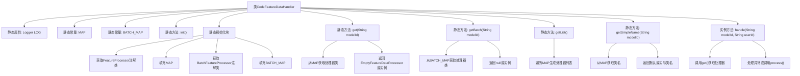

# 基础信息

|      |      |
|------|------|
| 名称 | CodeFeatureDataHandler |
| 编码语言 | .java |
| 代码路径 | WeFe/serving/serving-service/src/main/java/com/welab/wefe/serving/service/feature/CodeFeatureDataHandler.java |
| 包名 | com.welab.wefe.serving.service.feature |
| 依赖项 | ['com.welab.wefe.common.StatusCode', 'com.welab.wefe.common.exception.StatusCodeWithException', 'com.welab.wefe.common.util.ReflectionsUtil', 'com.welab.wefe.common.web.Launcher', 'com.welab.wefe.serving.sdk.model.FeatureDataModel', 'com.welab.wefe.serving.service.feature.code', 'org.slf4j.Logger', 'org.slf4j.LoggerFactory', 'java.util.ArrayList', 'java.util.HashMap', 'java.util.List', 'java.util.Map'] |
| 概述说明 | CodeFeatureDataHandler类继承AbstractFeatureDataHandler，通过反射初始化处理器映射，提供单例和批量处理器获取功能，处理特征数据请求。 |

# 说明

CodeFeatureDataHandler是一个继承自AbstractFeatureDataHandler的类，用于管理特征数据处理器的初始化和调用。它包含两个静态映射MAP和BATCH_MAP，分别存储特征处理器和批量特征处理器的类信息。通过反射机制，在静态初始化块中扫描带有特定注解的类并填充映射。提供get和getBatch方法根据模型ID获取对应的处理器实例，若未找到则返回空处理器。此外，还包含获取处理器列表和类名的方法。handle方法用于处理单个用户的特征数据，而注释掉的batch方法展示了批量处理的逻辑。整个类通过静态初始化确保处理器映射在类加载时完成填充。

# 类列表 Class Summary

| 名称   | 类型  | 说明 |
|-------|------|-------------|
| CodeFeatureDataHandler | class | CodeFeatureDataHandler类通过反射初始化处理器映射，提供单例和批量处理器获取功能，支持异常处理和空处理器返回。 |

## 类 CodeFeatureDataHandler

|      |      |
|------|------|
| 访问范围 | public |
| 类型 | class |
| 名称 | CodeFeatureDataHandler |
| 说明 | CodeFeatureDataHandler类通过反射初始化处理器映射，提供单例和批量处理器获取功能，支持异常处理和空处理器返回。 |

### UML类图

该图展示了CodeFeatureDataHandler作为特征数据处理器的核心实现，通过静态MAP和BATCH_MAP维护处理器类映射，利用反射动态加载标注了FeatureProcessor/BatchFeatureProcessor的处理器类。处理器分为单条(AbstractFeatureDataProcessor)和批量(AbstractBatchFeatureDataProcessor)两种类型，通过工厂模式按需创建实例，EmptyFeatureDataProcessor作为默认处理器提供降级处理能力。整体采用策略模式实现不同类型特征数据的处理逻辑解耦。

### 内部方法调用关系图

这段代码展示了一个特征数据处理器的实现，主要功能包括：通过静态初始化块自动扫描并注册带有特定注解的处理器类，提供根据模型ID获取对应处理器实例的方法，以及处理特征数据请求的核心逻辑。类中维护了两个静态映射表(MAP和BATCH_MAP)来存储不同类型的处理器类，通过反射机制动态加载处理器，并实现了完善的异常处理机制。流程图清晰地展示了类结构、初始化过程和各方法间的调用关系，特别是静态初始化块中通过反射填充映射表的关键步骤。

### 字段列表 Field List

| 名称  | 类型  | 说明 |
|-------|-------|------|
| BATCH_MAP = new HashMap<>() | Map<String, Class<? extends AbstractBatchFeatureDataProcessor>> | 定义静态常量BATCH_MAP，存储字符串到AbstractBatchFeatureDataProcessor子类的映射。 |
| LOG = LoggerFactory.getLogger(CodeFeatureDataHandler.class) | Logger | 定义CodeFeatureDataHandler类的静态日志对象LOG。 |
| MAP = new HashMap<>() | Map<String, Class<? extends AbstractFeatureDataProcessor>> | 定义静态常量MAP，存储字符串到AbstractFeatureDataProcessor子类类型的映射。 |

### 方法列表

| 名称  | 类型  | 说明 |
|-------|-------|------|
| handle | FeatureDataModel | Java方法处理特征数据，根据modelId获取处理器，未找到则抛出异常，找到则调用处理器处理userId并返回结果。 |
| init | void | 初始化类处理器，记录日志信息。 |
| getSimpleName | String | 根据模型ID获取处理器类名，若无则返回空处理器类名。 |
| get | AbstractFeatureDataProcessor | 根据模型ID获取对应的数据处理器类，若未找到则返回空处理器，找到则实例化返回，异常时返回null。 |
| getBatch | AbstractBatchFeatureDataProcessor | 根据模型ID获取批处理数据处理器，未找到返回null，创建实例失败也返回null。 |
| getList | List<String> | 该方法返回一个字符串列表，通过遍历MAP并将每个值的简单类名添加到列表中，最终返回该列表。 |

