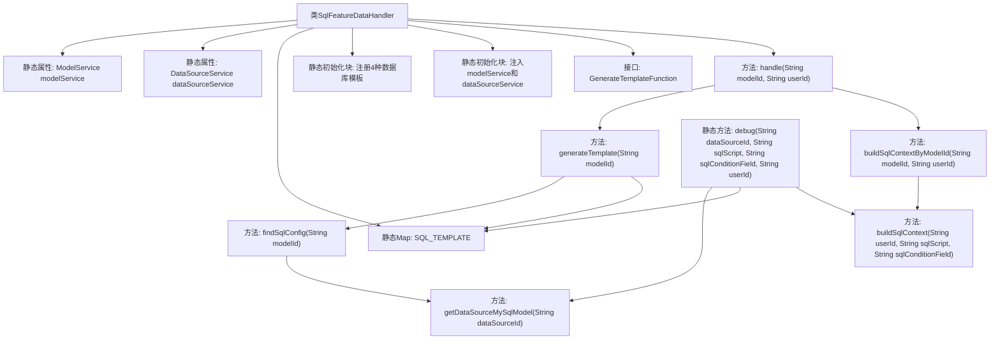

# 基础信息

|      |      |
|------|------|
| 名称 | SqlFeatureDataHandler |
| 编码语言 | .java |
| 代码路径 | WeFe/serving/serving-service/src/main/java/com/welab/wefe/serving/service/feature/SqlFeatureDataHandler.java |
| 包名 | com.welab.wefe.serving.service.feature |
| 依赖项 | ['com.welab.wefe.common.StatusCode', 'com.welab.wefe.common.exception.StatusCodeWithException', 'com.welab.wefe.common.jdbc.base.DatabaseType', 'com.welab.wefe.common.web.Launcher', 'com.welab.wefe.serving.sdk.model.FeatureDataModel', 'com.welab.wefe.serving.service.database.entity.DataSourceMySqlModel', 'com.welab.wefe.serving.service.database.entity.TableModelMySqlModel', 'com.welab.wefe.serving.service.feature.sql.AbstractTemplate', 'com.welab.wefe.serving.service.feature.sql.SqlRuleUtil', 'com.welab.wefe.serving.service.feature.sql.hive.HiveTemplate', 'com.welab.wefe.serving.service.feature.sql.impala.ImpalaTemplate', 'com.welab.wefe.serving.service.feature.sql.mysql.MySqlTemplate', 'com.welab.wefe.serving.service.feature.sql.pg.PgSqlTemplate', 'com.welab.wefe.serving.service.service.DataSourceService', 'com.welab.wefe.serving.service.service.ModelService', 'java.util.HashMap', 'java.util.Map'] |
| 概述说明 | SqlFeatureDataHandler类继承AbstractFeatureDataHandler，通过静态Map存储不同数据库类型的模板生成函数，处理模型ID和用户ID生成SQL查询并返回特征数据模型。支持MySQL、PgSQL、Hive和Impala数据库。 |

# 说明

SqlFeatureDataHandler是一个抽象特征数据处理类的具体实现，通过静态映射SQL_TEMPLATE支持多种数据库类型（MySql、PgSql、Hive、Impala）的模板生成。类中包含两个静态服务实例modelService和dataSourceService，用于获取模型配置和数据源信息。核心方法handle通过模型ID生成对应数据库模板，构建SQL查询语句并返回特征数据模型。私有方法generateTemplate根据数据源类型选择对应模板生成器，buildSqlContext拼接带用户条件的SQL语句。调试方法debug允许直接传入参数获取特征数据。整个过程包含参数校验和异常处理。

# 类列表 Class Summary

| 名称   | 类型  | 说明 |
|-------|------|-------------|
| SqlFeatureDataHandler | class | SqlFeatureDataHandler类继承AbstractFeatureDataHandler，通过静态映射SQL_TEMPLATE支持多种数据库模板生成，提供handle方法处理特征数据查询，包含SQL构建、模板生成及数据源配置校验功能。 |

## 类 SqlFeatureDataHandler

|      |      |
|------|------|
| 访问范围 | public |
| 类型 | class |
| 名称 | SqlFeatureDataHandler |
| 说明 | SqlFeatureDataHandler类继承AbstractFeatureDataHandler，通过静态映射SQL_TEMPLATE支持多种数据库模板生成，提供handle方法处理特征数据查询，包含SQL构建、模板生成及数据源配置校验功能。 |

### UML类图

```mermaid
classDiagram
    class AbstractFeatureDataHandler {
        <<abstract>>
    }

    class SqlFeatureDataHandler {
        -ModelService modelService
        -DataSourceService dataSourceService
        -Map~DatabaseType, GenerateTemplateFunction~ SQL_TEMPLATE
        +FeatureDataModel handle(String modelId, String userId)
        -String buildSqlContextByModelId(String modelId, String userId)
        -static String buildSqlContext(String userId, String sqlScript, String sqlConditionField)
        -AbstractTemplate generateTemplate(String modelId)
        -DataSourceMySqlModel findSqlConfig(String modelId)
        -static DataSourceMySqlModel getDataSourceMySqlModel(String dataSourceId)
        +static FeatureDataModel debug(String dataSourceId, String sqlScript, String sqlConditionField, String userId)
    }

    class GenerateTemplateFunction {
        <<Interface>>
        +AbstractTemplate generate(DatabaseType databaseType, String host, int port, String database, String username, String password)
    }

    class AbstractTemplate {
        <<abstract>>
        +Object handle(String sql)
    }

    class MySqlTemplate {
        +MySqlTemplate(DatabaseType databaseType, String host, int port, String database, String username, String password)
    }

    class PgSqlTemplate {
        +PgSqlTemplate(DatabaseType databaseType, String host, int port, String database, String username, String password)
    }

    class HiveTemplate {
        +HiveTemplate(DatabaseType databaseType, String host, int port, String database, String username, String password)
    }

    class ImpalaTemplate {
        +ImpalaTemplate(DatabaseType databaseType, String host, int port, String database, String username, String password)
    }

    class ModelService {
        +TableModelMySqlModel findOne(String modelId)
    }

    class DataSourceService {
        +DataSourceMySqlModel findById(String dataSourceId)
    }

    class TableModelMySqlModel {
        -String sqlScript
        -String sqlConditionField
        -String dataSourceId
        +String getSqlScript()
        +String getSqlConditionField()
        +String getDataSourceId()
    }

    class DataSourceMySqlModel {
        -DatabaseType databaseType
        -String host
        -int port
        -String databaseName
        -String userName
        -String password
        +DatabaseType getDatabaseType()
        +String getHost()
        +int getPort()
        +String getDatabaseName()
        +String getUserName()
        +String getPassword()
    }

    class FeatureDataModel {
        +static FeatureDataModel of(Object data)
    }

    SqlFeatureDataHandler --|> AbstractFeatureDataHandler
    SqlFeatureDataHandler --> GenerateTemplateFunction : 使用
    SqlFeatureDataHandler --> ModelService : 依赖
    SqlFeatureDataHandler --> DataSourceService : 依赖
    GenerateTemplateFunction ..> AbstractTemplate : 创建
    AbstractTemplate <|-- MySqlTemplate
    AbstractTemplate <|-- PgSqlTemplate
    AbstractTemplate <|-- HiveTemplate
    AbstractTemplate <|-- ImpalaTemplate
    SqlFeatureDataHandler --> TableModelMySqlModel : 依赖
    SqlFeatureDataHandler --> DataSourceMySqlModel : 依赖
    SqlFeatureDataHandler --> FeatureDataModel : 返回
```

这段代码描述了一个SQL特征数据处理系统，SqlFeatureDataHandler继承自抽象基类AbstractFeatureDataHandler，通过静态初始化块注册了四种数据库模板生成函数（MySQL/PostgreSQL/Hive/Impala）。该类主要功能是通过模型ID获取数据源配置，动态生成对应数据库的SQL模板，构建查询语句并执行，最终返回特征数据模型。系统依赖ModelService和DataSourceService获取模型配置和数据源信息，使用函数式接口GenerateTemplateFunction实现多数据库支持，并通过SqlRuleUtil进行SQL安全检查。

### 内部方法调用关系图

该流程图展示了SqlFeatureDataHandler类的核心结构和调用关系。类包含静态服务注入、数据库模板注册表初始化，以及主要数据处理流程。handle()方法通过generateTemplate()获取数据库连接模板，调用buildSqlContextByModelId()构建SQL语句，最终返回特征数据模型。debug()方法提供直接调试入口，复用相同处理逻辑但参数来源不同。所有数据库操作都通过SQL_TEMPLATE动态分发到具体数据库实现。

### 字段列表 Field List

| 名称  | 类型  | 说明 |
|-------|-------|------|
| SQL_TEMPLATE = new HashMap<>() | Map<DatabaseType, GenerateTemplateFunction> | 定义静态Map变量SQL_TEMPLATE，键为DatabaseType，值为GenerateTemplateFunction。 |
| dataSourceService | DataSourceService | 私有静态数据源服务实例。 |
| modelService | ModelService | 私有静态模型服务实例。 |

### 方法列表

| 名称  | 类型  | 说明 |
|-------|-------|------|
| buildSqlContextByModelId | String | 方法根据模型ID和用户ID构建SQL上下文：查询模型配置后调用通用构建方法，传入用户ID、SQL脚本和条件字段。异常时抛出StatusCodeWithException。 |
| getDataSourceMySqlModel | DataSourceMySqlModel | 静态方法通过ID查询MySQL数据源模型，若不存在则抛出参数无效异常。 |
| generateTemplate | AbstractTemplate | 根据模型ID生成模板，检查数据库类型是否支持，若支持则调用对应函数生成模板并返回，否则抛出异常。 |
| findSqlConfig | DataSourceMySqlModel | 查找指定modelId的MySQL数据源配置：先获取模型配置，再根据数据源ID返回对应数据源模型。异常时抛出StatusCodeWithException。 |
| buildSqlContext | String | 该方法根据用户ID、SQL脚本和条件字段构建SQL查询，添加条件限制并检查合法性，最后返回SQL语句。 |
| handle | FeatureDataModel | 方法重写，根据模型ID生成模板，构建SQL查询并返回处理结果。 |
| debug | FeatureDataModel | 静态方法debug根据数据源ID、SQL脚本、条件字段和用户ID调试数据库查询。验证数据源类型后生成SQL模板并执行查询，返回结果数据模型。 |

