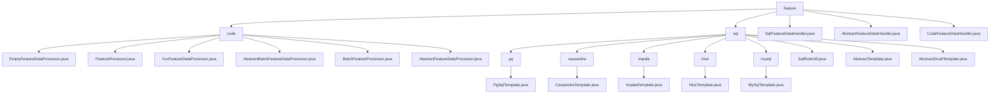

# 基础信息

|      |      |
|------|------|
| 名称 | feature |
| 编码语言 | .java |
| 代码路径 | WeFe/serving/serving-service/src/main/java/com/welab/wefe/serving/service/feature |
| 包名 | docs.serving.serving-service.src.main.java.com.welab.wefe.serving.service.feature |
| 概述说明 | 特征处理框架提供单条/批量模式，含抽象类与注解注册机制，支持空处理及扩展。数据库模块封装多库JDBC操作，含连接池管理与SQL校验。SqlFeatureDataHandler实现多库查询，CodeFeatureDataHandler通过反射管理处理器映射。 |

# 说明

## 概述  
该模块核心职责是构建多源特征数据处理的统一框架，包含代码级处理器（注解驱动）和SQL查询（模板化）两种实现方式。接口规范分层设计：顶层抽象类定义handle方法契约，中间层通过注解（@FeatureProcessor）注册处理器，底层SQL模板类封装跨数据库查询。关键数据结构包括FeatureDataModel（单条结果）、Map<String, Object>（SQL查询结果）及连接池配置Map。外部依赖涉及Druid连接池、多数据库驱动（如PostgreSQL/Hive）、SQL解析器及Java反射机制。例如EmptyFeatureDataProcessor实现空值兜底，PgSqlTemplate处理PostgreSQL协议差异。

## 主要业务场景  
模块采用分层策略模式，支持从内存计算到数据库查询的混合处理。典型流程为：CodeFeatureDataHandler通过注解发现处理器（如XxxFeatureDataProcessor），或SqlFeatureDataHandler动态选择数据库模板（如HiveTemplate）执行查询。交互模式类似责任链，空处理器确保健壮性，SQL模板实现多源聚合。功能完整性体现在注解扩展、SQL安全校验（禁用注释）及连接池复用。典型应用包括实时特征提取（单条处理）和跨库批量分析（嵌套Map返回），例如MySqlTemplate执行聚合查询后映射为特征模型。API类型涵盖处理器获取（get）、查询执行（execute）及条件构建（buildSqlContext）。

### 包内部结构视图

该流程图展示了WeFe服务模块中feature目录的完整层级结构，包含code和sql两个主要子目录。code目录下包含7个特征处理器相关类文件，sql目录下则按数据库类型分为5个子目录（pg/cassandra/impala/hive/mysql），每个子目录包含对应的模板类文件，同时sql目录还包含3个抽象类和工具类。顶层feature目录直接包含3个数据处理器类文件。

# 文件列表

| 名称   | 类型  | 说明 |
|-------|------|-------------|
| [SqlFeatureDataHandler.java](SqlFeatureDataHandler.md) | file | SqlFeatureDataHandler类继承AbstractFeatureDataHandler，通过静态Map存储不同数据库类型的模板生成函数，处理模型ID和用户ID生成SQL查询并返回特征数据模型。支持MySQL、PgSQL、Hive和Impala数据库。 |
| [AbstractFeatureDataHandler.java](AbstractFeatureDataHandler.md) | file | 抽象类AbstractFeatureDataHandler定义处理特征数据的方法，包括单个特征获取handle和批量获取batch（注释状态），可能抛出StatusCodeWithException异常。 |
| [CodeFeatureDataHandler.java](CodeFeatureDataHandler.md) | file | CodeFeatureDataHandler类继承AbstractFeatureDataHandler，通过反射初始化处理器映射，提供单例和批量处理器获取功能，处理特征数据请求。 |
| [sql](sql/_module.md) | package | PgSqlTemplate用于PostgreSQL连接，重写driver和url方法。ImpalaTemplate连接Impala，使用Hive驱动和Hive2协议。HiveTemplate连接Hive，重写driver和url。MySqlTemplate专用于MySQL，重写driver和url。SqlRuleUtil检查SQL脚本合法性。AbstractTemplate是数据库操作基类。AbstractDruidTemplate管理Druid连接池，子类需实现driver和url。 |
| [code](code/_module.md) | package | EmptyFeatureDataProcessor返回空特征数据。FeatureProcessor是运行时注解含必填id。XxxFeatureDataProcessor继承抽象类但返回null。AbstractBatchFeatureDataProcessor处理批量特征数据需子类实现。BatchFeatureProcessor是批处理运行时注解含id。AbstractFeatureDataProcessor定义特征处理框架需子类实现。 |

