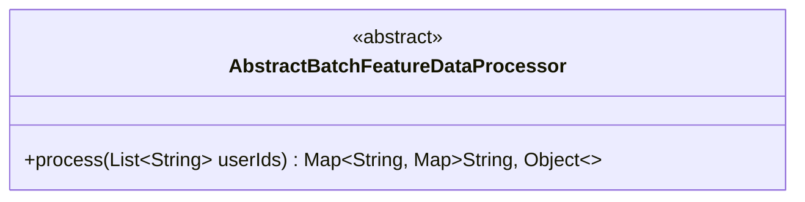
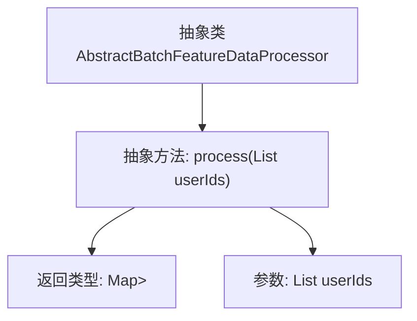

# 基础信息

|      |      |
|------|------|
| 名称 | AbstractBatchFeatureDataProcessor |
| 编码语言 | .java |
| 代码路径 | WeFe/serving/serving-service/src/main/java/com/welab/wefe/serving/service/feature/code/AbstractBatchFeatureDataProcessor.java |
| 包名 | com.welab.wefe.serving.service.feature.code |
| 依赖项 | ['java.util.List', 'java.util.Map'] |
| 概述说明 | 抽象类AbstractBatchFeatureDataProcessor定义了一个抽象方法process，用于处理用户ID列表并返回特征数据映射。 |

# 说明

这是一个名为AbstractBatchFeatureDataProcessor的抽象类，定义了一个处理批量特征数据的抽象方法。该方法接收一个用户ID列表作为参数，返回一个嵌套映射结构，外层映射的键是字符串类型，内层映射包含字符串键和对象值。该抽象方法需要子类实现具体逻辑，用于处理用户特征数据并返回结果映射。

# 类列表 Class Summary

| 名称   | 类型  | 说明 |
|-------|------|-------------|
| AbstractBatchFeatureDataProcessor | class | 抽象类AbstractBatchFeatureDataProcessor定义了一个处理用户特征数据的抽象方法process，输入用户ID列表，返回特征数据映射。 |

## 类 AbstractBatchFeatureDataProcessor

|      |      |
|------|------|
| 访问范围 | public abstract |
| 类型 | class |
| 名称 | AbstractBatchFeatureDataProcessor |
| 说明 | 抽象类AbstractBatchFeatureDataProcessor定义了一个处理用户特征数据的抽象方法process，输入用户ID列表，返回特征数据映射。 |

### UML类图

这段类图描述了一个名为AbstractBatchFeatureDataProcessor的抽象类，它定义了一个处理批量特征数据的抽象方法process。该方法接收一个字符串类型的用户ID列表作为参数，返回一个嵌套的映射结构，外层映射的键是字符串类型，值又是另一个映射（键为字符串，值为Object类型）。这个抽象类为后续具体实现提供了统一的处理接口，适用于需要批量处理用户特征数据的场景。

### 内部方法调用关系图

该流程图展示了抽象类AbstractBatchFeatureDataProcessor的结构，核心是一个名为process的抽象方法，该方法接收用户ID列表作为参数，返回嵌套的映射结构。图中清晰呈现了类与方法之间的从属关系，以及方法的输入输出类型定义，体现了该抽象类作为特征数据处理器基类的设计意图，为具体实现类提供了标准化的处理接口规范。

### 字段列表 Field List

| 名称  | 类型  | 说明 |
|-------|-------|------|

### 方法列表

| 名称  | 类型  | 说明 |
|-------|-------|------|
| process | Map<String, Map<String, Object>> | 抽象方法process，输入用户ID列表，返回嵌套映射结构，键为字符串，值为映射对象。 |

