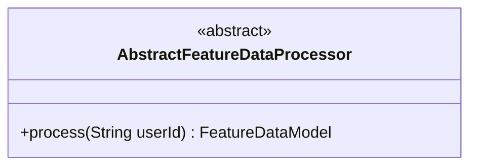
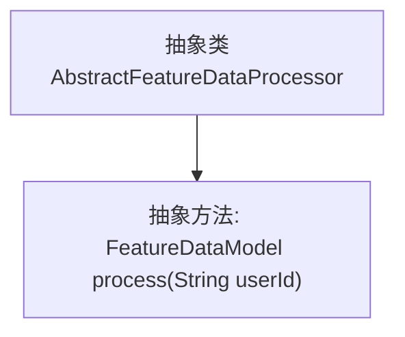

# 基础信息

|      |      |
|------|------|
| 名称 | AbstractFeatureDataProcessor |
| 编码语言 | .java |
| 代码路径 | WeFe/serving/serving-service/src/main/java/com/welab/wefe/serving/service/feature/code/AbstractFeatureDataProcessor.java |
| 包名 | com.welab.wefe.serving.service.feature.code |
| 依赖项 | ['com.welab.wefe.serving.sdk.model.FeatureDataModel', 'java.util.Map'] |
| 概述说明 | 抽象类AbstractFeatureDataProcessor定义了一个抽象方法process，接收userId参数并返回FeatureDataModel对象。 |

# 说明

这是一个名为AbstractFeatureDataProcessor的抽象类，定义了一个处理特征数据的抽象方法。该类包含一个名为process的抽象方法，接收一个字符串类型的userId参数，返回一个FeatureDataModel对象。方法注释说明该方法用于获取特征处理结果，返回的是特征数据映射。该抽象类为特征数据处理提供了基础框架，具体实现需要由子类完成。

# 类列表 Class Summary

| 名称   | 类型  | 说明 |
|-------|------|-------------|
| AbstractFeatureDataProcessor | class | 抽象类AbstractFeatureDataProcessor定义了一个抽象方法process，接收userId参数并返回FeatureDataModel对象。 |

## 类 AbstractFeatureDataProcessor

|      |      |
|------|------|
| 访问范围 | public abstract |
| 类型 | class |
| 名称 | AbstractFeatureDataProcessor |
| 说明 | 抽象类AbstractFeatureDataProcessor定义了一个抽象方法process，接收userId参数并返回FeatureDataModel对象。 |

### UML类图

这段代码定义了一个名为`AbstractFeatureDataProcessor`的抽象类，其中包含一个抽象方法`process`，该方法接收一个`String`类型的`userId`参数并返回`FeatureDataModel`对象。抽象类用于定义处理特征数据的通用接口，具体实现由子类完成。类图清晰地展示了该抽象类的结构，为后续具体处理器实现提供了基础模板。

### 内部方法调用关系图

这段代码定义了一个名为`AbstractFeatureDataProcessor`的抽象类，其中包含一个抽象方法`process`，该方法接收一个`userId`字符串参数并返回`FeatureDataModel`对象。流程图清晰地展示了类与方法之间的层级关系，抽象类作为父节点，抽象方法作为其子节点。该设计用于强制子类实现特定的数据处理逻辑，体现了面向对象的抽象特性。

### 字段列表 Field List

| 名称  | 类型  | 说明 |
|-------|-------|------|

### 方法列表

| 名称  | 类型  | 说明 |
|-------|-------|------|
| process | FeatureDataModel | 抽象方法process，接收userId参数，返回FeatureDataModel类型数据。 |

