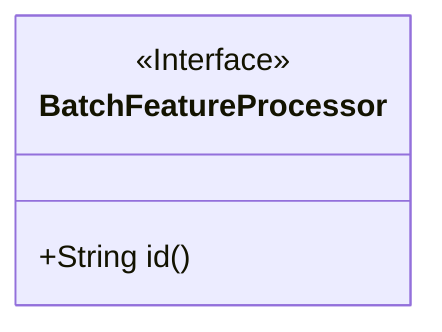
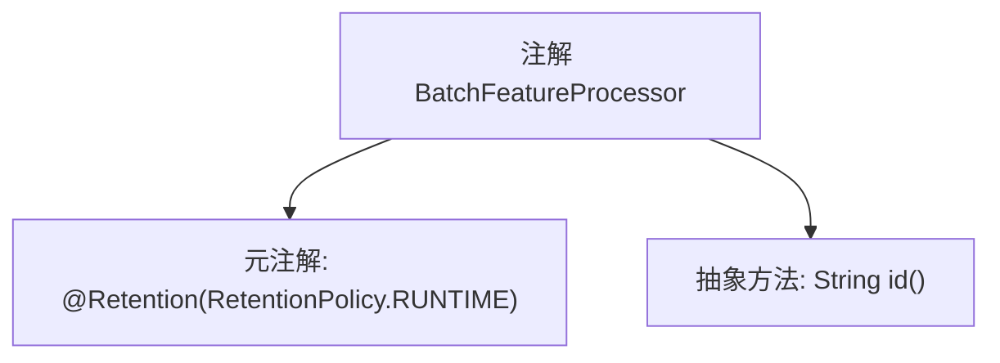

# 基础信息

|      |      |
|------|------|
| 名称 | BatchFeatureProcessor |
| 编码语言 | .java |
| 代码路径 | WeFe/serving/serving-service/src/main/java/com/welab/wefe/serving/service/feature/code/BatchFeatureProcessor.java |
| 包名 | com.welab.wefe.serving.service.feature.code |
| 依赖项 | ['java.lang.annotation.Retention', 'java.lang.annotation.RetentionPolicy'] |
| 概述说明 | Java注解`@BatchFeatureProcessor`，运行时保留，需指定唯一标识符`id`。 |

# 说明

该内容定义了一个名为`BatchFeatureProcessor`的Java注解，使用`@Retention(RetentionPolicy.RUNTIME)`指定该注解在运行时保留。注解包含一个名为`id`的字符串类型属性，该属性为必填项。该注解适用于需要在运行时处理的批处理功能场景。

# 类列表 Class Summary

| 名称   | 类型  | 说明 |
|-------|------|-------------|
| BatchFeatureProcessor | annotation | Java注解`@BatchFeatureProcessor`，保留至运行时，需指定唯一标识`id`。 |

## 类 BatchFeatureProcessor

|      |      |
|------|------|
| 访问范围 | @Retention(RetentionPolicy.RUNTIME);public |
| 类型 | annotation |
| 名称 | BatchFeatureProcessor |
| 说明 | Java注解`@BatchFeatureProcessor`，保留至运行时，需指定唯一标识`id`。 |

### UML类图

这段代码定义了一个名为`BatchFeatureProcessor`的运行时注解接口，其中包含一个名为`id`的字符串类型方法。注解使用`@Retention(RetentionPolicy.RUNTIME)`元注解标记，表示该注解在运行时可通过反射机制读取。类图中使用`<<Interface>>`标记表明这是一个注解接口，公有方法`id()`代表注解的可配置属性。该注解通常用于标记批处理特性处理器，其ID属性可用于标识或配置处理器实例。

### 内部方法调用关系图

该流程图描述了`BatchFeatureProcessor`注解的结构，包含两个主要部分：`@Retention`元注解指定了注解在运行时保留，以及一个名为`id()`的抽象方法定义。这个注解通常用于标记批处理特征处理器，并通过`id()`方法提供唯一标识符。整个结构简洁明了，符合Java注解的基本语法规范。

### 字段列表 Field List

| 名称  | 类型  | 说明 |
|-------|-------|------|
| id | String | 方法id()返回字符串类型标识符。 |

### 方法列表

| 名称  | 类型  | 说明 |
|-------|-------|------|

