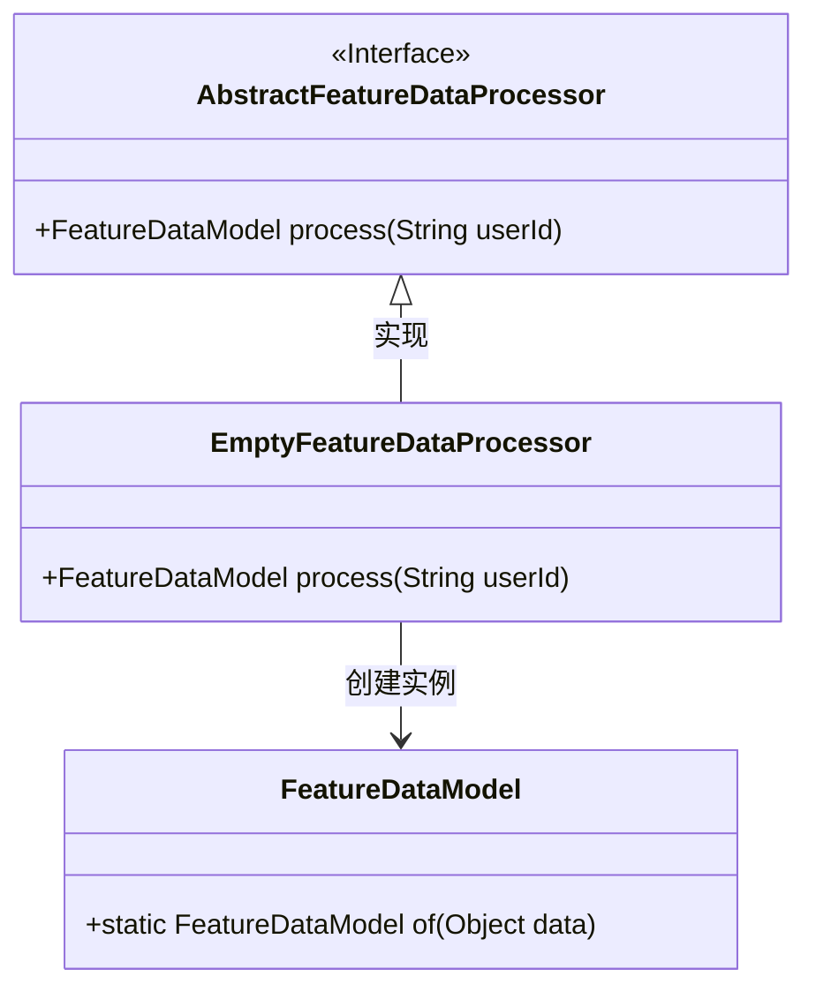
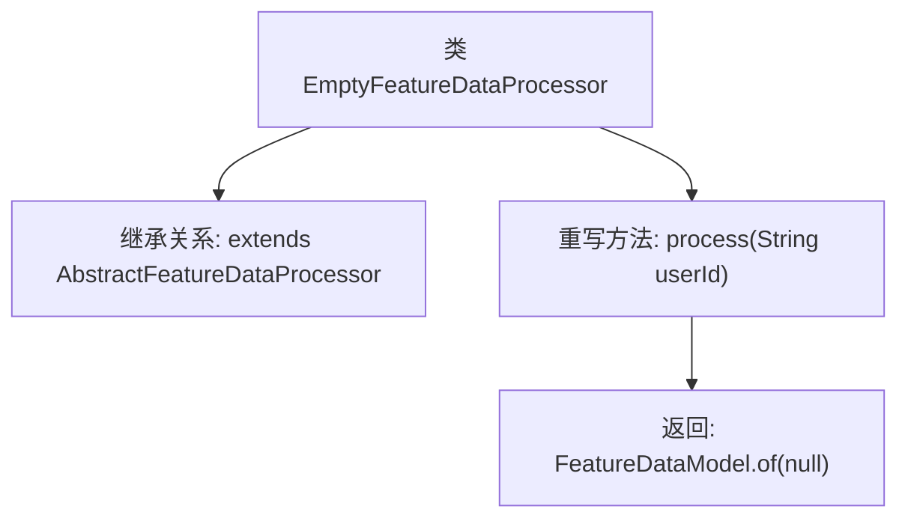

# 基础信息

|      |      |
|------|------|
| 名称 | EmptyFeatureDataProcessor |
| 编码语言 | .java |
| 代码路径 | WeFe/serving/serving-service/src/main/java/com/welab/wefe/serving/service/feature/code/EmptyFeatureDataProcessor.java |
| 包名 | com.welab.wefe.serving.service.feature.code |
| 依赖项 | ['com.welab.wefe.serving.sdk.model.FeatureDataModel'] |
| 概述说明 | EmptyFeatureDataProcessor继承AbstractFeatureDataProcessor，重写process方法，返回空FeatureDataModel。 |

# 说明

EmptyFeatureDataProcessor是一个继承自AbstractFeatureDataProcessor的类，用于处理特征数据。它重写了process方法，接收一个用户ID参数，但直接返回一个值为null的FeatureDataModel实例。该处理器不执行任何实际数据处理，仅提供空结果。

# 类列表 Class Summary

| 名称   | 类型  | 说明 |
|-------|------|-------------|
| EmptyFeatureDataProcessor | class | 空特征数据处理类，继承抽象处理器，重写process方法，返回空特征数据模型。 |

## 类 EmptyFeatureDataProcessor

|      |      |
|------|------|
| 访问范围 | public |
| 类型 | class |
| 名称 | EmptyFeatureDataProcessor |
| 说明 | 空特征数据处理类，继承抽象处理器，重写process方法，返回空特征数据模型。 |

### UML类图

这段类图展示了EmptyFeatureDataProcessor继承自AbstractFeatureDataProcessor接口并实现其process方法，该方法返回通过FeatureDataModel.of()方法创建的实例。EmptyFeatureDataProcessor是一个具体实现类，专门处理空特征数据场景，通过重写父接口方法返回包含null值的FeatureDataModel对象。整个设计体现了空对象模式的应用，为特征数据处理提供了默认实现方案。

### 内部方法调用关系图

这段代码展示了一个继承自AbstractFeatureDataProcessor的空特征数据处理器类。流程图清晰地呈现了类继承关系和唯一重写的process方法，该方法接收用户ID参数但始终返回一个包含null值的FeatureDataModel对象。这种设计通常用于实现空对象模式，为系统提供默认的空操作行为，避免空指针异常并保持接口一致性。

### 字段列表 Field List

| 名称  | 类型  | 说明 |
|-------|-------|------|

### 方法列表

| 名称  | 类型  | 说明 |
|-------|-------|------|
| process | FeatureDataModel | 方法process接收userId参数，返回空的FeatureDataModel实例。 |

