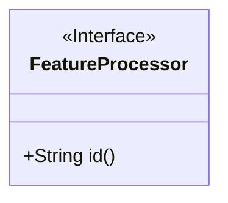
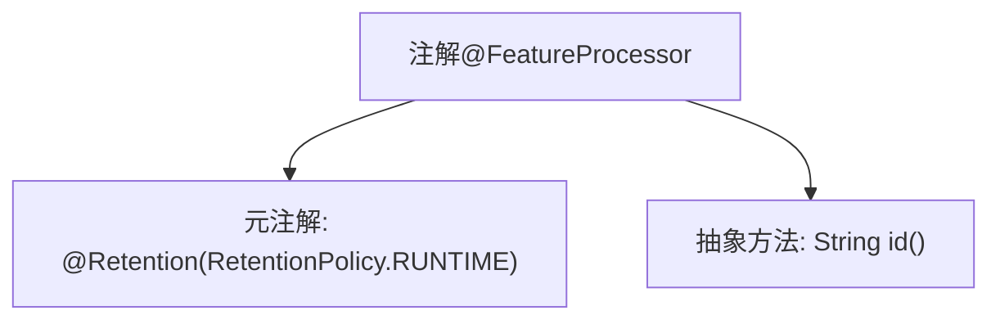

# 基础信息

|      |      |
|------|------|
| 名称 | FeatureProcessor |
| 编码语言 | .java |
| 代码路径 | WeFe/serving/serving-service/src/main/java/com/welab/wefe/serving/service/feature/code/FeatureProcessor.java |
| 包名 | com.welab.wefe.serving.service.feature.code |
| 依赖项 | ['java.lang.annotation.Retention', 'java.lang.annotation.RetentionPolicy'] |
| 概述说明 | 定义运行时保留的注解FeatureProcessor，包含一个id属性。 |

# 说明

该内容定义了一个名为FeatureProcessor的Java注解，使用@Retention(RetentionPolicy.RUNTIME)指定该注解在运行时保留。注解包含一个名为id的字符串类型属性，该属性为必填项。该注解可用于在运行时通过反射机制处理特定功能。

# 类列表 Class Summary

| 名称   | 类型  | 说明 |
|-------|------|-------------|
| FeatureProcessor | annotation | 运行时保留的注解FeatureProcessor，需指定id属性。 |

## 类 FeatureProcessor

|      |      |
|------|------|
| 访问范围 | @Retention(RetentionPolicy.RUNTIME);public |
| 类型 | annotation |
| 名称 | FeatureProcessor |
| 说明 | 运行时保留的注解FeatureProcessor，需指定id属性。 |

### UML类图

这段类图描述了一个名为FeatureProcessor的注解接口，该接口使用<<Interface>>标记表示其注解特性。注解包含一个公开的抽象方法id()，返回String类型值。由于注解本质是特殊接口，这里用接口符号表示，并遵循了运行时保留策略（通过@Retention标注）。该设计常用于标识具有特定功能的处理器，通过id属性进行唯一标识，适用于需要动态识别或配置处理的场景。

### 内部方法调用关系图

该流程图展示了`@FeatureProcessor`注解的结构，包含两个核心部分：`@Retention`元注解指定注解保留至运行时，以及一个必须实现的`id()`抽象方法用于标识特性处理器。这种设计常用于框架级的扩展点标记，通过运行时反射获取注解信息实现动态功能加载。

### 字段列表 Field List

| 名称  | 类型  | 说明 |
|-------|-------|------|
| id | String | 方法id()返回字符串类型标识符。 |

### 方法列表

| 名称  | 类型  | 说明 |
|-------|-------|------|

