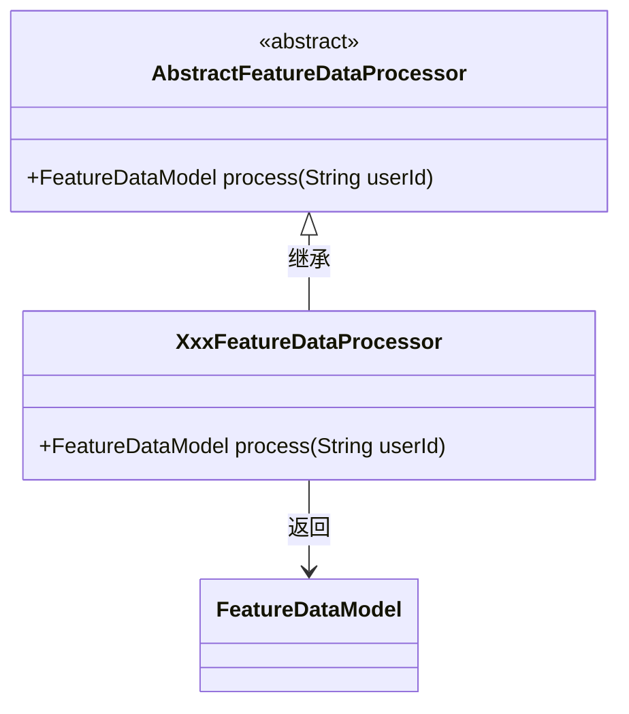
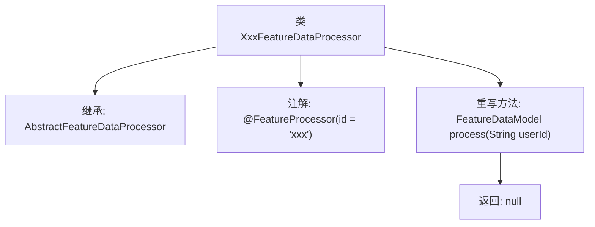

# 基础信息

|      |      |
|------|------|
| 名称 | XxxFeatureDataProcessor |
| 编码语言 | .java |
| 代码路径 | WeFe/serving/serving-service/src/main/java/com/welab/wefe/serving/service/feature/code/XxxFeatureDataProcessor.java |
| 包名 | com.welab.wefe.serving.service.feature.code |
| 依赖项 | ['com.welab.wefe.serving.sdk.model.FeatureDataModel', 'java.util.Map'] |
| 概述说明 | 这是一个名为XxxFeatureDataProcessor的Java类，继承自AbstractFeatureDataProcessor，用于处理特征数据。它通过@FeatureProcessor注解标识，并实现了process方法，接收userId参数，返回FeatureDataModel对象。当前process方法返回null。 |

# 说明

该内容描述了一个名为XxxFeatureDataProcessor的Java类，该类继承自AbstractFeatureDataProcessor抽象类，并使用@FeatureProcessor注解标识其ID为"xxx"。该类重写了process方法，接收一个userId字符串参数，返回一个FeatureDataModel对象，但当前实现直接返回null。这表示该类用于处理特定特征数据，但具体处理逻辑尚未实现。

# 类列表 Class Summary

| 名称   | 类型  | 说明 |
|-------|------|-------------|
| XxxFeatureDataProcessor | class | 这是一个名为XxxFeatureDataProcessor的Java类，继承自AbstractFeatureDataProcessor，用于处理特征数据，包含process方法，接收userId参数并返回FeatureDataModel对象。 |

## 类 XxxFeatureDataProcessor

|      |      |
|------|------|
| 访问范围 | @FeatureProcessor(id = "xxx");public |
| 类型 | class |
| 名称 | XxxFeatureDataProcessor |
| 说明 | 这是一个名为XxxFeatureDataProcessor的Java类，继承自AbstractFeatureDataProcessor，用于处理特征数据，包含process方法，接收userId参数并返回FeatureDataModel对象。 |

### UML类图

该类图展示了一个特征数据处理器的继承结构。抽象基类AbstractFeatureDataProcessor定义了处理特征数据的接口，XxxFeatureDataProcessor作为具体实现类继承并实现了process方法，该方法接收用户ID并返回FeatureDataModel类型的结果。注解@FeatureProcessor表明这是一个具有特定ID的特征处理器实现类。整个设计符合模板方法模式，便于扩展不同的特征处理逻辑。

### 内部方法调用关系图

这段流程图展示了XxxFeatureDataProcessor类的结构，它是一个带有特定注解的处理器类，继承自AbstractFeatureDataProcessor基类。主要描述了类继承关系、注解声明以及重写的process方法实现。该处理器接收userId参数但直接返回null，表明这是一个待实现的模板类或占位符实现。图中清晰呈现了从类定义到方法实现的层级关系，突出了框架扩展点的典型结构特征。

### 字段列表 Field List

| 名称  | 类型  | 说明 |
|-------|-------|------|

### 方法列表

| 名称  | 类型  | 说明 |
|-------|-------|------|
| process | FeatureDataModel | 用户ID处理功能，返回空数据模型。 |

