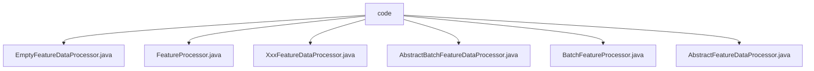

# 基础信息

|      |      |
|------|------|
| 名称 | code |
| 编码语言 | .java |
| 代码路径 | WeFe/serving/serving-service/src/main/java/com/welab/wefe/serving/service/feature/code |
| 包名 | docs.serving.serving-service.src.main.java.com.welab.wefe.serving.service.feature.code |
| 概述说明 | EmptyFeatureDataProcessor返回空特征数据。FeatureProcessor是运行时注解含必填id。XxxFeatureDataProcessor继承抽象类但返回null。AbstractBatchFeatureDataProcessor处理批量特征数据需子类实现。BatchFeatureProcessor是批处理运行时注解含id。AbstractFeatureDataProcessor定义特征处理框架需子类实现。 |

# 说明

## 概述  
该模块核心职责是提供特征数据处理的框架式实现，包含单条与批量处理两种模式，通过抽象类定义基础流程，注解标记实现类。接口规范统一采用抽象类定义process方法，单条处理接收userId返回FeatureDataModel，批量处理接收用户ID列表返回嵌套映射结构。关键数据结构包括FeatureDataModel（单条结果）和Map<String, Map<String, Object>>（批量结果）。外部依赖仅为Java反射机制（通过RUNTIME保留注解）。例如EmptyFeatureDataProcessor实现空处理，XxxFeatureDataProcessor预留特定特征处理扩展点。

## 主要业务场景  
模块采用类似策略模式的设计，通过抽象类定义算法骨架，具体处理器通过注解注册ID实现运行时识别。典型应用包含空数据兜底处理（EmptyFeatureDataProcessor）、批量特征提取（AbstractBatchFeatureDataProcessor）等场景。API类型分为单条处理（@FeatureProcessor标记）和批量处理（@BatchFeatureProcessor标记）两类，例如XxxFeatureDataProcessor演示了单条处理器的注解绑定方式。功能完整性体现在支持从空实现到具体业务逻辑的渐进式扩展。

### 包内部结构视图

该流程图展示了WeFe项目中feature/code目录下的文件结构关系。所有Java文件都直接位于code目录下，包括6个处理器类文件：EmptyFeatureDataProcessor、FeatureProcessor、XxxFeatureDataProcessor等。这些文件都是平级关系，没有进一步的子目录层级，体现了该模块中特征数据处理相关的代码组织方式。

# 文件列表

| 名称   | 类型  | 说明 |
|-------|------|-------------|
| [EmptyFeatureDataProcessor.java](EmptyFeatureDataProcessor.md) | file | EmptyFeatureDataProcessor继承AbstractFeatureDataProcessor，重写process方法，返回空FeatureDataModel。 |
| [FeatureProcessor.java](FeatureProcessor.md) | file | 定义运行时保留的注解FeatureProcessor，包含一个id属性。 |
| [XxxFeatureDataProcessor.java](XxxFeatureDataProcessor.md) | file | 这是一个名为XxxFeatureDataProcessor的Java类，继承自AbstractFeatureDataProcessor，用于处理特征数据。它通过@FeatureProcessor注解标识，并实现了process方法，接收userId参数，返回FeatureDataModel对象。当前process方法返回null。 |
| [AbstractBatchFeatureDataProcessor.java](AbstractBatchFeatureDataProcessor.md) | file | 抽象类AbstractBatchFeatureDataProcessor定义了一个抽象方法process，用于处理用户ID列表并返回特征数据映射。 |
| [BatchFeatureProcessor.java](BatchFeatureProcessor.md) | file | Java注解`@BatchFeatureProcessor`，运行时保留，需指定唯一标识符`id`。 |
| [AbstractFeatureDataProcessor.java](AbstractFeatureDataProcessor.md) | file | 抽象类AbstractFeatureDataProcessor定义了一个抽象方法process，接收userId参数并返回FeatureDataModel对象。 |

